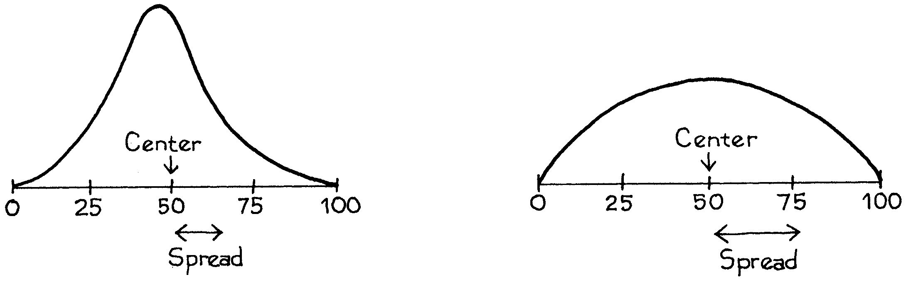
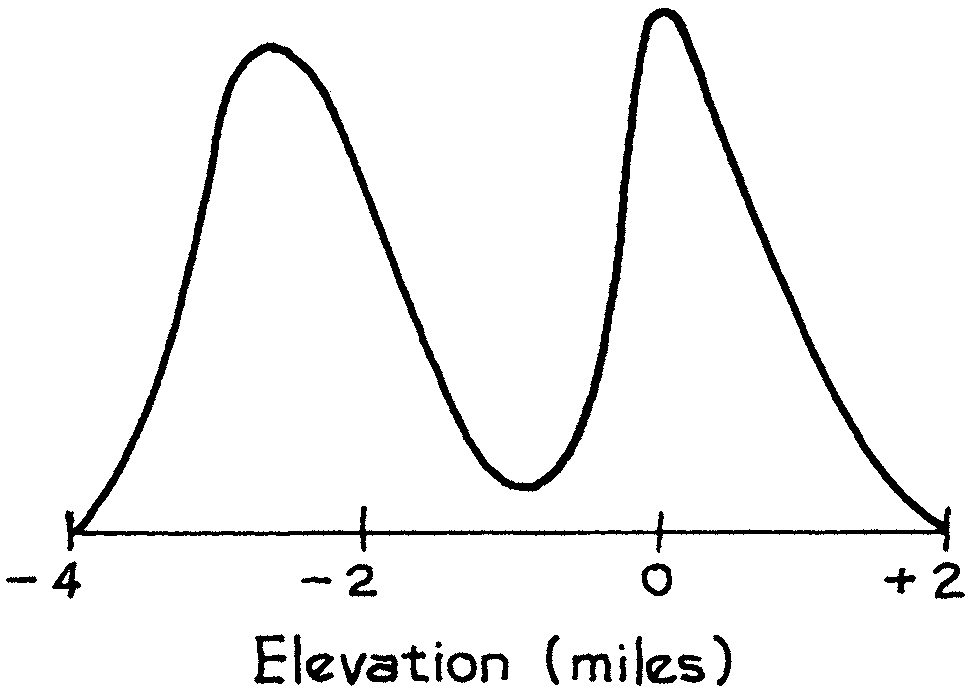

# Introduction
Một `histogram` có thể được sử dụng để tóm tắt một lượng lớn dữ liệu. Thông thường, một bản tóm tắt thậm chí còn hứu dụng hơn là chỉ đưa ra trung tâm của biểu đồ và mức độ lan rộng xung quanh trung tâm("Trung tâm" và "lây lan" là những từ bình thường ở đây, không có bất kỳ ý nghĩa kỹ thuật đặc biệt nào). Hai `histogram` được phác họa trong Hình 1. Trung tâm và lây lan được hiển thị. Cả hai biểu đồ đều có cùng tâm, nhưng biểu đồ thứ hai trải rộng hơn - có nhiều khu vực ở xa trung tâm hơn. Đối với công việc thống kê, các định nghĩa chính xác phải được đưa ra và có một số cách để thực hiện điều này. `average` thường được sử dụng để tìm trung tâm, và `median` cũng vậy[^2]. Các phép đo `standard deviation` trải rộng xung quanh trung bình; `interquartile range` là một thước đo khác của sự lây lan.

**
Hình 1: Trung tâm và lây lan. Tâm của hai biểu đồ `histogram` giống nhau, nhưng biểu đồ thứ 2 trải rộng hơn.
**

Các biểu đồ `histogram` trong Hình 1 có thể được tóm tắt theo trung tâm và mức lây lan. Tuy nhiên, không phải lúc nào mọi việc cũng suôn sẻ như vậy. Ví dụ, Hình 2 đưa ra sự phân bố độ cao trên bề mặt trái đất. Độ cao được hiển thị dọc theo trục ngang, tính bằng dặm trên (+) hoặc dưới (–) mực nước biển. Khu vực dưới biểu đồ giữa hai độ cao cho biết tỷ lệ phần trăm diện tích bề mặt trái đất giữa các độ cao đó. Có các đỉnh rõ ràng trong biểu đồ này. Hầu hết diện tích bề mặt là đáy biển, khoảng 3 dặm dưới mực nước biển; hoặc đồng bằng lục địa, xung quanh mực nước biển. Chỉ báo cáo trung tâm và trải rộng của biểu đồ này sẽ bỏ lỡ hai đỉnh[^3].

**
Hình 2: Phân bố diện tích bề mặt trái đất theo độ cao trên (+) hoặc dưới (–) mực nước biển.
**

[^2]: Nơi biểu đồ `histogram` cao nhất, `mode`, đôi khi được sử dụng để biểu thị trung tâm. Điều này không được khuyến khích vì những thay đổi nhỏ trong dữ liệu có thể gây ra những thay đổi lớn với `mode`.

[^3]: Tom Alexander, “Một cuộc cách mạng gọi là kiến tạo mảng,” Smithsonian Magazine vol. 5, không. 10 (1975). A. Hallam, “Alfred Wegener và giả thuyết về sự trôi dạt lục địa,” Scientific American vol. 232, không. 2 (1975). Ursula Marvin, Trôi dạt lục địa (Smithsonian Press, 1973).

