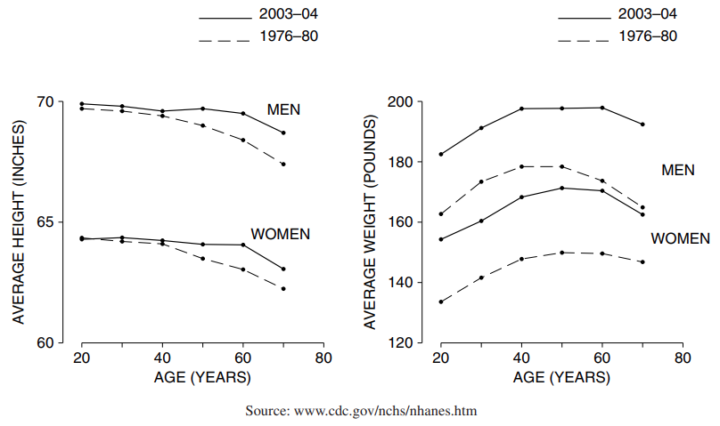

# The Average

Phần này là xem xét gía trị trung bình; sự khác biệt giữa khảo sát `cross-sectional` và `longitudinal` cũng sẽ được thảo luận. Bối cảnh là HANES - Khảo sát Kiểm tra Sức khỏe và Dinh dưỡng, trong đó Dịch vụ Y tế Công cộng kiểm tra một bộ phận đại diện của người Mỹ. Khảo sát này đã được thực hiện không thường xuyên kể từ năm 1959 (khi nó được gọi là Khảo sát kiểm tra sức khỏe). Mục tiêu là để có được dữ liệu cơ bản về:

- Các biến nhân khẩu học, như tuổi tác, học vấn và thu nhập;
- các biến số sinh lý như chiều cao, cân nặng, huyết áp và nồng độ cholesterol trong huyết thanh;
- Thói quen ăn uống;
- Tỷ lệ mắc bệnh.

Phân tích tiếp theo tập trung vào mối quan hệ qua lại giữa các biến và có một số tác động đến chính sách y tế[^4].

Mẫu HANES2 được lấy trong giai đoạn 1976–80. Trước khi xem dữ liệu, hãy xem xét nhanh các mức trung bình.

> Giá trị trung bình của một danh sách các số bằng tổng của chúng chia cho số lượng.

Chẳng hạn, danh sách **9,1,2,2,0** có **5 mục**, mục đầu tiên là **9**. Giá trị trung bình của danh sách là

\\[
\frac{9+1+2+2+0}{5} = \frac{14}{5} = 2.8
\\]

Hãy quay lại với HANES. Những người đàn ông và phụ nữ trong mẫu (18–74 tuổi) trông như thế nào?

- Chiều cao trung bình của những người đàn ông là **5 feet 9** inch và cân nặng trung bình là **171 pound**.
- Chiều cao trung bình của phụ nữ là **5 feet 3.5 inch** và cân nặng trung bình là **146 pound**.

Họ khá mũm mĩm.

Điều gì đã xảy ra kể từ năm 1980? Khảo sát được thực hiện lại vào năm 2003–04 (HANES5). Chiều cao trung bình tăng thêm một phần inch trong khi cân nặng tăng gần **20 pound** - cả nam và nữ.

Hình 3 cho thấy mức trung bình của nam và nữ trong từng nhóm tuổi; trung bình được nối bởi các đường thẳng. Từ HANES2 đến HANES5, chiều cao trung bình tăng lên một chút trong mỗi nhóm - nhưng cân nặng trung bình tăng lên rất nhiều. Điều này có thể trở thành một vấn đề sức khỏe cộng đồng nghiêm trọng, vì thừa cân có liên quan đến nhiều bệnh, bao gồm bệnh tim, ung thư và tiểu đường.

<figure>
    <center></center>
    <center><figcaption>Hình 3: Chiều cao và cân nặng trung bình theo độ tuổi của nam và nữ 18–74 trong mẫu HANES. Bảng bên trái hiển thị chiều cao, bảng bên phải hiển thị cân nặng.</figcaption></center>
</figure>

Giá trị trung bình là một cách hiệu quả để tóm tắt dữ liệu - nhiều `histogram` được nén thành 4 đường cong. Nhưng sự nén này chỉ đạt được bằng cách làm dịu đi những khác biệt cá nhân. Ví dụ, trong năm 2003–04, chiều cao trung bình của nam giới ở độ tuổi 18–24 là **5 feet 10 inch**. Nhưng **15%** trong số họ cao hơn **6 feet 1 inch**; **15%** số khác thấp hơn **5 feet 6 inch**. Sự đa dạng này bị ẩn bởi mức trung bình.

Trong giây lát, chúng ta quay lại vấn đề thiết kế (chương 2). Trong dữ liệu năm 1976–80, chiều cao trung bình của nam giới dường như giảm sau 20 tuổi, giảm khoảng **2 inch** sau 50 năm. Tương tự như vậy đối với phụ nữ. Bạn có nên kết luận rằng một người bình thường trở nên thấp hơn với tốc độ này không? Không thực sự. HANES là `cross-sectional`, không phải `longitudinal`. Trong một nghiên cứu `cross-sectional`, các đối tượng khác nhau được so sánh với nhau tại một thời điểm. Trong một nghiên cứu `longitudinal`, các đối tượng được theo dõi theo thời gian và được so sánh với chính họ tại các thời điểm khác nhau. Những người ở độ tuổi 18–24 trong Hình 3 hoàn toàn khác với những người ở độ tuổi 65–74. Nhóm thứ nhất ra đời muộn hơn nhóm thứ hai rất nhiều.

Có bằng chứng cho thấy rằng, theo thời gian, người Mỹ ngày càng cao hơn. Đây được gọi là `secular trend` về chiều cao và ảnh hưởng của nó bị nhầm lẫn với ảnh hưởng của tuổi tác trong Hình 3. Hầu hết chiều cao giảm 2 inch dường như là do `secular trend`. Những người ở độ tuổi 65–74 được sinh ra khoảng 50 năm trước những người ở độ tuổi 18–24 và vì lý do đó mà họ thấp hơn 1 hoặc 2 inch[^5]. Mặt khác, `secular trend` đã chậm lại. (Không rõ lý do.) Chiều cao trung bình chỉ tăng một chút từ năm 1976–80 đến năm 2003–04. Sự chậm lại cũng giải thích tại sao các đường cong chiều cao năm 2003–04 phẳng hơn các đường cong năm 1976–80.

> Nếu một nghiên cứu đưa ra kết luận về ảnh hưởng của tuổi tác, hãy tìm hiểu xem dữ liệu là dữ liệu cắt ngang hay theo chiều dọc.

[^4]: The Public Health Service and the National Center for Health Statistics (NCHS) are in the Department of Health and and Human Services. Data on HANES2 are from series 11 of the Vital and Health Statistics publications, and from tapes supplied by the National Center for Health Statistics and by the Inter-University Consortium for Political and Social Research. Data on HANES3 were kindly supplied on a CD-ROM by NCHS. These data, and data for HANES5, are now available on the internet, at

```
http://www.cdc.gov/nchs/about/major/nhanes/datalink.htm
```

(URLs cited here were alive in February 2006, but time will doubtless take its toll.) We are responsible for the interpretation of the data. For help with earlier editions of the book, we thank Dale Hitchcock, Arthur McDowell, and Bob Murphy at NCHS, as well as Dorothy Rice (UCSF). For the fourth edition, we thank Wim van Veen (Health Council of the Netherlands).

The histograms in figures 4, 8, 9 are based on sample counts, unweighted, ages 18+; likewise for the scatter diagrams discussed in part III. Summary statistics are heavily rounded. Sample weights made little difference in HANES2, but have more noticeable effects in HANES5. The table below compares HANES5 to HANES2 (ages 18–74).

**<center>HANES2: 1976–80</center>**

|        | Men 18–74      | Men 18–74      | Women 18–74    | Women 18–74    |
| ------ | -------------- | -------------- | -------------- | -------------- |
|        | unweighted     | weighted       | unweighted     | weighted       |
| Height | 68.78 ± 2.83   | 69.11 ± 2.82   | 63.46 ± 2.62   | 63.71 ± 2.60   |
| Weight | 170.92 ± 30.13 | 172.19 ± 29.75 | 145.71 ± 32.65 | 144.18 ± 32.27 |

**<center>HANES5: 2003–04</center>**

|        | Men 18–74      | Men 18–74      | Women 18–74    | Women 18–74    |
| ------ | -------------- | -------------- | -------------- | -------------- |
|        | unweighted     | weighted       | unweighted     | weighted       |
| Height | 69.11 ± 3.10   | 69.61 ± 2.97   | 63.67 ± 2.76   | 64.09 ± 2.65   |
| Weight | 188.92 ± 42.95 | 193.94 ± 41.95 | 165.84 ± 43.76 | 165.32 ± 44.19 |
