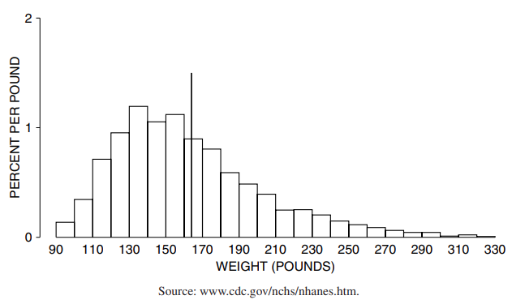
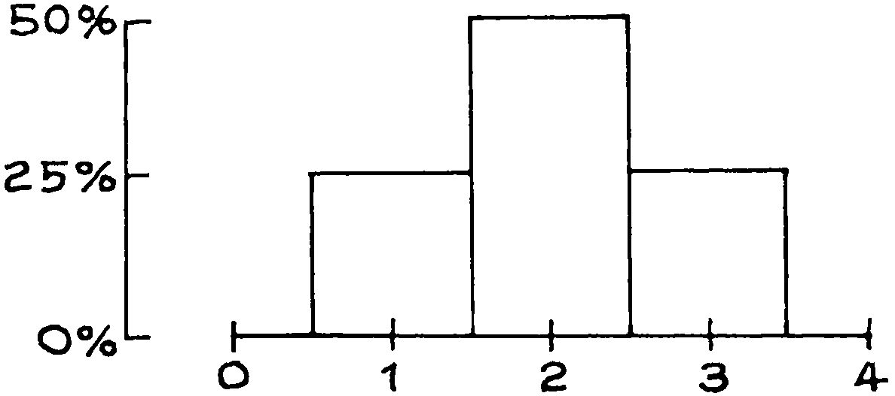
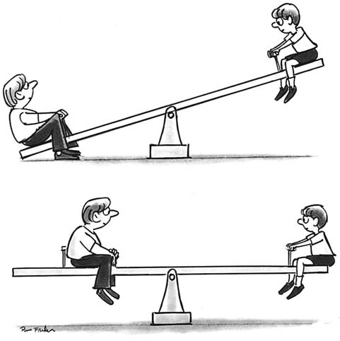
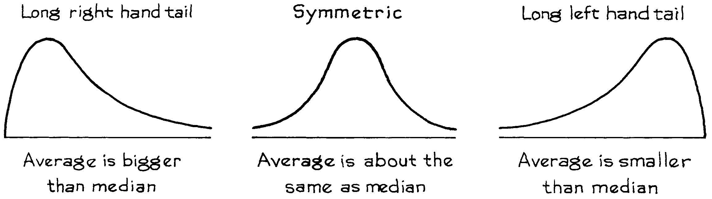

# The Average and the Histogram

Phần này sẽ chỉ ra trung bình và `median` liên quan như thể nào đến `histogram`. Để bắt đầu với một ví dụ, có 2.696 phụ nữ từ 18 tuổi trở lên trong HANES5 (2003–04). Trọng lượng trung bình của họ là 164 pounds. Rất dễ dàng để đoán rằng 50% trong số họ có cân nặng trên trung bình và 50% dưới mức trung bình. Tuy nhiên, dự đoán này là hơi tắt. Trên thực tế, chỉ có 41% là trên trung bình và 59% là dưới trung bình. Hình 4 hiển thị `histogram` cho dữ liệu: giá trị trung bình được đánh dấu bằng một đường thẳng đứng. Trong các tình huống khác, tỷ lệ phần trăm thậm chí có thể xa hơn 50%.

**
Hình 4: `histogram` về trọng lượng của 2.696 phụ nữ trong mẫu HANES5. Mức trung bình được đánh dấu bằng một đường thẳng đứng. Chỉ 41% phụ nữ có cân nặng trên mức trung bình
**

Sao lại như vậy? Để tìm hiểu, cách dễ nhất là bắt đầu với một số dữ liệu giả định—danh sách 1, 2, 2, 3. `histogram` cho danh sách này (Hình 5) đối xứng tại 2. Và giá trị trung bình bằng 2. Nếu biểu đồ đối xứng xung quanh một giá trị, giá trị đó bằng giá trị trung bình. Hơn nữa, một nửa diện tích dưới biểu đồ của anh ta nằm ở bên trái của giá trị đó và một nửa ở bên phải. (Đối xứng có nghĩa là gì? Hãy tưởng tượng vẽ một đường thẳng đứng qua tâm của biểu đồ và gấp một nửa biểu đồ xung quanh đường thẳng đó: hai nửa phải khớp với nhau).

**
Hình 5: `histogram` cho danh sách 1, 2, 2, 3. Biểu đồ này đối xứng quanh 2, trung bình: 50% diện tích nằm ở bên trái của 2 và 50% ở bên phải.
**

Điều gì xảy ra khi giá trị 3 trong danh sách 1, 2, 2, 3 tăng lên, chẳng hạn như 5 hoặc 7? Như thể hiện trong Hình 6, hình chữ nhật trên giá trị đó dịch chuyển sang phải, phá hủy tính đối xứng. Giá trị trung bình cho mỗi biểu đồ được đánh dấu bằng một mũi tên và mũi tên dịch chuyển sang phải theo hình chữ nhật. Để hiểu tại sao, hãy tưởng tượng biểu đồ được làm từ các khối gỗ gắn vào một tấm ván cứng, không trọng lượng. Đặt biểu đồ trên một sợi dây căng, như được minh họa trong bảng dưới cùng của Hình 6. `histogram` sẽ cân bằng ở trung bình[^7]. Một khu vực nhỏ cách xa mức trung bình có thể cân bằng một khu vực lớn gần mức trung bình, bởi vì các khu vực được tính trọng số theo khoảng cách của chúng so với điểm cân bằng.

**
Hình 6: Trung bình. Bảng trên cùng hiển thị 3 `histogram`; các giá trị trung bình được đánh dấu bằng mũi tên. Khi hộp kẻ sọc dịch sang phải, nó sẽ kéo theo giá trị trung bình. Phần bên trái của trung bình lên tới 75%. Bảng dưới cùng hiển thị 3 `histogram` giống nhau được làm từ các khối gỗ gắn vào một tấm ván cứng, không trọng lượng. Các `histogram` cân bằng khi được kê ở trung bình.
**

> Biểu đồ cân bằng khi được đặt ở mức trung bình.

Một đứa trẻ nhỏ ngồi xa trung tâm bập bênh hơn để giữ thăng bằng cho đứa trẻ lớn ngồi gần trung tâm hơn. Các khối trong biểu đồ hoạt động theo cùng một cách. Đó là lý do tại sao tỷ lệ các thành phần ở hai bên mức trung bình có thể khác 50%.

`median` của histogram là giá trị có một nửa diện tích ở bên trái và một nửa ở bên phải. Đối với cả 3 `histogram` trong Hình 6, `median` là 2. Với `histogram` thứ 2 và  3, diện tích bên phải của trung vị cách xa so với diện tích bên trái. Do đó, nếu bạn cố gắng cân bằng một trong những `histogram` đó tại `median`, nó sẽ nghiêng về bên phải. Tổng quát hơn, giá trị trung bình nằm bên phải của `median` bất cứ khi nào `histogram` có phần đuôi dài bên phải, như trong Hình 7. Biểu đồ cân nặng (Hình 4 trang 62) có trung bình là 164 lbs và `median` là 155 lbs. Cái đuôi dài bên phải là thứ làm cho mức trung bình lớn hơn `median`.

**
Hình 7: Đuôi của các `histogram`.
**

Ví dụ khác, thu nhập gia đình trung bình ở Hoa Kỳ năm 2004 là khoảng $54,000. `histogram` thu nhập có đuôi dài bên phải và trung bình cao hơn - $60.000[^8]. Khi xử lý các phân phối đuôi dài, các nhà thống kê có thể sử dụng `median` thay vì trung bình, nếu trung bình chú ý quá nhiều đến phần cuối cùng của phân phối. Chúng tôi trở lại điểm này trong chương tiếp theo.

[^7]: Định nghĩa về "randomize controlled trial" không chặt chẽ. Bảng gốc bao gồm dữ liệu về thuốc chống đông máu sau nhồi máu cơ tim. Ngay cả trong những năm 1980, đã có một số tranh cãi về việc giải thích các thử nghiệm lâm sàng về thuốc chống đông máu. Kể từ đó, các liệu pháp tiêu huyết khối đã thay đổi đáng kể và có nhiều thử nghiệm mới. Để đánh giá, xem: 

    _Coronary Artery Disease_ vol. 5 no. 4 (1994). “Hướng dẫn của ACC/AHA về quản lý bệnh nhân nhồi máu cơ tim có ST chênh lên: Báo cáo của Đại học Tim mạch Hoa Kỳ/Lực lượng Đặc nhiệm của Hiệp hội Tim mạch Hoa Kỳ về Hướng dẫn Thực hành,” Circulation vol. 110 (2004) trang 588–636. 

    J. D. Talley, “Đánh giá can thiệp tiêu huyết khối cho nhồi máu cơ tim cấp tính—nó có giá trị không?” Tạp chí của Hiệp hội Y khoa Arkansas 91 (1994) trang 70–79. 

    C. H. Hennekens, “Liệu pháp tiêu sợi huyết: Trước và sau GISSI-2, ISIS-3, và GUSTO-1,” Clinical Cardiology vol. 17 bổ sung. I (1994) trang I15–7. 

    R. Collins, R. Peto, S. Parish và P. Sleight, “ISIS-3 và GISSI-2: Không có lợi thế sống sót với chất kích hoạt plasminogen mô so với streptokinase, nhưng có quá nhiều đột quỵ với chất kích hoạt plasminogen mô trong cả hai thử nghiệm,” Tạp chí Tim mạch Hoa Kỳ vol. 71 (1993) trang 1127–30.

    M. J. Stampfer và cộng sự, “Tác dụng của streptokinase tiêm tĩnh mạch đối với nhồi máu cơ tim cấp tính: Kết quả tổng hợp từ các thử nghiệm ngẫu nhiên,” Tạp chí Y học New England tập. 307 (1982) trang 1180–82.

[^8]: T. C. Chalmers, “Tác động của các thử nghiệm có kiểm soát đối với việc thực hành y học,” Tạp chí Y học Mount Sinai tập. 41 (1974) trang 753–59.
