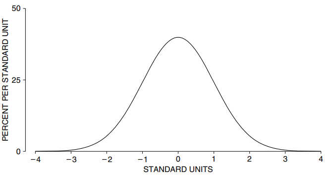

# The Normal Curve

`normal curve` được phát hiện vào khoảng năm 1720 bởi Abraham de Moivre, khi ông đang phát triển toán học về sự ngẫu nhiên. (Công trình của ông sẽ được thảo luận lại ở phần IV và V.) Khoảng năm 1870, nhà toán học người Bỉ Adolph Quetelet có ý tưởng sử dụng đường cong như một `histogram` lý tưởng để có thể so sánh `histogram` dữ liệu.

`normal curve` có phương trình trông rất ghê gớm:

\\[y = \frac{100\%}{\sqrt{2\pi}}e^{-x^2/2},\ với\ e=2.71828...\\]

Phương trình này liên quan đến 3 con số nổi tiếng nhất trong lịch sử toán học: \\(\sqrt{2}\\), \\(\pi\\) và \\(e\\).

Đây chỉ là để khoe một chút thôi. Bạn sẽ thấy thật dễ dàng khi làm việc với `normal curve` thông qua sơ đồ và bảng biểu mà không cần sử dụng phương trình. Đồ thị của đường cong được thể hiện trong Hình 1.

**
Hình 1: `normal curve`.
**

Một số tính năng của đồ thị này sẽ rất quan trọng. Đầu tiên, đồ thị đối xứng quanh 0: phần đường cong bên phải số 0 là ảnh phản chiếu của phần bên trái. Tiếp theo, tổng diện tích dưới đường cong bằng 100%. (Các diện tích được tính theo phần trăm vì trục tung sử dụng thang đo mật độ.) Cuối cùng, đường cong luôn nằm phía trên trục hoành. Nó dường như dừng lại ở khoảng từ 3 đến 4, nhưng đó chỉ là do đường cong ở đó quá thấp. Chỉ có khoảng 6/100.000 diện tích nằm ngoài khoảng từ −4 đến 4.

Sẽ rất hữu ích khi tìm các khu vực dưới `normal curve` giữa các giá trị được chỉ định. Ví dụ,

- Diện tích bên dưới `normal curve` giữa -1 và +1 là khoảng 68%.
- Diện tích bên dưới `normal curve` giữa -2 và +2 là khoảng 95%.
- Diện tích bên dưới `normal curve` giữa -3 và +3 là khoảng 99.7%.

Việc tìm những diện tích này chỉ cần tra cứu mọi thứ trong bảng hoặc nhấn nút trên loại máy tính phù hợp; bảng sẽ được giải thích ở phần 2.

Nhiều `histogram` cho dữ liệu có hình dạng tương tự như `normal curve`, miễn là chúng được vẽ theo cùng một tỷ lệ. Việc làm cho các thang đo ngang khớp với nhau đòi hỏi phải có các `standard units`[^1].

> Một giá trị được chuyển đổi thành `standard units` bằng cách xem nó cao hơn hoặc thấp hơn mức trung bình bao nhiêu `SD`.

Các giá trị trên mức trung bình được đặt dấu cộng; giá trị dưới mức trung bình nhận được dấu trừ. Trục hoành của Hình 1 được tính theo `standard unit`.

Ví dụ: lấy phụ nữ từ 18 tuổi trở lên trong mẫu HANES5. Chiều cao trung bình của họ là 63,5 inch; `SD` là 3 inch. Một trong những người phụ nữ này cao 69,5 inch. Chiều cao của cô ấy theo `standard units` là bao nhiêu? Đối tượng của chúng ta cao hơn mức trung bình 6 inch và 6 inch là 2 `SD`. Trong `standard units`, chiều cao của cô ấy là +2.

_Ví dụ 1._ Với phụ nữ từ 18 tuổi trở lên trong mẫu HANES5

(a) Đổi các đơn vị sau sang `standard units`

    (i) 66.5 inch     (ii) 57.5 inch    (iii) 64 inch     (iv) 64.5 inch

(b) Tìm chiều cao là -1.2 theo `standard units`.

_Đáp án._ _Câu (a)._ (i), 66.5 inch cao hơn trung bình 3 inch. Tức là cao hơn trung bình 1 `SD`. Trong `standard units`, 66.5 inch là +1. Với (ii), 57.5 inch thấp hơn trung bình 6 inch. Tức là thấp hơn trung bình 2 `SD`. Trong `standard units`, 57.5 inch là -2. Với (iii), 64 inch cao hơn trung bình 0.5 inch. Tức là \\(0.5/3 \approx 0.17\\) `SD`. Câu trả lời là 0.17. Với (iv), 63.5 inch là trung bình. Do đó, 63.5 inch cách trung bình 0 `SD`. Câu trả lời là 0. (Nhớ rằng \\(\approx\\) nghĩa là xấp xỉ).

_Câu (b)._ Chiều cao dưới trung bình 1.2 `SD` và \\(1.2 \times 3\ inch = 3.6\ inch\\). Chiều cao là

\\[
63.5\ inch - 3.6\ inch = 59.9\ inch
\\]

Đó là câu trả lời.

`standard units` được dùng trong Hình 2. Trong đó, `histogram` với những phụ nữ

Trong đó, `histogram`chiều cao của phụ nữ từ 18 tuổi trở lên trong mẫu HANES5 được so sánh với `normal curve`. Trục ngang của `histogram` tính bằng inch; trục ngang của đường cong chuẩn được tính bằng `standard units`. Hai số này khớp với nhau như được chỉ ra trong ví dụ 1. Ví dụ: 66.5 inch nằm ngay trên +1 và 57.5 inch nằm ngay trên −2.

Ngoài ra còn có hai trục thẳng đứng trong Hình 2. Biểu đồ được vẽ so với trục dọc bên trong, tính bằng phần trăm trên mỗi inch. `normal curve` được vẽ so với đường cong bên ngoài, tính bằng phần trăm trên mỗi `standard units`. Để xem các tỷ lệ khớp với nhau như thế nào, hãy lấy giá trị cao nhất trên mỗi trục: 60% trên mỗi `standard units` khớp với 20% trên mỗi inch vì có 3 inch cho `standard units`. Trải 60% trên `SD` cũng giống như trải 60% trên 3 inch với 20% mỗi inch

\\[
60\\%\\ mỗi\\ standard\\ inits=60\\%\\ mỗi\\ 3\\ inch\\\\
=60\\%\\ \div\\ 3\\ inch=20\\%\ mỗi\\ inch.
\\]

Tương tự, 30% trên mỗi `standard units` tương ứng với 10% trên mỗi inch. Bất kỳ cặp giá trị nào khác có thể được xử lý theo cách tương tự.

Chương trước đã nói rằng đối với nhiều danh sách, khoảng 68% mục nhập nằm trong khoảng 1 SD từ trung bình. Đây là khoảng

\\[
trung\\ bình - SD\\ đến\\ trung\\ bình + SD
\\]

[^1]:
