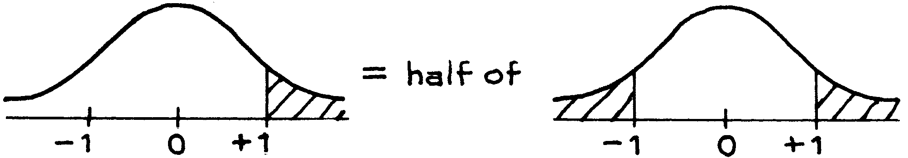

# Finding Areas Under The Normal Curve

Ở cuối cuốn sách có bảng cho diện tích dưới đường cong (tr. A104). Ví dụ: để tìm diện tích bên dưới `normal curve` nằm trong khoảng từ −1,20 đến 1,20, hãy chuyển đến 1,20 trong cột được đánh dấu \\(z\\) và đọc giá trị trong cột được đánh dấu _Area_. Tỷ lệ này là khoảng 77%, do đó diện tích dưới đường cong chuẩn giữa −1,20 và 1,20 là khoảng 77%.

Nhưng bạn cũng sẽ muốn tìm các diện tích khác:

Phương pháp tìm các diện tích như vậy được chỉ dẫn bằng ví dụ.

_Ví dụ 2._ Tìm diện tích giữa 0 và 1 dưới `normal curve`.

_Lời giải._ Đầu tiên vẽ phác thảo 1 `normal curve`, sau đó tô màu ở khu vực được tìm thấy.

Bảng sẽ cung cấp cho bạn diện tích từ −1 đến +1. Tỷ lệ này là khoảng 68%. Theo tính đối xứng, diện tích giữa 0 và 1 bằng một nửa diện tích giữa −1 và +1, nghĩa là

\\[
\frac{1}{2} \times 68\\% = 34\\%
\\]

_Ví dụ 3._ Tìm diện tích từ 0 và 2 dưới `normal curve`.

_Lời giải._ Diện tích không gấp đôi diện tích giữa 0 và 1 vì `normal curve` không phải là hình chữ nhật.

Quy trình tương tự như trong Ví dụ 2. Có thể tính diện tích giữa −2 và 2 từ bảng. Đó là khoảng 95%. Diện tích giữa 0 và 2 bằng một nửa diện tích đó, theo tính đối xứng:

\\[
\frac{1}{2} \times 68\\% = 34\\%
\\]

_Ví dụ 4._ Tìm diện tích giữa −2 và 1 dưới `normal curve`.

_Lời giải._ Diện tích giữa −2 và 1 có thể được chia thành

Diện tích giữa −2 và 0 tương đương diện tích giữa 0 và 2, xét về mặt đối xứng, và bằng khoảng 48% (Ví dụ 3). Diện tích giữa 0 và 1 là khoảng 34% (Ví dụ 2). Diện tích giữa −2 và 1 là khoảng

\\[
48\\% + 34\\% = 82\\%
\\]

Ví dụ 5. Tìm diện tích bên phải số 1 dưới `normal curve`.

_Lời giải._ Bảng cho biết diện tích từ −1 đến 1, là 68%. Diện tích ngoài khoảng này là 32%.

Theo tính đối xứng, diện tích bên phải số 1 bằng một nửa diện tích này, hay 16%.

_Ví dụ 6._ Tìm diện tích bên trái của 2 dưới `normal curve`.

_Lời giải._ Diện tích bên trái của 2 là tổng của diện tích bên trái của 0 và diện tích nằm trong khoảng từ 0 đến 2.

Diện tích bên trái của số 0 bằng một nửa tổng diện tích, theo tính đối xứng:

\\[
\frac{1}{2} \times 100\\% = 50\\%
\\]

Diện tích giữa 0 và 2 là khoảng 48%. Tổng là 50% + 48% = 98%.

_Ví dụ 7._ Tìm diện tích giữa 1 và 2 dưới `normal curve`.

_Lời giải._

Diện tích giữa −2 và 2 là khoảng 95%; diện tích giữa −1 và 1 là khoảng 68%. Một nửa sự chênh lệch là

\\[
\frac{1}{2} \times (95\\% - 68\\%) = \frac{1}{2} \times 27\\% \approx 14\\%
\\]

Không có quy trình cố định nào được sử dụng để giải quyết loại vấn đề này. Chỉ là vẽ những bức tranh liên quan đến diện tích bạn muốn với những diện tích có thể đọc được từ bảng.

