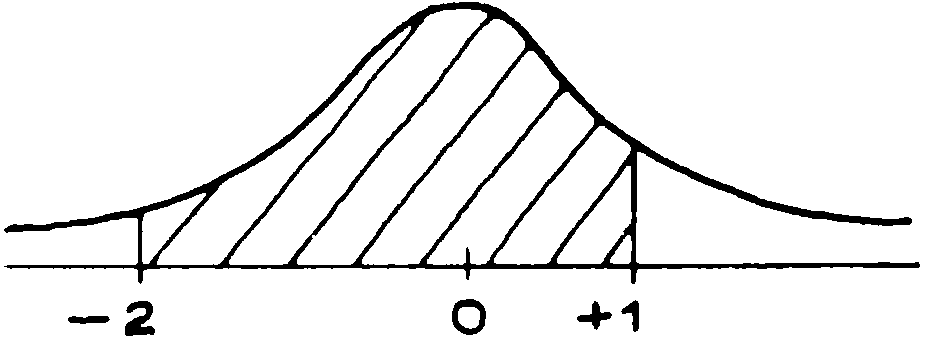
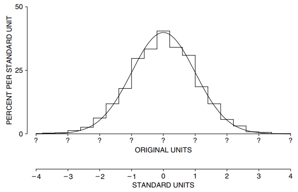

# The Normal Approximation For Data

Phương pháp `normal approximation` sẽ được giải thích ở đây bằng ví dụ. Các sơ đồ trông đơn giản đến mức bạn có thể nghĩ rằng chúng không đáng vẽ. Tuy nhiên, rất dễ bị mất dấu diện tích mong muốn. Hãy vẽ sơ đồ.

_Ví dụ 8._ Chiều cao trung bình của nam từ 18 tuổi trở lên trong HANES5 là 69 inch; `SD` là 3 inch. Sử dụng `normal curve` để ước tính tỷ lệ phần trăm những người có chiều cao từ 63 inch đến 72 inch.

_Giải pháp._ Tỷ lệ phần trăm được tính theo diện tích dưới `histogram` chiều cao, từ 63 inch đến 72 inch.

_Bước 1._ Vẽ trục số và tô màu khoảng.

_Bước 2._ Đánh dấu giá trị trung bình trên dòng và chuyển đổi sang `standard units`.

_Bước 3._ Vẽ `normal curve` và tìm diện tích phía trên khoảng đơn vị tiêu chuẩn được tô bóng thu được ở Bước 2. Tỷ lệ phần trăm xấp xỉ bằng diện tích được tô bóng, gần bằng 82%.

Sử dụng `normal curve`, ta ước tính khoảng 82% người với chiều cao nằm trong khoảng từ 63 inch đến 72 inch. Đây chỉ là con số gần đúng nhưng cũng khá tốt: 81% nam giới nằm trong khoảng đó. Hình 3 cho thấy sự xấp xỉ.

**
Hình 3. `normal approximation` bao gồm việc thay thế `histogram` ban đầu bằng `normal curve` trước khi tính diện tích.
**

_Ví dụ 9._ Chiều cao trung bình của nữ từ 18 tuổi trở lên trong HANES5 là 63.5 inch; `SD` là 3 inch. Sử dụng `normal curve` để ước tính tỷ lệ phần trăm có nhưng người có chiều cao trên 59 inch.
_Giải pháp._ Chiều cao 59 inch là dưới mức trung bình 1,5 `SD`:

\\[
\frac{59 - 63.5}{3} = -1.5
\\]

Sử dụng `normal curve`, ta ước tính 93% phụ nữ có chiều cao trên 59 inch. Ước tính này gần đúng: 96% phụ nữ cao hơn 59 inch.

Một thực tế đáng chú ý là nhiều `histogram` tuân theo `normal curve`. (Câu chuyện tiếp tục ở phần V.) Đối với những `histogram` như vậy, mức trung bình và `SD` là những thống kê tóm tắt tốt. Nếu `histogram` tuân ttheo `normal curve`, nó trông giống như bản phác thảo trong Hình 4. Các chốt trung bình ở giữa và SD cho biết mức chênh lệch. Đó gần như là tất cả những gì có thể nói về `histogram` - nếu hình dạng của nó giống như `normal curve`. Tuy nhiên, nhiều `histogram` khác không tuân theo `normal curve`. Trong những trường hợp như vậy, mức trung bình và `SD` là số liệu thống kê tóm tắt kém. Thông tin thêm về điều này nằm trong phần tiếp theo.

**
Hình 4. Giá trị trung bình và `SD`. Bằng cách xác định vị trí trung tâm và đo độ rộng xung quanh trung tâm, giá trị trung bình và `SD` tóm tắt một biểu đồ tuân theo `normal curve`.
**
