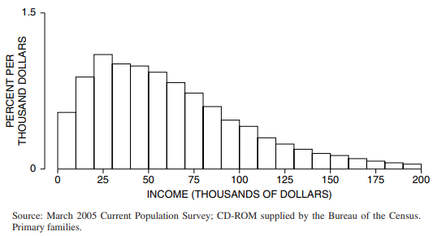
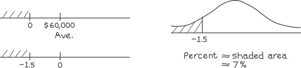

# Percentiles

Giá trị trung bình và `SD` có thể được sử dụng để tóm tắt dữ liệu theo `normal curve`. Chúng ít thỏa đáng hơn đối với các loại dữ liệu khác. Hãy lấy sự phân bổ thu nhập của các hộ gia đình ở Mỹ năm 2004, minh họa trong Hình 5.

**
Hình 5. Phân bổ thu nhập các hộ gia đinh: U.S năm 2004.
**

Thu nhập trung bình của các gia đình trong Hình 5 là khoảng 60.000 USD; `SD` là khoảng $40.000[^3]. Vì vậy, `normal approximation` cho thấy khoảng 7% hộ gia đình có thu nhập âm:

Lý do cho sai lầm này: `histogram` trong Hình 5 hoàn toàn không tuân theo `normal curve`, nó có một cái đuôi dài bên phải. Để tóm tắt các `histogram`như vậy, các nhà thống kê thường sử dụng `percentiles` (Bảng 1).

`percentile` thứ nhất của phân bổ thu nhập là $0, nghĩa là khoảng 1% gia đình có thu nhập từ $0 trở xuống và khoảng 99% có thu nhập trên mức đó. (Chủ yếu, các gia đình không có thu nhập đã nghỉ hưu hoặc không làm việc vì lý do khác). `percentiles` thứ 10 là $15.000: khoảng 10% gia đình có thu nhập dưới mức đó và 90% là ở trên. `percentiles` thứ 50 chỉ là `median`(Chương 4).

Theo định nghĩa, `interquartile` bằng

\\[
\text{75th percentile - 25th percentile}
\\]

Điều này đôi khi được sử dụng như một thước đo mức độ lây lan khi phân phối có đuôi dài. Đối với Bảng 1, phạm vi `interquartile` là $61.000.

Vì những lý do riêng, các nhà thống kê gọi đường cong de Moivre là "normal". Điều này tạo ấn tượng rằng các đường cong khác là bất thường. Không phải vậy. Nhiều `histogram` tuân theo `normal curve`rất tốt, còn nhiều biểu đồ khác - như biểu đồ thu nhập - thì không. Ở phần sau của cuốn sách, chúng tôi sẽ trình bày một lý thuyết toán học giúp giải thích khi nào `histogram` nên tuân theo `normal curve`.

[^3]: Xem chú thích 3 ở Chương 3. `histogram`, `SD` và `percentiles`được tính toán từ CD ROM, không có trọng số, đối với các thành viên chính trong gia đình. Giá trị trung bình và `SD` gần như đúng khi thu nhập trên 200.000 USD bị kiểm duyệt. Phần trăm dành cho việc phân phối đầy đủ thu nhập của gia đình, giá trị trung bình và `SD` tương ứng đều khoảng $70.000. (Lưu ý rằng thu nhập cao đã được mã hóa để bảo vệ tính bảo mật của người trả lời).
