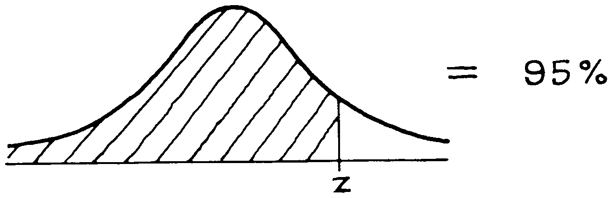
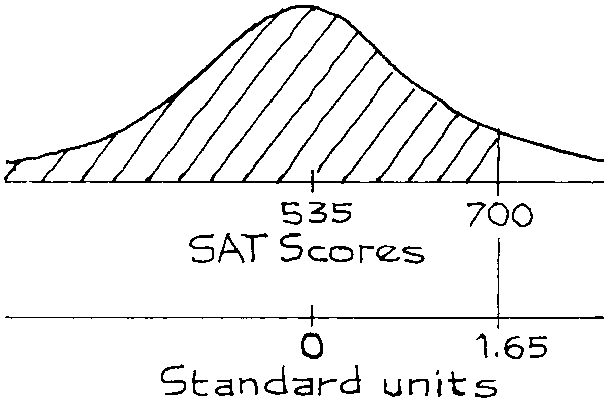

# Percentiles And The Normal Curve

Khi `histogram` tuân theo `normal curve`, bảng có thể được sử dụng để ước tính `percentiles`của nó. Phương pháp này được chỉ định bằng ví dụ.

_Ví dụ 10._ Trong số tất cả những người đăng ký vào một trường đại học nhất định trong một năm, điểm SAT Toán trung bình là 535 `SD` là 100 và điểm số tuân theo `normal score`. Ước tính `percentile` thứ 95của phân phối điểm số.

_Giải pháp._ Điểm này cao hơn mức trung bình ở một số `SD`. Ta cần tìm số đó, gọi nó là \\(z\\). Phương trình cho \\(z\\):

Bảng không thể được sử dụng trực tiếp vì nó cho diện tích giữa \\(−z\\) và \\(z\\) chứ không phải diện tích bên trái của \\(z\\).

Diện tích bên phải \\(z\\) của chúng ta là 5%do đó diện tích bên trái \\(−z\\) cũng là 5%. Khi đó diện tích giữa \\(−z\\) và \\(z\\) phải là 100% − 5% − 5% = 90%.

Từ bảng, \\(z \approx 1.65\\). Bạn phải đạt 1.65 `SD` trên mức trung bình để nằm trong `percentile` thứ 95 của SAT Toán. Dịch ngược lại về điểm thì số điểm này cao hơn mức trung bình \\(1,65 \times 100 = 165\\) điểm. `percentile` thứ 95 của phân bổ điểm là 535 + 165 = 700.

Thuật ngữ này có chút khó hiểu. Một `percentile` là điểm: trong Ví dụ 10, `percentile` thứ 95 là 700 điểm. Tuy nhiên, thứ hạng `percentile rank` là phần trăm: nếu bạn đạt 700 điểm thì `percentile rank` của bạn là 95%. Thậm chí còn có cách thứ ba để nói điều tương tự: số điểm 700 đưa bạn vào `percentile` thứ 95 trong bảng phân bổ điểm.
