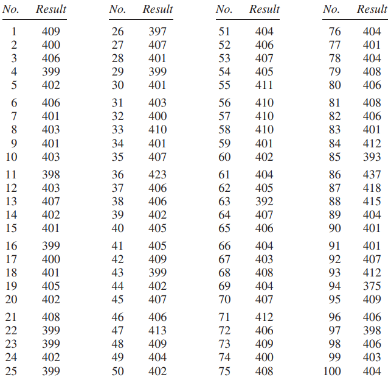
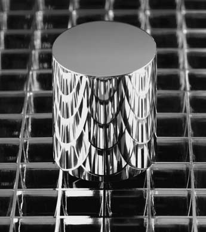

[^1]: NBS khởi đầu là Bureau of Weights of Measures, dưới sự lãnh đạo của Ferdinand Hassler (sinh năm 1770 tại Thụy Sĩ, Giám đốc Bureau từ 1830 đến 1843). Thành tựu to lớn của Hassler là đưa các trọng lượng và thước đo được sử dụng trên khắp nước Mỹ về một mức độ nhất quán cao. Cục hiện nay được gọi là NIST - The National Institute of Standards and Technology. Chúng tôi xin cảm ơn H. H. Ku của Bureau vì sự giúp đỡ của ông trong các lần xuất bản trước.
[^2]: Trọng lượng được sử dụng ở đây thay vì từ _mass_ mang tính kỹ thuật hơn. Năm 1983, Hội nghị chung về Weights and Measures superseded the Treaty of the Meter, nhưng trọng lượng vẫn được xác định bằng cách tham chiếu đến một vật tiêu chuẩn. Để biết thông tin cập nhật về The Kilogram, xem Science (12/5/1995) tr. 804.
[^3]: Hai nguyên nhân chính gây ra `chance error` trong quá trình cân chính xác tại Bureau được cho là:

- mức độ tác động nhỏ trong cơ cấu cân bằng, đặc biệt là ở cạnh tiếp xúc;
- có sự thay đổi nhỏ về vị trí của các quả cân trên đĩa cân.

# Chance Error

Phần này sẽ thảo luận về `chance error`trong quá trình cân chính xác được thực hiện tại National Bureau of Standards[^1]. Đầu tiên, một giải thích ngắn gọn về các cân nặng tiêu chuẩn. Các cửa hàng cân hàng hóa trên cân. Cân được kiểm tra định kỳ theo các tổ chức đo lường của quận, sử dụng trọng lượng tiêu chuẩn của quận. Các tiêu chuẩn của quận cũng phải được _calibrated_ (kiểm tra theo tiêu chuẩn bên ngoài) định kỳ. Việc này được thực hiện ở cấp tiểu bang. Và các tiêu chuẩn của tiểu bang được hiệu chuẩn theo tiêu chuẩn quốc gia bởi National Bureau of Standards ở Washington, D.C.

Chuỗi so sánh này kết thúc ở International Prototype Kilogram(viết tắt là The Kilogram), một quả cân platinum-iridium được lưu giữ tại Internaltional Bureau of Weights and Measures gần Paris. Theo hiệp ước quốc tế - The Treaty of the Meter, 1875—“một kilogram” được định nghĩa là trọng lượng của vật này trong các điều kiện tiêu chuẩn[^2]. Tất cả các trọng lượng khác được xác định tương ứng với Kilogram. Ví dụ, một vật nặng 1 pound nếu nó nặng chỉ nhỏ hơn một nửa so với The Kilogram một chút. Chính xác hơn,

\\[
\text{The Pound} = \text{0.4539237 of The Kilogram}
\\]

Nói rằng 1 gói bơ nặng 1 pound có nghĩa là nó đã được kết nối bằng một loạt so sánh dài và phức tạp với The Kilogram ở Paris, và nặng gấp 0,4539237 lần.

Mỗi quốc gia ký kết Treaty of the Meter đều có một kilgram nguyên mẫu quốc gia, có trọng lượng chính xác được xác định chính xác nhất có thể so với The Kilogram. Những nguyên mẫu này được phân phối theo lô và Hoa Kỳ đã nhận được Kilogram #20. Giá trị của tất cả các tiêu chuẩn quốc gia của Hoa Kỳ được xác định liên quan đến \\(K\_{20}\\).

Ở Hoa Kỳ, độ chính xác khi cân ở siêu thị cuối cùng phụ thuộc vào độ chính xác của công việc hiệu chuẩn được thực hiện tại Bureau. Một vấn đề cơ bản là khả năng tái lập: nếu một phép đo được lặp lại thì nó sẽ thay đổi bao nhiêu? Bureau giải quyết vấn đề này bằng cách thực hiện các phép đo lặp đi lặp lại trên một số quả cân của chính họ. Chúng ta sẽ thảo luận về kết quả của một quả cân như vậy, được gọi là NB 10 vì nó thuộc sở hữu của National Bareau và giá trị danh nghĩa của nó là 10 gram - trọng lượng của hai đồng xu. (Một gói bơ có trọng lượng “danh nghĩa” là 1 pound; trọng lượng chính xác sẽ hơi khác một chút - `chance error` của bơ; tương tự, những người sản xuất NB 10 đã cố gắng làm cho nó nặng 10 gram nhưng đã sai sót một chút).

NB 10 được Bureau mua lại vào khoảng năm 1940 và họ cân nó nhiều lần kể từ đó. Chúng ta sẽ xem xét 100 lần cân như vậy. Những phép đo này được thực hiện trong cùng một phòng, trên cùng một thiết bị, bởi cùng một kỹ thuật viên. Mọi nỗ lực đã được thực hiện để tuân theo cùng một quy trình mỗi lần. Tất cả các yếu tố được biết là ảnh hưởng đến kết quả, như áp suất không khí hoặc nhiệt độ, đều được giữ ở mức không đổi nhất có thể.

5 lần cân đầu tiên là

|                 |
| --------------- |
| 99.999591 grams |
| 99.999600 grams |
| 99.999594 grams |
| 99.999601 grams |
| 99.999598 grams |

Thoạt nhìn, những con số này có vẻ giống nhau. Nhưng hãy nhìn kỹ hơn. Chỉ có 4 chữ số đầu tiên là giữ nguyên, ở mức 9.999. 3 chữ số cuối lung lay, thay đổi từ số đo này sang số đo khác. Đây là `chance error` tại nơi làm việc[^3].

NB 10 có trọng lượng dưới 10 gram một chút. Thay vì viết ra con số 9,999 mỗi lần, Bureau chỉ báo cáo lượng mà NB10 giảm xuống còn 10 gam. Đối với lần cân đầu tiên, đây là

\\[
0.000409\ grams.
\\]

Số 0 gây mất tập trung, vì vậy Bureau không làm việc với gram mà bằng microgram: microgram là phần triệu của gram. Trong các đơn vị này, năm số đo đầu tiên trên NB10 dễ đọc hơn. Chúng là

\\[
409 \quad 400 \quad 406 \quad 399 \quad 402
\\]

Tất cả 100 phép đo được thể hiện trong Bảng 1. Nhìn vào bảng. Bạn có thể thấy rằng kết quả cho thấy khoảng 400 microgram, nhưng một số thì nhiều hơn, một số ít hơn. Nhỏ nhất là 375 microgram (#94); lớn nhất là 437 microgram (#86). Và có rất nhiều sự thay đổi ở giữa. Để dễ hiểu, một microgram là trọng lượng của một hạt bụi lớn; 400 microgram là trọng lượng của 1 hoặc 2 hạt muối. Đây thực sự là một chiếc cân chính xác!

Tuy nhiên, các phép đo khác nhau không thể đều đúng. Số lượng chính xác mà NB10 thiếu 10 gram rất khó có thể bằng con số đầu tiên trong bảng, hoặc thứ 2, hoặc bất kỳ trong số chúng. Bất chấp nỗ lực thực hiện 100 phép đo này, trọng lượng chính xác của NB10 vẫn chưa được biết và có lẽ không thể biết được.

**
Bảng 1. 100 phép đo trên NB10. Almer và Jones, National Bureau of Standards. Đơn vị là microgram dưới 10 gram.
**

Tại sao Bureau lại phải cân đi cân lại cùng một trọng lượng? Một trong những mục tiêu là kiểm soát chất lượng. Nếu số đo trên NB10 tăng từ 400 microgram dưới 10 gram lên 500 microgram trên 10 gram thì đã xảy ra lỗi và cần phải khắc phục. (Vì lý do này, NB10 được gọi là quả cân kiểm tra; nó được sử dụng để kiểm tra quá trình cân.)

Để thấy một cách sử dụng khác của các phép đo lặp lại, hãy tưởng tượng rằng một phòng thí nghiệm khoa học gửi một vật nặng trên danh nghĩa 10 gram đến Bureau để hiệu chuẩn. Một phép đo không thể là kết quả cuối cùng vì có thể xảy ra lỗi. Phòng thí nghiệm sẽ muốn biết `chance error` này có thể lớn đến mức nào. Có một cách trực tiếp để tìm hiểu: gửi lại khối lượng tương tự để cân lần thứ hai. Nếu hai kết quả khác nhau vài microgram thì `chance error` ở mỗi kết quả chỉ có thể có kích thước vài microgram. Mặt khác, nếu hai kết quả khác nhau vài trăm microgram thì mỗi phép đo có thể sai lệch vài trăm microgram. Việc cân lặp đi lặp lại trên NB10 giúp mọi người không phải gửi trọng lượng nhiều lần. Không cần phải yêu cầu hiệu chuẩn lại vì Bureau đã thực hiện công việc này rồi.

> Cho dù nó được thực hiện cẩn thận đến đâu, phép đo vẫn có thể cho ra kết quả hơi khác một chút. Nếu phép đo được lặp lại, kết quả sẽ hơi khác một chút. Bằng bao nhiêu? Cách tốt nhất để trả lời câu hỏi này là lặp lại phép đo.

`SD` của 100 phép đo trong Bảng 1 chỉ hơn 6 microgram. `SD` cho bạn biết rằng mỗi phép đo trên NB10 đều bị sai sót do 1 `chance error` có kích thước tương đương 6 microgram. Các lỗi có thể có kích thước khoảng 2 hoặc 5 hoặc 10 microgam là khá phổ biến. Các sai sót có thể xảy ra ở khoảng 50 hoặc 100 microgram hẳn là cực kỳ hiếm. Kết luận: khi hiệu chỉnh các quả nặng 10 gram khác bằng quy trình tương tự, `chance error` sẽ có kích thước khoảng 6 microgam.

`SD` của một loạt các phép đo lặp lại ước tính kích thước có thể xảy ra của `chance error` trong 1 phép đo đơn lẻ.

Có một phương trình giúp giải thích ý tưởng:

\\[
\text{individual measurement = exact value + chance error}
\\]

`chance error` làm cho mỗi phép đo riêng lẻ lệch khỏi giá trị chính xác một lượng thay đổi từ phép đo này sang phép đo khác. Sự thay đổi trong các phép đo lặp lại phản ánh sự thay đổi trong các `chance error` và cả hai đều được đo bằng `SD` của dữ liệu. Về mặt toán học, `SD` của các `chance error` phải bằng `SD` của phép đo: việc cộng giá trị chính xác chỉ là sự thay đổi tỷ lệ (trang 92–93).

Để tiến hành điều này chậm hơn, trung bình của tất cả 100 phép đo được báo cáo trong Bảng 1 là 405 microgram dưới 10 gram. Con số này rất có thể gần với trọng lượng chính xác của NB10. Phép đo đầu tiên trong Bảng 1 khác với mức trung bình 4 microgram:

\\[
409-405=4
\\]

Số đo này chắc chắn phải khác với trọng lượng chính xác gần 4 microgram. `chance error` là gần 4 microgram. Lần đo thứ 2 thấp hơn mức trung bình 5 microgram; `chance error`phải vào khoảng −5 microgram. Độ lệch điển hình so với mức trung bình là khoảng 6 microgram, vì `SD` là 6 microgram. Do đó, sai số cơ hội điển hình phải có kích thước khoảng 6 microgram.

Tất nhiên, giá trị trung bình của tất cả 100 phép đo (405 microgam dưới 10 gram) bản thân nó chỉ là ước tính cho trọng lượng chính xác của NB10. Ước tính này chắc chắn cũng bị sai lệch bởi một số sai số vô cùng nhỏ. Chương 24 sẽ giải thích cách tính độ lớn của `chance error` trong loại trung bình này.

**
Hình 1. Nguyên mẫu kilogram quốc gia của Hoa Kỳ, \\(K_{20}\\).
**

