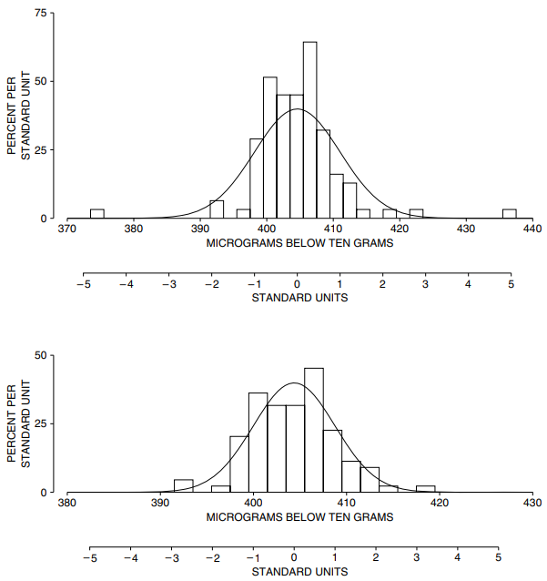

# Outliers

Các phép đo được báo cáo trong Bảng 1 fit với `normal curve`đến mức nào? Câu trả lời là, không tốt lắm. Phép đo #36 cách mức trung bình 3 `SD`; #86 và #94 là 5 `SD` - một điều kỳ diệu nho nhỏ. Các phép đo cực đoan như vậy được gọi là các `outlier`. Chúng không phải là kết quả của những sai lầm ngớ ngẩn. Theo như Bureau có thể nói, không có gì sai sót khi thực hiện 3 quan sát này. Tuy nhiên, 3 `outlier` đã làm tăng `SD`. Do đó, tỷ lệ phần trăm kết quả rơi gần mức trung bình hơn một `SD` là 86% - lớn hơn một chút so với mức 68% được dự đoán bởi `normal curve`.

Khi 3 `outlier` bị loại bỏ, 97 phép đo còn lại có trung bình là 404 microgram dưới 10 gram, `SD` chỉ là 4 microgam. Mức trung bình không thay đổi nhiều nhưng `SD` giảm khoảng 30%. Như Hình 2 cho thấy, 97 phép đo còn lại tiến gần hơn đến `normal curve`. Tóm lại, hầu hết dữ liệu đều có `SD` khoảng 4 microgram. Nhưng một số phép đo cách xa mức trung bình hơn một chút so với mức `SD` đề xuất. `SD` tổng thể là 6 microgram là sự thỏa hiệp giữa `SD` của phần chính của `histogram` - 4 microgram và `outlier`.

**
Hình 2. Các `outlier`. Bảng trên cùng hiển thị `histogram` cho tất cả 100 phép đo trên NB10; một `normal curve` được vẽ để so sánh. Đường cong không fit tốt lắm. Bảng thứ hai hiển thị dữ liệu đã loại bỏ 3 `outlier`. Đường cong fit tốt hơn. Hầu hết dữ liệu đều tuân theo `normal curve`, nhưng một số phép đo cách xa mức trung bình hơn nhiều so với đường cong gợi ý.
**

Trong công việc đo lường cẩn thận, dự kiến sẽ có một tỷ lệ nhỏ `outlier`. Khía cạnh bất thường duy nhất của dữ liệu NB10 là `outlier` được báo cáo. Đây là những gì Bureau phải nói về việc **không** báo cáo `outlier`[^4]. Đối với công văn chính thức, giọng điệu khá nghiêm khắc.

_Khó khăn lớn nhất trong việc áp dụng các phương pháp thống kê để phân tích dữ liệu đo lường là việc thu thập được các bộ sưu tập dữ liệu phù hợp. Vấn đề thường liên quan đến những nỗ lực có ý thức hoặc có lẽ là vô thức để làm cho một quy trình cụ thể hoạt động như người ta mong muốn nó thực hiện hơn là chấp nhận hiệu suất thực tế.... Việc từ chối dữ liệu trên cơ sở giới hạn hiệu suất tùy ý một cách nghiêm ngặt làm sai lệch ước tính về độ biến thiên của quá trình thực tế. Những thủ tục như vậy làm mất đi mục đích của...chương trình. Các tham số hiệu suất thực tế yêu cầu chấp nhận tất cả dữ liệu không thể bị từ chối vì lý do chính đáng._

Có một sự lựa chọn khó khăn khi các nhà điều tra nhìn thấy một `outlier`. Hoặc là họ phớt lờ nó, hoặc họ phải thừa nhận rằng các phép đo của họ không tuân theo `normal curve`. Uy tín của đường cong cao đến mức lựa chọn đầu tiên là lựa chọn thông thường - một chiến thắng của lý thuyết trước kinh nghiệm.

[^4]: P. E. Pontius, “Measurement philosophy of the pilot program for mass calibration,” NBS Technical Note No. 288 (1966). The Bureau rejects outliers only “for cause, such as door-slam or equipment malfunction.” Also see H. H. Ku, editor, Precision Measurement and Calibration, NBS Special Publication no. 300, vol. 1 (Washington, D.C., 1969).
