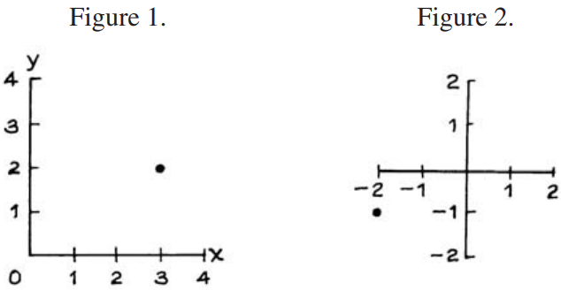

# Reading Points of a Graph

Chương này ôn lại một số ý tưởng về cách vẽ điểm và đường sẽ được sử dụng trong Phần III. Bạn có thể đọc chương này ngay bây giờ hoặc quay lại chương này nếu bạn gặp khó khăn trong Phần III. Nếu bạn đọc chương này bây giờ thì 4 phần đầu tiên là quan trọng nhất; phần cuối khó hơn.

Hình 1 thể hiện trục hoành (trục x) và trục tung (trục y). Điểm hiển thị trong hình có tọa độ x là 3, vì nó thẳng hàng với 3 trên trục x. Nó có tọa độ y là 2, vì nó thẳng hàng với 2 trên trục y. Điểm này được viết x = 3, y = 2. Đôi khi, nó còn được viết tắt hơn nữa là (3, 2). Điểm thể hiện trong hình 2 là (−2, −1): nó nằm ngay dưới −2 trên trục x và ngay bên trái −1 trên trục y.

Ý tưởng biểu diễn điểm bằng các cặp số là của René Descartes(Pháp, 1596–1650). Để vinh danh ông, tọa độ x và y thường được gọi là "cartesian coordinates".
