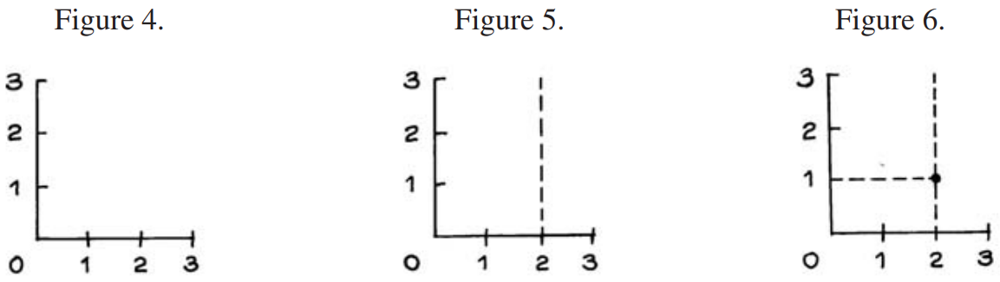

# Plotting Points

Hình 4 cho thấy một cặp trục. Để vẽ điểm **(2, 1)**, hãy tìm số **2** trên trục _x_. Điểm sẽ ở ngay phía trên điểm này, như trong Hình 5. Tìm số **1** trên trục _y_, điểm sẽ nằm ngay bên phải điểm này, như trong Hình 6.

