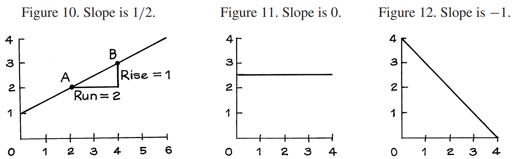
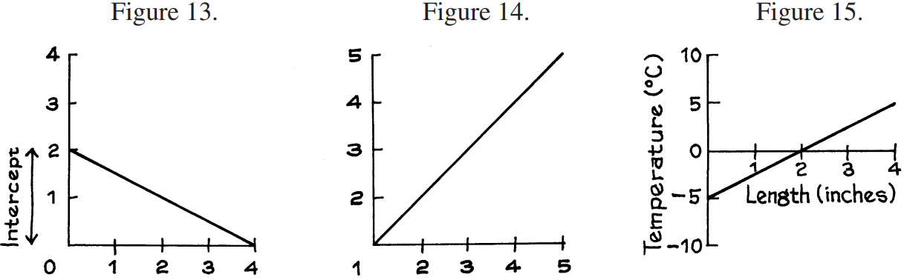

# Slope and Intercept

Hình 10 cho thấy một đường thẳng. Lấy bất kỳ điểm nào trên đường thẳng - ví dụ: điểm A. Bây giờ di chuyển đường thẳng lên bất kỳ điểm nào khác - ví dụ: điểm B. Tọa độ _x_ của bạn đã tăng lên một lượng nào đó, gọi là `run`. Trong trường hợp này, `run` là **2**. Đồng thời, tọa độ _y_ của bạn đã tăng thêm một lượng khác, được gọi là `rise`. Trong trường hợp này, `rise` là **1**. Lưu ý rằng trong trường hợp này, `rise` là một nửa `run`. Dù bạn đạt được hai điểm nào trên đường này thì `rise` sẽ là một nửa `run`. Tỷ lệ `riste`/`run` được gọi là `slope` của đường thẳng:

\\[
slope = \frac{rise}{run}
\\]

`slope` là tốc độ _y_ tăng theo x, dọc theo đường thẳng. Để giải thích nó theo cách khác, hãy tưởng tượng đường này giống như một con đường đi lên đồi. The `slope` measures the steepness of the grade. Đối với đường thẳng trong Hình 10, `slope` là **1** trên **2** - khá dốc đối với một con đường. Trong Hình 11, `slope` của đường thẳng là **0**. Trong hình 12, `slope` là **−1**. Nếu `slope` dương thì đường này đang đi lên dốc. Nếu `slope` bằng **0** thì đường thẳng nằm ngang. Nếu `slope` âm thì đường thẳng sẽ xuống dốc.

`intercept` của một đường thẳng là chiều cao của nó tại \\(x = 0\\). Thông thường, các trục cắt nhau tại **0**. Khi đó, `intercept` là nơi đường thẳng cắt trục y. Trong Hình 13, `intercept` là **2**. Đôi khi, các trục không giao nhau tại **0** và khi đó bạn phải cẩn thận một chút. Trong hình 14, các trục cắt nhau tại **(1, 1)**. `intercept` của đường thẳng trong Hình 14 là **0** - đó sẽ là chiều cao của nó tại \\(x = 0\\).

Thông thường, các trục của biểu đồ hiển thị đơn vị. Ví dụ, trong Hình 15 đơn vị cho trục _x_ là inch, đơn vị cho trục _y_ là độ C. Khi đó `slope` và `intercept` cũng có đơn vị. Trong Hình 15, `slope` của đường thẳng là **2.5** độ/inch; `intercept` là **−5** độ.

