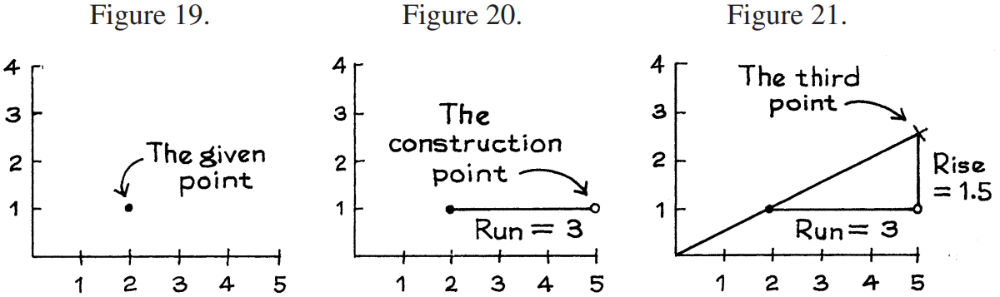

# Plotting Lines

_Ví dụ 1._ Vẽ đường thẳng đi qua điểm (2, 1) và có `slope` 1/2.

_Giải pháp._ Đầu tiên, vẽ một cặp trục và vẽ điểm đã cho (2, 1), như trong Hình 19. Sau đó di chuyển bất kỳ khoảng cách thuận tiện nào trực tiếp sang bên phải so với điểm đã cho: Hình 20 thể hiện `run` 3. Tạo điểm mốc tại điểm mới này. Vì đường dốc lên nên nó đi qua điểm mốc. Bao xa? Nghĩa là, dòng sẽ `rise` bao nhiêu trong 3 `run`? Câu trả lời được đưa ra bởi `slope`. Đường này đang tăng với tốc độ nửa đơn vị dọc trên một đơn vị ngang và trong trường hợp này có 3 đơn vị ngang, do đó `rise` là 3 × 1/2 = 1.5:

\\[
rise = run \times slope
\\]

Thực hiện di chuyển theo chiều dọc 1,5 từ điểm mốc và đánh dấu một điểm ở vị trí thứ ba này, như trong Hình 21. Điểm này nằm trên đường thẳng. Đặt thước xuống và nối nó với điểm đã cho (2, 1).

