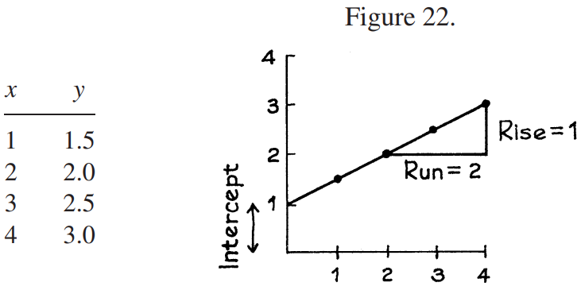
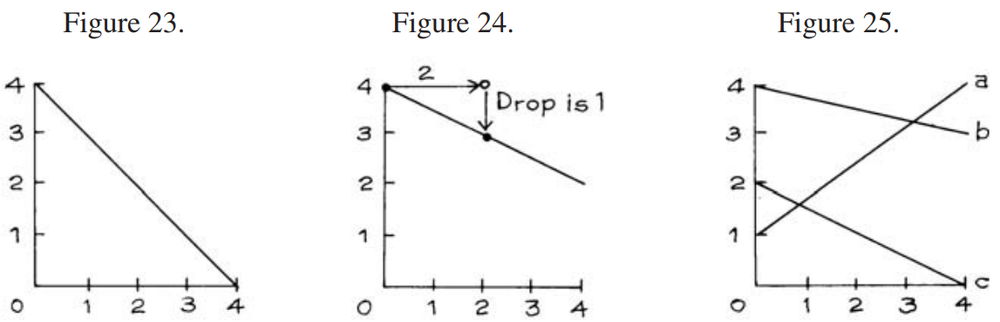

# The Algebraic Equation For a Line

_Ví dụ 2._ Đây là quy tắc tính tọa độ y của một điểm từ tọa độ x của nó: \\(y = \frac{1}{2}x + 1\\). Bảng dưới đây thể hiện các điểm với tọa độ x là 1, 2, 3, 4. Vẽ đồ thị các điểm. Họ có nằm trên một đường? Nếu vậy, hãy tìm `slope` và `intercept` của đường này.

_Giải pháp._ Các điểm được vẽ trong Hình 22. Chúng nằm trên một đường thẳng. Bất kỳ điểm nào có tọa độ y liên hệ với tọa độ x của nó theo cùng một phương trình \\(y = \frac{1}{2}x + 1\\) sẽ nằm trên cùng một đường thẳng. Đường này được gọi là đồ thị của phương trình. `slope` của đường thẳng là \\(\frac{1}{2}\\) , hệ số của x trong phương trình. `intercept` là 1, số hạng không đổi trong phương trình.

> Đồ thị của phương trình \\( y = mx + b\\) là một đường thẳng, có `slope` m và `intercept` b.

_Ví dụ 3._ Hình 23 hiển thị một đường thẳng. Phương trình của đường này là gì? Chiều cao của đường này tại x = 1 là bao nhiêu?

_Giải pháp._ Đường thẳng này có `slope` −1 và `intercept` bằng 4. Do đó, phương trình của nó là \\(y = −x + 4\\). Thay x = 1 thì y = 3; vì vậy chiều cao của đường thẳng là 3 khi x bằng 1.

_Ví dụ 4._ Vẽ đường thẳng có phương trình \\(y = −\frac{1}{2}x + 4\\).

_Giải pháp._ `intercept` của đường thẳng này là 4. Vẽ điểm (0, 4) như Hình 24. Đường thẳng phải đi qua điểm này. Thực hiện dịch ngang bất kỳ - ví dụ 2. `slope` là \\(−\frac{1}{2}\\), do đó đường thẳng phải giảm 1. Đánh dấu điểm nằm trên 2 và dưới 1 so với điểm đầu tiên trong Hình 24. Sau đó nối hai điểm này bằng một đường thẳng.

