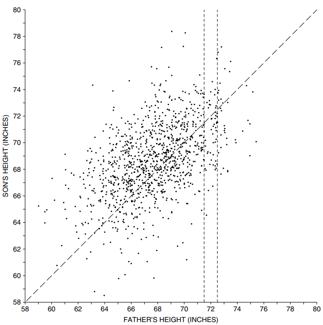
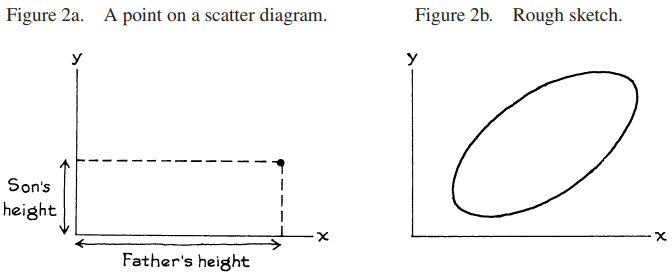
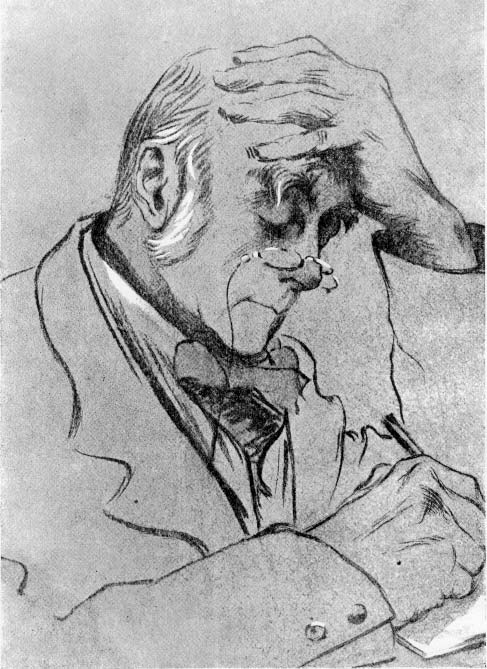

# The Scatter Diagram

Các phương pháp được thảo luận ở Phần II rất tốt để xử lý từng biến một. Cần có những phương pháp khác để nghiên cứu mối quan hệ giữa hai biến[^1]. Francis Galton (Anh, 1822-1911) đã đạt được một số tiến bộ trong lĩnh vực này khi ông đang suy nghĩ về mức độ mà con cái giống cha mẹ chúng. Các nhà thống kê ở nước Anh thời Victoria bị mê hoặc bởi ý tưởng định lượng ảnh hưởng di truyền và thu thập lượng dữ liệu khổng lồ để theo đuổi mục tiêu này. Chúng ta sẽ xem xét kết quả của một nghiên cứu được thực hiện bởi đệ tử của Galton là Karl Pearson (Anh, 1857–1936)[^2].

Là một phần của nghiên cứu, Pearson đã đo chiều cao của 1.078 người cha và con trai họ khi trưởng thành. Thật khó để nắm bắt được danh sách 1.078 cặp độ cao. Nhưng mối quan hệ giữa hai biến số – chiều cao của cha và chiều cao của con trai - có thể được thể hiện bằng `scatter diagram` (Hình 1 ở trang tiếp theo). Mỗi dấu chấm trên sơ đồ tượng trưng cho một cặp cha con. Tọa độ x của dấu chấm đo dọc theo trục hoành cho biết chiều cao của người cha. Tọa độ y của điểm dọc theo trục tung cho biết chiều cao của con trai.

**
Hình 1. `scatter diagram` về chiều cao của 1.078 ông bố và con trai. Cho thấy mối liên hệ tích cực giữa chiều cao của con trai và chiều cao của bố. Các gia đình có chiều cao của con trai bằng chiều cao của cha được vẽ dọc theo đường 45 độ y = x. Những gia đình có người cha cao 72 inch (tính đến inch gần nhất) được vẽ trên dải dọc hình ống khói.
**

Hình 2a minh họa cơ chế vẽ `scatter diagram`. (Chương 7 có thông tin chi tiết.) `scatter  diagram` trong Hình 1 là một đám mây có hình dạng giống quả bóng đá, với các điểm nằm rải rác ở các cạnh. Khi tạo một bản phác thảo thô của `scatter diagram` như vậy, chỉ cần hiển thị phần hình bầu dục chính - Hình 2b.

Nhóm các điểm trong Hình 1 dốc lên về phía bên phải, tọa độ y của các điểm có xu hướng tăng theo tọa độ x của chúng. Một nhà thống kê có thể nói rằng có mối liên hệ tích cực giữa chiều cao của người cha và con trai. Thông thường, những người cha cao hơn thì con trai cao hơn. Điều này xác nhận điều hiển nhiên. Bây giờ hãy nhìn vào đường 45 độ trong Hình 1. Đường này tương ứng với những gia đình có chiều cao của con trai bằng chiều cao của cha. Ví dụ, nếu người cha cao 72 inch thì con trai cao 72 inch; nếu người cha cao 64 inch thì con trai cũng cao chừng đó; và cứ như vậy.

Có rất nhiều khoảng cách xung quanh đường 45 độ trong `scatter diagram` thực tế so với trong Hình 3. Sự chênh lệch này cho thấy điểm yếu của mối quan hệ giữa chiều cao của cha và chiều cao của con trai. Ví dụ, giả sử bạn phải đoán chiều cao của một đứa con trai. Chiều cao của bố giúp ích cho bạn bao nhiêu? Trong Hình 1, các chấm trong ống khói đại diện cho tất cả các cặp cha-con trong đó người cha cao từ 72 inch đến inch gần nhất (chiều cao của người cha từ 71,5 inch đến 72,5 inch, trong đó các đường thẳng đứng nét đứt cắt ngang trục x). Vẫn có rất nhiều sự thay đổi về chiều cao của các con trai, được biểu thị bằng sự phân tán theo chiều dọc trong ống khói. Ngay cả khi bạn biết chiều cao của người cha, vẫn có rất nhiều sai sót khi cố gắng đoán chiều cao của con trai mình.

> Nếu có mối liên hệ chặt chẽ giữa hai biến thì việc biết một biến sẽ giúp ích rất nhiều cho việc dự đoán biến kia. Nhưng khi có mối liên hệ yếu, thông tin về một biến không giúp ích nhiều cho việc đoán biến kia.

Trong các nghiên cứu khoa học xã hội về mối quan hệ giữa hai biến, người ta thường gắn nhãn một biến là `independent` và biến kia là `dependent`. Thông thường, biến `independent` được cho là có ảnh hưởng đến biến `dependent`, hơn là ngược lại. Trong Hình 1, chiều cao của người cha được lấy làm biến `independent` và được vẽ dọc theo trục x: chiều cao của người cha ảnh hưởng đến chiều cao của con trai. Tuy nhiên, không có gì có thể ngăn cản người điều tra sử dụng chiều cao của con trai làm biến `independent`. Lựa chọn này có thể phù hợp, ví dụ, nếu vấn đề là đoán chiều cao của người cha từ chiều cao của con trai ông ta.

**
Sir Francis Galton (England, 1822-1911). Source: _Biometrika_(November, 1903)
**

Trước khi tiếp tục, bạn nên thực hiện các bài tập của phần này. Chúng rất dễ dàng và thực sự sẽ giúp bạn hiểu phần còn lại của chương này. Nếu bạn gặp rắc rối với chúng, hãy xem lại Chương 7.

[^1]: Có nhiều phương pháp để xử lý nhiều hơn hai biến, nhưng chúng khá phức tạp. Một số đại số cần ma trận để theo dõi cuộc thảo luận. Tham khảo:

    M. L. Eaton, Multivariate Statistics: A Vector Space Approach (John Wiley & Sons, 1983).
    D. A. Freedman, Statistical Models: Theory and Practice (Cambridge University Press,
    2005).
    C. R. Rao, Linear Statistical Inference and Its Applications, 2nd ed. (John Wiley & Sons,
    1973).
    J. A. Rice, Mathematical Statistics and Data Analysis, 3d ed. (Duxbury Press, 2005).
    H. Scheffe,´ The Analysis of Variance (John Wiley & Sons, 1961).
    G. A. F. Seber and Alan J. Lee, Linear Regression Analysis (John Wiley & Sons, 2003).
    Có một cuộc thảo luận ngắn gọn về hồi quy bội trong Phần 3 của Chương 12.

[^2]: K. Pearson và A. Lee, "On the laws of inheritance in man," Biometrika vol. II (1903) trang 357 - 462. Bảng _xxii_ của họ đưa ra sự phân bố chung, với chiều cao được làm tròn đến inch gần nhất. Chúng tôi đã thêm nhiễu đồng đều để có được dữ liệu liên tục. Do sự ngẫu nhiên hóa độc lập, tập dữ liệu ở đây hơi khác so với tập dữ liệu trong ấn bản đầu tiên của chúng tôi.
