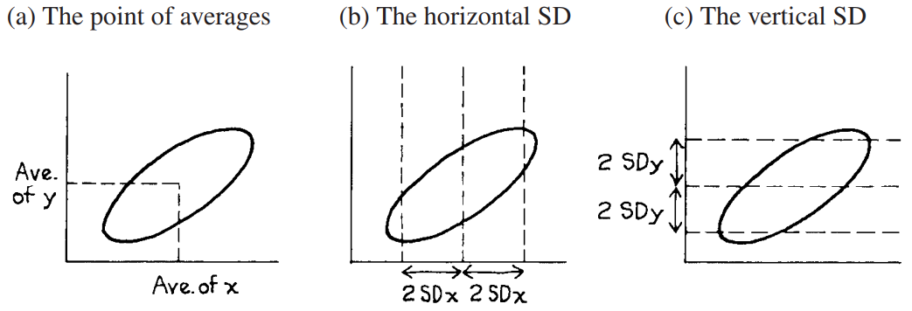
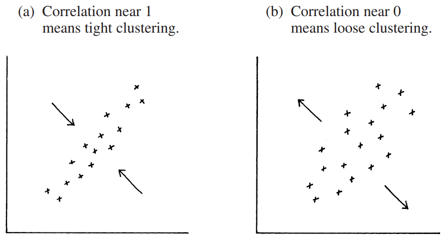
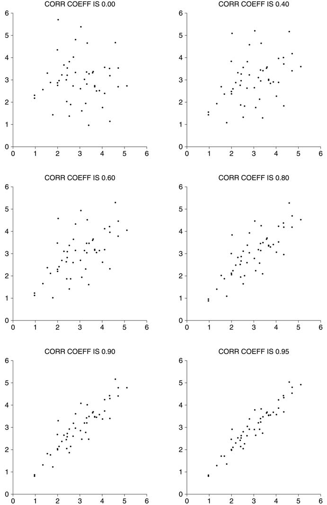

# The Correlation Coefficient

Giả sử bạn đang xem xét mối quan hệ giữa hai biến và đã vẽ `scatter diagram`. Biểu đồ là một đám mây điểm có hình quả bóng đá. Làm thế nào để tóm tắt? Bước đầu tiên là đánh dấu một điểm thể hiện giá trị trung bình của các giá trị x và giá trị trung bình của các giá trị y (Hình 4a). Đây là _các điểm trung bình_, xác định vị trí trung tâm của đám mây[^3]. Bước tiếp theo sẽ là đo mức độ lan rộng của đám mây từ bên này sang bên kia. Điều này có thể được thực hiện bằng cách sử dụng `SD` của giá trị x - `SD` ngang. Hầu hết các điểm sẽ nằm trong **2** `SD` ngang ở hai bên điểm trung bình (Hình 4b). Tương tự, `SD` của các giá trị y - `SD` dọc - có thể được sử dụng để đo mức độ lan truyền của đám mây từ trên xuống dưới. Hầu hết các điểm sẽ nằm trong phạm vi **2** `SD` dọc trên hoặc dưới điểm trung bình (Hình 4c).

**
Hình 4. Tóm tắt một `scatter diagram`
**

Cho đến nay, số liệu thống kê tóm tắt là

- trung bình của các giá trị x, `SD` của các giá trị x,
- trung bình của các giá trị y, `SD` của các giá trị y.

Những số liệu thống kê này cho chúng ta biết trung tâm của đám mây và mức độ lan rộng của nó, cả theo chiều ngang và chiều dọc. Nhưng vẫn còn thiếu một điều gì đó - mức độ liên hệ giữa hai biến. Nhìn vào các `scatter diagram` trong Hình 5.

**
Hình 5. Tóm tắt `scatter diagram`. `correlation coefficient` đo lường sự phân cụm xung quanh một đường.
**

Cả hai đám mây đều có cùng tâm và có cùng độ trải rộng, theo chiều ngang và chiều dọc. Tuy nhiên, các điểm trong đám mây đầu tiên được tập hợp chặt chẽ xung quanh một đường: có mối liên hệ tuyến tính mạnh mẽ giữa hai biến. Ở đám mây thứ hai, việc phân cụm lỏng lẻo hơn nhiều. Mức độ liên kết là khác nhau trong hai sơ đồ. Để đo lường mối liên hệ, cần có thêm một thống kê tóm tắt nữa - `correlation coefficient`. Hệ số này thường được viết tắt là **_r_** mà không có lý do chính đáng (mặc dù có hai chữ r trong từ "correlation").

> `correlation coefficient` là thước đo của sự liên kết tuyến tính hoặc phân cụm xung quanh một đường. Mối quan hệ giữa hai biến có thể được tóm tắt bằng
>
> - trung bình của các giá trị x, `SD` của các giá trị x,
> - trung bình của các giá trị y, `SD` của các giá trị y,
> - `correlation coefficient` **_r_**.

Công thức tính **_r_** sẽ được trình bày trong Phần 4, nhưng bây giờ chúng ta muốn tập trung vào việc diễn giải bằng đồ họa. Hình 6 hiển thị 6 `scatter diagram` cho dữ liệu giả định, mỗi biểu đồ có **50** điểm. Các sơ đồ được tạo ra bởi máy tính. Trong tất cả 6 hình, giá trị trung bình là **3** và `SD` là **1** đối với x và y. Máy tính đã in giá trị `correlation coefficient` trên từng biểu đồ. Cái ở trên cùng bên trái cho thấy mối tương quan bằng **0**. Đám mây hoàn toàn vô dạng. Khi x tăng, y không có xu hướng tăng hay giảm: nó chỉ lảng vảng xung quanh.

`scatter diagram` tiếp theo có **_r_** = **0.40**; một mô hình tuyến tính đang bắt đầu xuất hiện. Cái tiếp theo có **_r_** = **0.60**, với mẫu tuyến tính mạnh hơn. Và cứ thế, đến cái cuối cùng. **_r_** càng gần **1** thì mối liên hệ tuyến tính giữa các biến càng mạnh và các điểm xung quanh một đường càng được phân cụm chặt chẽ hơn. Mối tương quan bằng **1**, không xuất hiện trong hình, thường được gọi là _mối tương quan hoàn hảo_ - tất cả các điểm đều nằm chính xác trên một đường thẳng, do đó có mối quan hệ tuyến tính hoàn hảo giữa các biến. Mối tương quan luôn bằng **1** hoặc ít hơn.
Mối tương quan giữa chiều cao của các cặp song sinh giống hệt nhau là khoảng **0.95**[^4], `scatter diagram` phía dưới bên phải trong Hình 6 có `correlation coefficient` là **0.95**. `scatter diagram` cho cặp song sinh sẽ trông giống nhau. Các cặp song sinh giống hệt nhau có chiều cao giống nhau và các điểm của chúng trên `scatter diagram` khá gần với đường thẳng y = x. Tuy nhiên, những cặp song sinh như vậy không có chiều cao hoàn toàn giống nhau. Đó là những gì mà sự phân tán xung quanh đường **45** độ cho thấy.

Một ví dụ khác, ở Mỹ năm 2005, mối tương quan giữa thu nhập và giáo dục là **0.07** đối với nam giới ở độ tuổi 18 - 24, tăng lên **0.43** đối với nam giới ở độ tuổi 55 - 64[^5]. Như `scatter diagram` trong Hình 6 cho thấy, mối quan hệ giữa thu nhập và giáo dục của đàn ông lớn tuổi mạnh mẽ hơn nhưng vẫn còn khá thô. Mối liên hệ yếu là phổ biến trong các nghiên cứu khoa học xã hội, **0.3** đến **0.7** là phạm vi thông thường của **_r_** trong nhiều lĩnh vực.

Một lời cảnh báo: **_r_ = 0.80** không có nghĩa là **80%** số điểm được tập hợp chặt chẽ xung quanh một đường thẳng, cũng như không biểu thị độ tuyến tính cao gấp đôi so với **_r_ = 0.40**. Hiện tại, không có cách trực tiếp nào để diễn giải giá trị số chính xác của `correlation coefficient`; điều đó sẽ được thực hiện trong Chương 10 và 11.

**
Hình 6. `correlation coefficient` - 6 giá trị dương. Các sơ đồ được chia tỷ lệ sao cho giá trị trung bình bằng 3 và `SD` bằng 1, theo chiều ngang và chiều dọc; có 50 điểm trong mỗi sơ đồ. Phân cụm được đo bằng `correlation coefficient`.
**

Cho đến nay, chỉ có liên hệ tích cực được thảo luận. Mối liên hệ tiêu cực được biểu thị bằng dấu âm trong `correlation coefficient`. Hình 7 hiển thị thêm 6 `scatter diagram` cho dữ liệu giả định, mỗi biểu đồ có **50** điểm. Chúng được chia tỷ lệ giống như Hình 6, mỗi biến có trung bình là **3** và `SD` là **1**.

Ví dụ: mối tương quan **-0.90** cho thấy mức độ phân cụm tương tự như **+0.90**. Với dấu âm, việc phân cụm xung quanh một đường dốc xuống; với dấu dương, đường dốc lên. Đối với phụ nữ ở độ tuổi 25 - 39 ở Hoa Kỳ vào năm 2005, mối tương quan giữa trình độ học vấn và số con là khoảng **-0.2**, một mối liên hệ tiêu cực yếu[^6]. Một mối tương quan âm hoàn hảo bằng **-1** cho thấy rằng tất cả các điểm đều nằm trên một đường dốc xuống .

Mối tương quan luôn nằm trong khoảng **-1** và **1**, có thể nhận bất kỳ giá trị nào ở giữa. Mối tương quan dương có nghĩa là đám mây dốc lên; khi một biến tăng thì biến kia cũng tăng. Tương quan âm có nghĩa là đám mây dốc xuống; khi một biến tăng thì biến kia giảm.

Trong tập dữ liệu thực, cả hai `SD` sẽ dương. Về mặt kỹ thuật, nếu SD bằng **0** thì không có cách nào tốt để xác định `correlation coefficient`.

---

[^3]: "Điểm trung bình" không phải là một thuật ngữ tiêu chuẩn.

[^4]: H. N. Newman, F. N. Freeman, and K. J. Holzinger, Twins: A Study of Heredity and Environment(University of Chicago Press, 1937).Trong các nghiên cứu về cặp song sinh, quy ước là vẽ đồ thị cho mỗi cặp song sinh hai lần; một lần là (x, y) và một lần là (y, x).

[^5]: Data from the March 2005 Current Population Survey; a CD-ROM was supplied by the Bureau of the Census. Income is from 2004, and was censored at $150,000: this reduces the mean and the SD, but increases the correlation by a little. Starting in 1992, the Current Population Survey (CPS) reports educational attainment in categories, for instance, "1st–4th grade" or "some college, no degree." See Monthly Labor Review, September 1993, pp. 34–38. Single years of education were imputed from grouped data. The correlation between the imputed educational level and the ordered categorical variable used in the CPS is about 0.97.

[^6]: See note 5. “Number of children” is number of own, never-married children under the age of 18. (The data are for women age 25–39, and the correlation depends to some extent on the age range that is used.) Weights must be used here, because the March CPS over-samples large families(note 3 to chapter 3).
