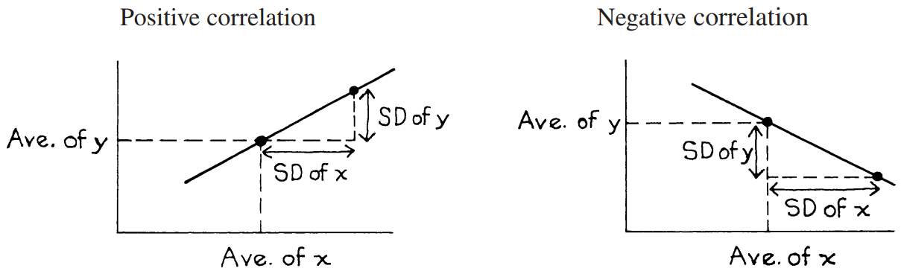

# The SD Line

Các điểm trong `scatter diagram` thường tập trung xung quanh `SD line`. Đường này đi qua điểm trung bình; và nó đi qua tất cả các điểm có số `SD` bằng nhau so với mức trung bình, cho cả hai biến. Ví dụ: lấy `scatter diagram` hiển thị chiều cao và cân nặng. Một người tình cờ có chiều cao trên trung bình **1** `SD` và cân nặng trên trung bình **1** `SD` sẽ được vẽ trên `SD line`. Nhưng một người cao hơn mức trung bình **1** `SD` và cân nặng trên mức trung bình **0.5** `SD` sẽ là không phù hợp. Tương tự, một người có chiều cao dưới mức trung bình **2** `SD` và cân nặng dưới mức trung bình **2** `SD` sẽ nằm trên đường thẳng. Một người nào đó có chiều cao dưới mức trung bình **2** `SD` và cân nặng dưới mức trung bình **2.5** `SD` sẽ không phù hợp.

Hình 8 cho thấy cách vẽ `SD line` trên biểu đồ. Đường này đi qua điểm trung bình và tăng lên với tốc độ **1** `SD` dọc cho mỗi `SD` ngang. Về mặt kỹ thuật hơn, độ dốc là tỷ lệ.

\\[
\frac{\text{SD of y}}{\text{SD of x}}
\\]

Điều này là dành cho mối tương quan tích cực. Khi hệ số tương quan âm, `SD line` đi xuống; độ dốc là[^7]

\\[
-\frac{\text{SD of y}}{\text{SD of x}}
\\]

**
Hình 8. Vẽ `SD line`
**
