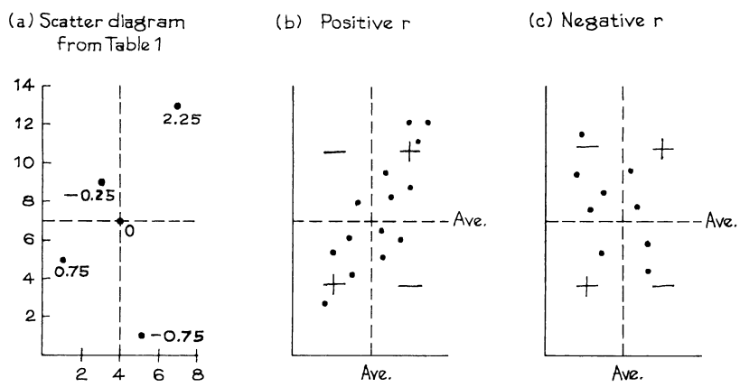

# Computing The Correlation Coefficient

Đây là quy trình tính `correlation coefficient`.

> Chuyển đổi từng biến thành `standard unit`. Giá trị trung bình của phép nhân cho ra `correlation coefficient`.

(`standard unit` đã được thảo luận ở [Mục 5.1][sec5.1]) Quy trình này có thể được đưa ra dưới dạng công thức, trong đó x là biến đầu tiên, y là biến thứ hai và r là `correlation coefficient`:

\\[
r = \text{average of (x in standard units)} \times \text{y in standard units}
\\]

_Ví dụ 1._ Tính r cho dữ liệu giả định trong Bảng 1.

**
Bảng 1. Dữ liệu
**

| x   | y   |
| --- | --- |
| 1   | 5   |
| 3   | 9   |
| 4   | 7   |
| 5   | 1   |
| 7   | 13  |

_Note._ Hàng đầu tiên của Bảng 1 thể hiện hai thước đo về một chủ đề trong nghiên cứu; hai số là tọa độ x và y của điểm tương ứng trên `scatter diagram`. Tương tự cho các hàng khác. Vấn đề ghép nối: r chỉ được xác định khi bạn có hai biến và cả hai đều được đo cho mọi đối tượng trong nghiên cứu.

_Giải pháp._ Được trình bày như trong Bảng 2.

_Bước 1._ Đổi giá trị x thành `standard unit`, như trong Chương 5. Việc này tốn khá nhiều công sức. Trước tiên, bạn phải tìm giá trị trung bình và `SD` các giá trị của x:
\\[
\text{average of x-values = 4, SD = 2}
\\]

Sau đó, bạn phải trừ giá trị trung bình từ mỗi giá trị của x và chia cho `SD`:

\\[
\frac{1-4}{2}=-1.5 \quad \frac{3-4}{2}=-0.5 \quad \frac{4-4}{2}=0 \quad \frac{5-4}{2}=0.5 \quad \frac{7-4}{2}=1.5
\\]

Các kết quả nằm trong cột thứ ba của Bảng 2. Các con số cho bạn biết giá trị của x ở trên hoặc dưới mức trung bình bao nhiêu tính theo `SD`. Chẳng hạn, giá trị 1 là dưới mức trung bình 1.5 `SD`.

**
Bảng 2. Tính _r_
**

| x   | y   | x in standard units | y in standard units | Product |
| --- | --- | ------------------- | ------------------- | ------- |
| 1   | 5   | -1.5                | -0.5                | 0.75    |
| 3   | 9   | -0.5                | 0.5                 | -0.25   |
| 4   | 7   | 0.0                 | 0.0                 | 0.00    |
| 5   | 1   | 0.5                 | -1.5                | -0.75   |
| 7   | 13  | 1.5                 | 1.5                 | 2.25    |

_Bước 2._ Đổi giá trị của y sang `standard unit`; kết quả sẽ được ghi vào cột thứ 4 của bảng. Điều đó kết thúc phần tồi tệ nhất của số học.

_Bước 3._ Với mỗi hàng của bảng, hãy tính tích

\\[
\text{(x in standard units)} \times \text{(y in standard units)}
\\]

Các tích đi vào cột cuối cùng của bảng.

_Bước 4._ Lấy giá trị trung bình của các tích:

\\[
\begin{equation}
\begin{split}
r & = \text{average of (x in standard units)} \times \text{(y in standard units)}\\\\
& = \frac{0.75- 0.25 + 0.00 - 0.75 + 2.25}{5} = 0.40
\end{split}
\end{equation}
\\]

Nếu bạn vẽ `scatter diagram` cho dữ liệu (Hình 9a), các điểm sẽ dốc lên nhưng chỉ được phân cụm một cách lỏng lẻo.

Tại sao r lại được coi là thước đo của sự liên kết? Trong Hình 9a, các tích được đánh dấu ở các chấm tương ứng. Các đường ngang và dọc được vẽ qua điểm trung bình, chia `scatter diagram` thành bốn góc phần tư. Nếu một điểm nằm ở góc phần tư phía dưới bên trái thì cả hai biến đều dưới mức trung bình và `standard unit` âm; tích của hai số âm là số dương. Ở góc phần tư phía trên bên phải, tích của hai số dương là dương. Trong hai góc phần tư còn lại, tích của số dương và số âm là số âm. Giá trị trung bình của tất cả các tích này là `correlation coefficient`. Nếu r dương thì các điểm trong hai góc phần tư dương sẽ chiếm ưu thế, như trong Hình 9b. Nếu r âm, các điểm trong hai góc phần tư âm sẽ chiếm ưu thế, như trong Hình 9c.

  

[sec5.1]: ../ch05/ch05-01.md
