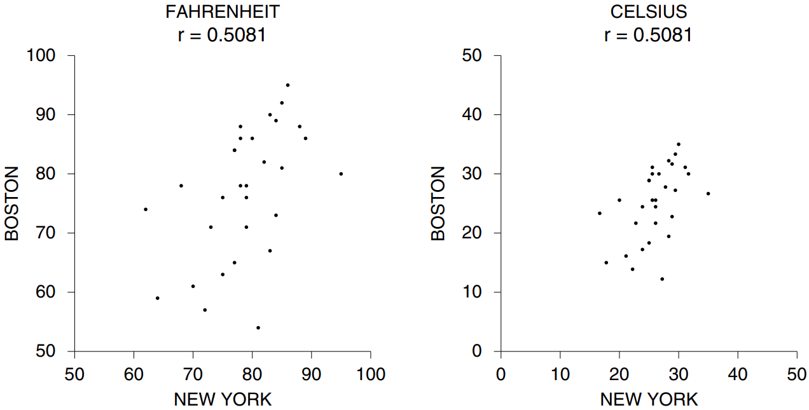
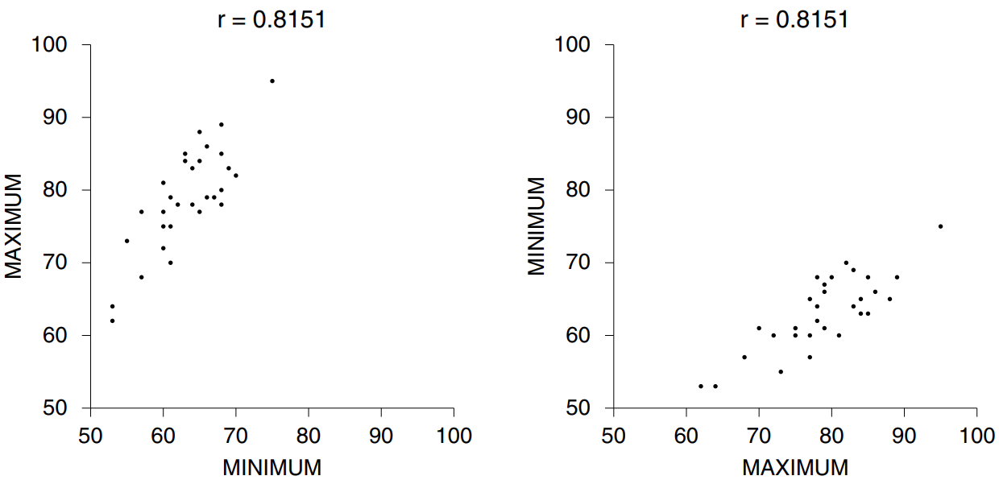

# Features of the Correlation Coefficient

`correlation coefficient` là một số thuần túy. Tại sao? Vì bước đầu tiên trong tính toán **_r_** là chuyển đổi sang `standard unit`. Các đơn vị ban đầu - như inch cho dữ liệu chiều cao hoặc độ cho dữ liệu nhiệt độ - bị loại bỏ. Theo cách tương tự, **_r_** không bị ảnh hưởng nếu bạn nhân tất cả các giá trị của một biến với cùng một số dương hoặc nếu bạn cộng cùng một số vào tất cả các giá trị của một biến. (Như một nhà thống kê có thể nói, **_r_** không bị ảnh hưởng bởi những thay đổi về quy mô; xem [Mục 5.6][sec5.6])

Ví dụ: nếu bạn nhân mỗi giá trị của x với **3** thì giá trị trung bình sẽ được nhân với **3**. Tất cả độ lệch so với giá trị trung bình cũng được nhân với **3** và `SD` cũng vậy. Yếu tố chung này bị hủy bỏ khi chuyển sang `standard unit`. Vậy **_r_** vẫn giữ nguyên. Trong một ví dụ khác, giả sử bạn cộng **7** vào mỗi giá trị của x. Khi đó trung bình của x cũng tăng lên **7**. Tuy nhiên, độ lệch so với mức trung bình không thay đổi. **_r_** cũng vậy.

Hình 1 (ở trang tiếp theo) cho thấy mối tương quan giữa nhiệt độ tối đa hàng ngày tại New York và Boston. Có một dấu chấm trong biểu đồ cho mỗi ngày của tháng 6 năm 2005. Nhiệt độ ở New York ngày hôm đó được vẽ trên trục hoành; nhiệt độ Boston theo phương thẳng đứng. Phần bên trái thực hiện theo độ F và **_r_** = **0.5081**. Phần bên phải thực hiện theo độ C và **_r_** giữ nguyên[^1]. Việc chuyển từ F sang C chỉ là sự thay đổi tỷ lệ, không ảnh hưởng đến mối tương quan.

<center></center>

**<center>Hình 1. Nhiệt độ tối đa hàng ngày. New York và Boston, tháng 6 năm 2005. Phần bên trái biểu thị dữ liệu theo độ F; Phần bên bên phải tính bằng độ C. Điều này không làm thay đổi **_r_**.</center>**

Một đặc điểm khác: Mối tương quan giữa x và y cũng giống như mối tương quan giữa y và x. Ví dụ, phần bên trái trong Hình 2 là `scatter diagram` cho dữ liệu nhiệt độ tại New York vào tháng 6 năm 2005. Nhiệt độ tối thiểu mỗi ngày được vẽ trên trục ngang; tối đa, theo chiều dọc. Mối tương quan giữa nhiệt độ tối thiểu và tối đa là **0.8151**. Phần bên phải hiển thị chính xác dữ liệu tương tự. Lần này, mức tối thiểu được vẽ theo chiều dọc thay vì chiều ngang. Các hình ảnh trông khác nhau vì các điểm được phản ánh xung quanh đường chéo. Nhưng **_r_** vẫn giữ nguyên. Việc chuyển đổi thứ tự của các biến không ảnh hưởng đến **_r_**. Tại sao? Hãy nhớ rằng, **_r_** là giá trị trung bình của các tích sau khi chuyển sang `standard unit`. Tích không phụ thuộc vào thứ tự của các thừa số (\\( a \times b = b \times a\\)). Có thể ngạc nhiên là mối tương quan chỉ là **0.8151**, nhưng thời tiết lại đầy bất ngờ.

<center></center>

**<center>Hình 2. Nhiệt dộ hàng ngày. New York, June 2005.</center>**

> `correlation coefficient` là một số thuần túy, không có đơn vị. Nó không bị ảnh hưởng bởi việc
>
> - hoán đổi hai biến,
> - cộng cùng một số với tất cả các giá trị của một biến,
> - nhân tất cả các giá trị của một biến với cùng một số dương.

[^1]: The New York temperatures are measured at JFK; Boston, at Logan Airport. Data are from the Weather Undergound,

```
http://www.wunderground.com
```

[sec5.6]: ../ch05/ch05-06.md
