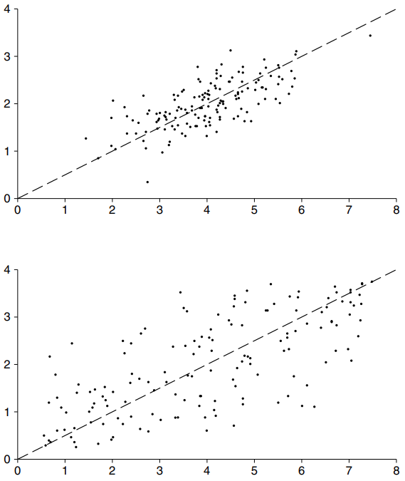

# Changing SDs

Hình dạng của `scatter diagram` phụ thuộc vào `SD`. Ví dụ, hãy nhìn vào Hình 3. Trong cả hai biểu đồ, **_r_** là **0.70**. Tuy nhiên, phần trên trông tập trung chặt chẽ hơn xung quanh đường `SD`. Đó là bởi `SD` của nó nhỏ hơn. Công thức của **_r_** liên quan đến việc chuyển đổi các biến thành `standard unit`: độ lệch so với giá trị trung bình được chia cho `SD`. Vì vậy, **_r_** đo lường việc phân cụm không phải theo thuật ngữ tuyệt đối mà theo thuật ngữ tương đối - so với `SD`.

**
Hình 3. Ảnh hưởng của việc thay đổi `SD`. Hai `scatter diagram` có cùng `correlation coefficient` là 0.70. Sơ đồ trên cùng trông tập trung chặt chẽ hơn xung quanh đường `SD` vì `SD` của nó nhỏ hơn.
**

Để giải thích `correlation coefficient` bằng đồ họa, hãy tưởng tượng `scatter diagram` sao cho `SD` dọc có cùng khoảng cách trên trang với `SD` dọc trong Hình 6 [Mục 8.2][sec8.2]; tương tự như vậy đối với `SD` ngang. Nếu **_r_** ứng với `scatter diagram` của bạn là **0.40**, thì nó có thể sẽ hiển thị cùng một lượng phân cụm xung quanh đường chéo như biểu đồ có **_r_** là **0.40** trong hình ở trên cùng bên phải. Nếu **_r_** là **0.90**, nó sẽ trông giống như sơ đồ trong hình ở phía dưới bên trái. Nói chung, `scatter diagram` của bạn sẽ khớp với biểu đồ có giá trị tương tự cho **_r_**.

[sec8.2]: ../ch08/ch08-02.md
