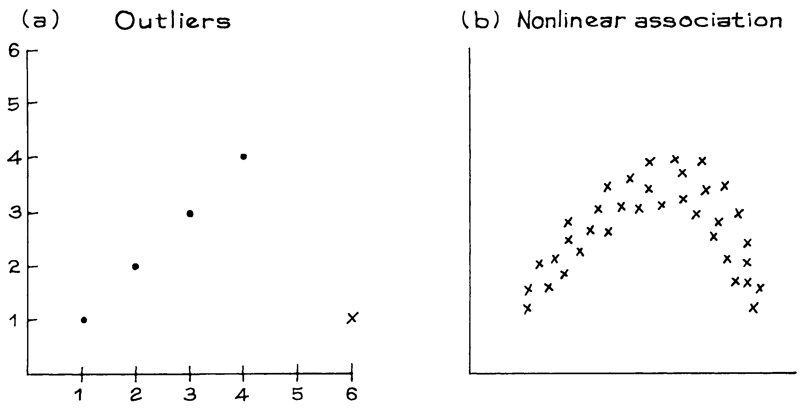

# Some Exceptional Case

`correlation doefficient` rất hữu ích cho các `scatter diagram` hình quả bóng đá. Đối với các sơ đồ khác, **r** có thể gây hiểu nhầm. Các ngoại lệ và phi tuyến tính là những trường hợp có vấn đề. Trong Hình 5a, các dấu chấm thể hiện mối tương quan hoàn hảo bằng **1**. `outlier`, được đánh dấu bằng dấu **x**, làm cho mối tương quan giảm xuống gần như bằng **0**. Hình 5a không nên được tóm tắt bằng cách sử dụng **r**. Một số người bị cuốn theo việc theo đuổi những `outlier`. Tuy nhiên, trong bất kỳ `scatter diagram` nào cũng sẽ có một số điểm ít nhiều tách ra khỏi phần chính của đám mây. Những điểm này chỉ nên bị từ chối nếu có lý do chính đáng để làm như vậy.

**
Hình 5. `correlation coefficient` có thể gây hiểu nhầm khi có sự xuất hiện của các `outlier` hoặc mối liên hệ phi tuyến.
**

Trong Hình 5b, `correlation coefficient` gần bằng **0**, mặc dù các điểm thể hiện mối liên hệ chặt chẽ. Lý do là vì đồ thị trông không giống một đường thẳng chút nào: khi **x** tăng thì **y** tăng rồi giảm. Mô hình này được thể hiện qua mối liên hệ giữa cân nặng và tuổi tác ở nam giới trưởng thành (Hình 3 [Mục 4.2][sec4.2]). Một lần nữa, dữ liệu đó không nên được tóm tắt bằng cách sử dụng **r** - the pattern gets lost.

>**r** đo lường sự liên quan tuyến tính, không phải sự liên quan nói chung.

[sec4.2]: ../ch04/ch04-02.md
