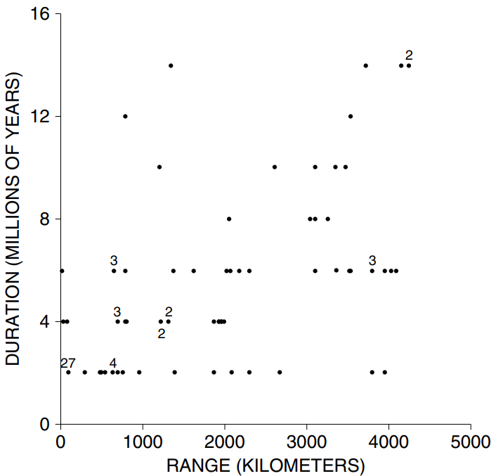
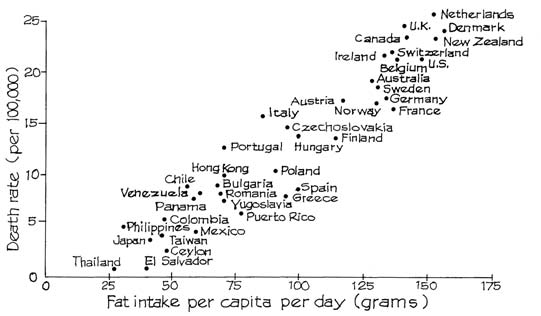

# Association is Not Causation

Đối với học sinh, cỡ giày có mối tương quan chặt chẽ với kỹ năng đọc. Tuy nhiên, học từ mới không làm cho bàn chân to ra. Thay vào đó, có yếu tố thứ ba liên quan đến tuổi tác. Khi trẻ lớn hơn, chúng học đọc tốt hơn và giày của chúng không vừa vặn nữa. (Theo thuật ngữ thống kê của Chương 2, tuổi tác là một yếu tố gây nhiễu.) Trong ví dụ này, yếu tố gây nhiễu rất dễ nhận ra. Thông thường, điều này không dễ dàng như vậy. Và phép tính số học của `correlation coefficient` không bảo vệ bạn trước các yếu tố thứ ba.[^5]

> Sự tương quan đo lường mối liên kết. Nhưng sự liên kết không giống nhân quả.

_Ví dụ 1._ _Giáo dục và thất nghiệp_. Trong cuộc Đại suy thoái 1929-1933, những người có trình độ học vấn cao hơn thường có thời gian thất nghiệp ngắn hơn. Giáo dục có bảo vệ bạn khỏi thất nghiệp không?

_Thảo luận._ Có lẽ, nhưng dữ liệu chỉ mang tính quan sát. Hóa ra, tuổi tác là một biến số gây nhiễu. Những người trẻ tuổi được giáo dục tốt hơn bởi vì trình độ học vấn ngày càng tăng lên theo thời gian. (Vẫn vậy.) Khi được lựa chọn trong việc tuyển dụng, các nhà tuyển dụng dường như thích những người tìm việc trẻ hơn. Việc kiểm soát độ tuổi khiến tác động của giáo dục lên tình trạng thất nghiệp yếu hơn nhiều.[^6]

_Ví dụ 2._ _Phạm vi và thời gian tồn tại của loài_. Liệu chọn lọc tự nhiên có hoạt động ở cấp độ loài không? Đây là một câu hỏi được một số nhà cổ sinh vật học quan tâm. David Jablonski lập luận rằng phạm vi địa lý là một đặc điểm di truyền của các loài: một loài có phạm vi phân bố rộng sẽ tồn tại lâu hơn, bởi vì nếu thảm họa xảy ra ở một nơi, loài đó vẫn sống sót ở những nơi khác.

**
Hình 7. Thời gian tồn tại của các loài tính bằng hàng triệu năm được vẽ theo phạm vi đồ họa địa lý tính bằng km, đối với 99 loài động vật chân bụng. Một số loài có thể được vẽ tại cùng một điểm; số lượng các loài như vậy được chỉ định bên cạnh điểm.
**

Một bằng chứng là `scatter diagram` (Hình 7). **99** loài động vật chân bụng (sên, ốc bưu, v.v.) được thể hiện trong sơ đồ. Khoảng thời gian của loài - thời gian tồn tại của nó, tính bằng triệu năm - được vẽ trên trục tung; phạm vi của nó là theo chiều ngang, tính bằng km. Cả hai biến đều được xác định từ hồ sơ hóa thạch. Có mối liên hệ tích cực tốt: **_r_** khoảng **0.64**. (Đám mây trông không có hình dạng, nhưng đó là do có một vài điểm rải rác ở phía dưới bên phải và phía trên bên trái.) Liệu phạm vi địa lý rộng có thúc đẩy sự sinh tồn của loài này không?

_Thảo luận._ Phạm vi rộng có thể dẫn đến sự tồn tại lâu dài. Hoặc, tuổi thọ dài có thể gây ra phạm vi rộng. Hoặc, có thể có điều gì khác đang xảy ra. Jablonski đã để mắt đến khả năng đầu tiên. Trường hợp thứ hai khó xảy ra vì các bằng chứng khác cho thấy các loài đạt được phạm vi hoạt động rất sớm sau khi xuất hiện. Nhưng còn cách giải thích thứ ba thì sao? Michael Russell và David Lindberg chỉ ra rằng những loài có phạm vi địa lý rộng có nhiều cơ hội được bảo tồn trong hồ sơ hóa thạch, điều này có thể tạo nên vẻ ngoài có niên đại lâu dài. Nếu vậy, Hình 7 là một tạo tác thống kê.[^7] Sự liên kết không phải là quan hệ nhân quả.

_Ví dụ 3._ _Chất béo trong chế độ ăn uống và bệnh ung thư_. Ở những quốc gia nơi người dân ăn nhiều chất béo - như Hoa Kỳ - tỷ lệ ung thư vú và ung thư ruột kết rất cao. Xem Hình 8 để biết dữ liệu về ung thư vú. Mối tương quan này thường được sử dụng để lập luận rằng chất béo trong chế độ ăn uống gây ung thư. Bằng chứng tốt đến mức nào?

**
Hình 8. Tỷ lệ tử vong do ung thư vú được thể hiện dựa trên chất béo trong chế độ ăn uống đối với một mẫu của các quốc gia.
**

_Note: Age standardized.
Source: K. Carroll, “Experimental evidence of dietary factors and hormone-dependent cancers,” Cancer Research vol. 35 (1975) p. 3379. Copyright by Cancer Research. Reproduced by permission._

_Thảo luận._ Nếu chất béo trong chế độ ăn gây ung thư thì các điểm trong biểu đồ sẽ dốc lên, các yếu tố khác không đổi. Vì vậy, sơ đồ là một số bằng chứng cho lý thuyết. Nhưng bằng chứng khá yếu vì những thứ khác không giống nhau. Ví dụ, những quốc gia có nhiều chất béo trong khẩu phần ăn cũng có nhiều đường. Biểu đồ về tỷ lệ ung thư vú so với lượng đường tiêu thụ sẽ trông giống như Hình 8, và không ai nghĩ rằng đường gây ra ung thư vú. Hóa ra, chất béo và đường tương đối đắt tiền. Ở các nước giàu, người dân có đủ khả năng ăn chất béo và đường thay vì các sản phẩm ngũ cốc giàu tinh bột. Một số khía cạnh của chế độ ăn uống ở những quốc gia này hoặc các yếu tố khác trong lối sống có thể gây ra một số loại ung thư và bảo vệ chống lại các loại khác. Cho đến nay, các nhà dịch tễ học chỉ có thể xác định được một vài yếu tố này một cách chắc chắn.[^8]

[^5]: Multiple regression is some help, but may raise more questions than it answers (section 3, chapter 12). Also see note 11 to chapter 12.

[^6]: For more discussion, see H. Zeisel, Say It With Figures, 6th ed. (Harper & Row, 1985, pp. 152ff.)

[^7]: Data supplied by M. Russell from table 1 in D. Jablonski, “Larval ecology and macroevolution
in marine invertebrates,” Bulletin of Marine Science vol. 39 part 2 (1986) pp. 565–87. Also see
Science vol. 240 (1988) p. 969.

[^8]: References—

    R. Doll and R. Peto, The Causes of Cancer (Oxford University Press, 1981).
    B. E. Henderson, R. K. Ross and M. C. Pike, “Toward the primary prevention of cancer,” Science vol. 254 (1991) pp. 1131–38.
    B. N. Ames, L. S. Gold and W. C. Willett, “The causes and prevention of cancer,” Proceedings of the National Academy of Science U.S.A. vol. 92 (1995) pp. 5258–65.
    B. S. Hulka and A. T. Stark, “Breast cancer: Cause and prevention,” Lancet vol. 346(September 30, 1995) pp. 883–887.

Figure 8 controls for age, but number of children would seem to be an important confounder (note 14 to chapter 2). Diet in the 1950s and 1960s would be at issue in the figure. There is strong evidence from epidemiology—and animal experiments—to show that over-eating is carcinogenic. The impact of fat (in isocaloric diets) is less clear. Two prospective studies support the ecological analysis: A. Schatzkin et al., “Serum cholesterol and cancer in the NHANES I epidemiologic followup study,” Lancet ii (1987) pp. 298–301; W. C. Willett et al., “Relation of meat, fat, and fiber intake to the risk of colon cancer in a prospective study among women,” New England Journal of Medicine, December 13, 1990, pp. 1664–71. But see D. Hunter et al., “Cohort studies of fat intake and the risk of breast cancer—a pooled analysis,” New England Journal of Medicine vol. 334 (1996) pp. 356–61. Recent experimental evidence contradicts the hypothesis that low-fat diets are protective against cancer.

A Schatzkin et al., “Lack of effect of a low-fat, high-fiber diet on the recurrence of colorectal adenomas,” New England Journal of Medicine vol. 342 (2000) pp. 1149–55.

R. L. Prentice et al., “Low-fat dietary pattern and risk of invasive breast cancer: The Women’s Health Initiative randomized controlled dietary modification trial,” Journal of the American Medical Association vol. 295 (2006) 629–642.

S. A. Beresford et al., “Low-fat dietary pattern and risk of colorectal cancer: The Women’s Health Initiative randomized controlled dietary modification trial,” Journal of the American Medical Association vol. 295 (2006) 643–54.
