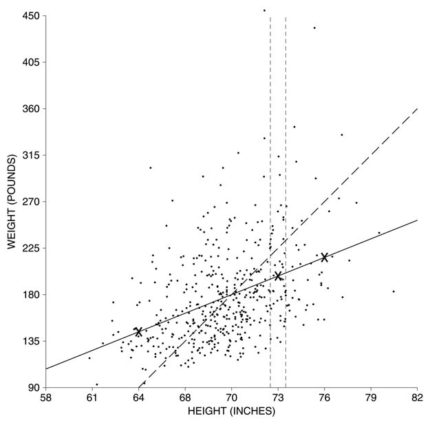

# Introduction

`regression method` tả cách một biến phụ thuộc vào biến khác. Ví dụ: lấy chiều cao và cân nặng. Chúng ta có dữ liệu về 471 nam giới từ 18-24 tuổi (từ Khảo sát khám sức khỏe và dinh dưỡng - HANES5; xem [Mục 4.1][sec4.1]). Theo số làm tròn, chiều cao trung bình của những người đàn ông này là 70 inch và cân nặng trung bình tổng thể của họ là 180 pound. Đương nhiên, những người đàn ông cao hơn sẽ nặng hơn. Cân nặng tăng bao nhiêu thì chiều cao tăng lên một đơn vị? Để bắt đầu, hãy nhìn vào `scatter diagram`(Hình 1 ở trang tiếp theo). Chiều cao được vẽ trên trục hoành và cân nặng trên trục dọc. Số liệu thống kê tóm tắt là[^1]

\\[
\begin{align*}
\text{average height} &\approx \text{70 inches}&,SD &\approx \text{3 inches} \\\\
\text{average weight} &\approx \text{180 pounds}&,SD &\approx \text{45 pounds}&,  r &\approx 0.40
\end{align*}
\\]

**
Hình 1. `scatter diagram`. Mỗi điểm thể hiện chiều cao và cân nặng của một trong số 471 nam giới từ 18-24 tuổi trong HANES5. Dải dọc tượng trưng cho những người đàn ông có chiều cao trên mức trung bình khoảng 1 `SD`. Những người có cân nặng trên trung bình 1 `SD` sẽ được vẽ dọc theo `SD line` nét đứt. Hầu hết đàn ông trong dải đều ở dưới `SD line`: họ chỉ là một phần của `SD` có trọng lượng trên mức trung bình. `regression line` liền nét ước tính trọng lượng trung bình với mỗi chiều cao.
**

Tỷ lệ trên trục dọc và trục ngang đã được chọn sao cho một `SD` chiều cao và một `SD` cân nặng bao phủ cùng một khoảng cách trên trang. Điều này làm cho đường SD (nét đứt) tăng lên 45 độ trên trang. Có một lượng phân tán khá lớn xung quanh đường này: r chỉ bằng 0.40.

Dải dọc trong Hình 1 cho thấy những người đàn ông có chiều cao trên trung bình một `SD` (tính đến inch gần nhất). Những người đàn ông có cân nặng trên trung bình một `SD` sẽ được vẽ trên `SD line`. Tuy nhiên, hầu hết các điểm trên dải đều nằm dưới đường `SD line`. Nói cách khác, hầu hết những người đàn ông có chiều cao trên trung bình 1 `SD` đều thấp hơn khá nhiều so với 1 `SD` trên mức cân nặng trung bình. Cân nặng trung bình của những người đàn ông này chỉ là một phần của `SD` trên tổng cân nặng trung bình. Đây là nơi xuất hiện mối tương quan 0.40. Liên quan đến việc tăng một `SD` về chiều cao, trung bình chỉ tăng 0.40 `SD` về cân nặng.

Để cụ thể hơn, hãy lấy những người đàn ông có chiều cao trên trung bình một `SD`:

\\[
\text{average height} + \text{SD of height} = \text{70 in} + \text{3 in} = \text{73 in}
\\]

Trọng lượng trung bình của họ sẽ cao hơn mức trung bình tổng thể 0.40 `SD`. Dịch trở lại pound, đó là

\\[
0.40 \times \text{45 lb} = \text{18 lb}
\\]

Vì vậy, trọng lượng trung bình của những người đàn ông này là khoảng

\\[
\text{180 lb} + \text{18 lb} = \text{198 lb}
\\]

Điểm (73 inch, 198 pound) được đánh dấu bằng dấu x trong Hình 1.

Còn những người đàn ông có chiều cao trên trung bình 2 `SD` thì sao? Giờ thì

\\[
\text{average height} + \text{2 SD of height} = \text{70 in} + 2 \times \text{3 in} = \text{76 in}
\\]

Cân nặng trung bình của nhóm nam giới thứ hai này phải cao hơn độ tuổi trung bình tổng thể \\(0.40 \times 2 = 0.80\\) `SD` cân nặng. Đó là \\(0.80 \times \text{45 lb} = \text{36 lb}\\). Vì vậy, trung bình của chúng là khoảng \\(\text{180 lb} + \text{36 lb} = \text{216 lb}\\). Điểm (76 inch, 216 pound) cũng được đánh dấu bằng dấu x trong Hình 1.

Còn những người đàn ông có chiều cao dưới mức trung bình 2 `SD` thì sao? Chiều cao của họ bằng

\\[
\text{average height} - \text{2 SD of height} = \text{70 in} - 2 \times \text{3 in} = \text{64 in}
\\]
Trọng lượng trung bình của chúng thấp hơn mức trung bình tổng thể \\(0.40 \times 2 = 0.80\\) `SD` trọng lượng. Đó là \\(0.80 \times \text{45 lb} = \text{36 lb}\\). Trọng lượng trung bình của nhóm thứ ba này là khoảng \\(\text{180 lb - 36 lb = 144 lb}\\). Điểm (64 inch, 144 pound) được đánh dấu bằng dấu x thứ ba trong Hình 1.

Tất cả các điểm (chiều cao, ước tính cân nặng trung bình) đều nằm trên đường liền nét như trong Hình 1. Đây là `regression line`. Đường đi qua điểm trung bình: nam giới có chiều cao trung bình cũng phải có cân nặng trung bình.

> `regression line` của y trên x ước tính giá trị trung bình của y tương ứng với từng giá trị của x.

Dọc theo `regression line`, mỗi lần tăng một `SD` về chiều cao thì cân nặng chỉ tăng 0.40 `SD`. Để cụ thể hơn, hãy tưởng tượng việc nhóm những người đàn ông theo chiều cao. Có một nhóm có chiều cao trung bình, một nhóm khác có chiều cao trên trung bình một `SD`, v.v. Từ nhóm này sang nhóm khác, trọng lượng trung bình cũng tăng lên, nhưng chỉ khoảng 0.40 `SD`. Hãy nhớ 0.40 đến từ đâu. Đó là mối tương quan giữa chiều cao và cân nặng.
Cách sử dụng `correlation coefficient` để ước tính giá trị trung bình của y cho mỗi giá trị của x được gọi là `regression method`. Phương pháp này có thể được phát biểu như sau.

Tính trung bình, cứ mỗi lần tăng một `SD` trong x thì chỉ có sự gia tăng r `SD` trong y.
Hai `SD` khác nhau có liên quan ở đây: `SD` của x, để đánh giá những thay đổi trong x; và `SD` của y, để đánh giá những thay đổi trong y. Rất dễ bị nhịp điệu cuốn đi: nếu x tăng lên một `SD` thì y cũng vậy. Nhưng điều đó sai. Trung bình y chỉ tăng r `SD` (Hình 2, trang tiếp theo).

**
Hình 2. `regression method`. Khi x tăng lên 1 `SD` thì giá trị trung bình của y chỉ tăng lên r `SD`.
**

Tại sao r là yếu tố đúng? Có 3 trường hợp dễ dàng nhận thấy trực tiếp. Đầu tiên, giả sử r bằng 0. Khi đó không có mối liên hệ nào giữa x và y. Vì vậy, tính trung bình, mức tăng 1 `SD` của x đi kèm với mức tăng trung bình 0 `SD` của y. Thứ hai, giả sử r bằng 1. Khi đó tất cả các điểm đều nằm trên `SD line`: x tăng 1 `SD` thì y tăng 1 `SD`. Thứ ba, giả sử r là −1. Lập luận giống nhau, ngoại trừ đường dốc xuống. Với các giá trị ở giữa của r, cần có một đối số toán học phức tạp - nhưng r là hệ số cần sử dụng.

[^1]:These figures are rounded. The exact figures (unweighted):
\\[
\begin{align*}
\text{average height} &= \text{69.6 inches} & \text{SD} &= \text{3.19 inches} \\\\
\text{average weight} &= \text{177 pounds} & \text{SD} &= \text{46.8 pounds} & r &= 0.414
\end{align*}
\\]

[sec4.1]: ../ch04/ch04-01.md
