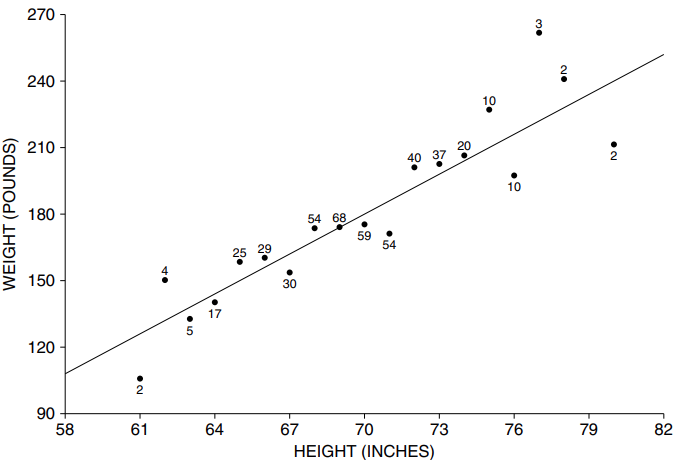
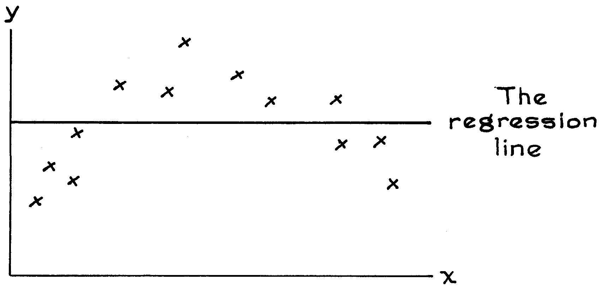

# The Grapth of Averages

Hình 3 là biểu đồ thể hiện chiều cao và cân nặng trung bình của nam giới trong độ tuổi 18-24 trong mẫu HANES5.[^3] Biểu đồ cho thấy cân nặng trung bình của nam giới ở mỗi chiều cao và gần với một đường thẳng ở giữa - nơi chiếm jphần lớn. Nhưng ở phần cuối, biểu đồ khá gập ghềnh. Ví dụ, những người đàn ông cao 78 inch (tính theo inch gần nhất) có cân nặng trung bình là 241 pound. Điều này được thể hiện bằng điểm (78 inch, 241 pound) trong hình. Những người đàn ông cao 80 inch có cân nặng trung bình là 211 pound. Con số này thấp hơn đáng kể so với mức trung bình của những người đàn ông cao 78 inch. Những người đàn ông cao hơn cân nặng ít hơn những người đàn ông thấp hơn. Sự biến thiên ngẫu nhiên đang diễn ra. Những người đàn ông được chọn ngẫu nhiên vào mẫu. May mắn thay, những người cao 78 inch thì quá nặng và những người đàn ông 80 inch lại không đủ nặng. Tất nhiên, chỉ có 2 người đàn ông trong mỗi nhóm, được biểu thị bằng những con số nhỏ ở trên hoặc dưới dấu chấm. `regression line` làm mịn loại biến thiên ngẫu nhiên này.

**
Hình 3. Biểu đồ trung bình. Hiển thị cân nặng trung bình ở mỗi chiều cao của 471 nam giới từ 18-24 tuổi trong mẫu HANES5. `regression line` làm mịn biểu đồ này.
**

`regression line` là một phiên bản được làm mịn của biểu đồ trung bình. Nếu biểu đồ trung bình đi theo một đường thẳng thì đường đó là `regession line`.

Trong một số trường hợp, `regession line` bị làm mịn đi quá nhiều. Nếu có mối liên hệ phi tuyến tính giữa hai biến, như trong Hình 4, `regression line` sẽ bỏ qua nó. Sau đó, tốt hơn là sử dụng biểu đồ trung bình. (Tính phi tuyến tính được đưa ra đối với `correlation coefficient`, [Mục 9.3][sec9.3]; cũng xem [Mục 4.2][sec4.2] để biết dữ liệu trong đó biểu đồ trung bình là phi tuyến.)

**
Hình 4. Mối liên hệ phi tuyến tính. Không nên sử dụng `regression line` khi có mối liên hệ phi tuyến giữa các biến.
**

[^3]: The term "graph of averages" is not standard. In principle, the graph depends on how finely the x-values are subdivided.

[sec9.3]: ../ch09/ch09-03.md
[sec4.2]: ../ch04/ch04-02.md
