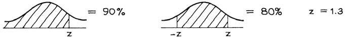

# The Regression Method for Individuals

Đối với nam giới độ tuổi 18-24 trong HANES5, mối quan hệ giữa chiều cao và cân nặng có thể được tóm tắt như sau:

\\[
\begin{align*}
\text{average height} &\approx \text{70 inches} & SD &\approx \text{3 inches} \\\\
\text{average weight} &\approx \text{180 pounds} & SD &\approx \text{45 pounds} & r &\approx 0.40
\end{align*}
\\]

Giả sử một trong những người đàn ông này được chọn ngẫu nhiên và bạn phải đoán cân nặng của anh ta mà không được cho biết bất cứ điều gì về anh ta. Dự đoán tốt nhất là trọng lượng trung bình tổng thể, 180 pound. Tiếp theo, bạn được biết chiều cao của người đàn ông đó: chẳng hạn như 73 inch. Người đàn ông này cao và có vẻ nặng hơn mức trung bình. Dự đoán tốt nhất của bạn về cân nặng của anh ấy là mức trung bình của tất cả những người đàn ông cao 73 inch trong nghiên cứu. Mức trung bình mới này có thể được ước tính bằng phương pháp hồi quy, là 198 pound ([Mục 10.1][sec10.1]). Quy tắc: nếu bạn phải dự đoán một biến này từ một biến khác, hãy sử dụng mức trung bình mới. Trong nhiều trường hợp, phương pháp hồi quy đưa ra một cách hợp lý để ước tính mức trung bình mới. Tất nhiên, nếu có mối liên hệ phi tuyến giữa các biến thì phương pháp hồi quy sẽ không được áp dụng.

Ví dụ 1. Một trường đại học đã thực hiện một phân tích thống kê về mối quan hệ giữa điểm SAT môn Toán (từ 200 đến 800) và điểm trung bình GPA năm thứ nhất (từ 0 đến 4.0) đối với những sinh viên hoàn thành năm thứ nhất. Kết quả:

\\[
\begin{align*}
\text{average SAT score} &= 550 & \text{SD} &= 80\\\\
\text{average first-year GPA} &= 2.6 & \text{SD} &= 0.6 & r &= 0.4
\end{align*}
\\]

`scatter diagram` có hình quả bóng đá. Một học sinh được chọn ngẫu nhiên và có điểm SAT là 650. Hãy dự đoán điểm trung bình năm đầu tiên của cá nhân này.

_Giải pháp._ Học sinh này đạt \\(100/80 = 1.25\\) `SD` trên mức trung bình trong kỳ thi SAT. Ước tính hồi quy cho điểm trung bình năm đầu tiên là trên trung bình \\(0.4 \times 1.25 = 0.5\\) `SD`. Đó là \\(0.5 \times 0.6 = 0.3\\) điểm trung bình. Điểm trung bình dự đoán là \\(2.6 + 0.3 = 2.9\\).
Logic: đối với tất cả học sinh có điểm SAT khoảng 650, điểm trung bình trung bình năm đầu tiên là khoảng 2.9, theo phương pháp hồi quy. Đó là lý do tại sao chúng tôi dự đoán điểm trung bình năm đầu tiên của cá nhân này là 2.9.

Thông thường, các nhà điều tra tính toán các ước tính hồi quy từ một nghiên cứu và sau đó ngoại suy: họ sử dụng các ước tính về các chủ đề mới. Trong nhiều trường hợp, điều này có ý nghĩa, miễn là các đối tượng trong cuộc khảo sát đại diện cho những người mà các suy luận sẽ được đưa ra. Nhưng bạn phải suy nghĩ về vấn đề mỗi lần. Toán học của phương pháp hồi quy sẽ không bảo vệ bạn. Trong Ví dụ 1, trường đại học chỉ có kinh nghiệm với những sinh viên mà trường tiếp nhận. Có thể có vấn đề khi sử dụng quy trình hồi quy đối với những học sinh khá khác biệt với nhóm đó. (Các cán bộ tuyển sinh thường thực hiện ngoại suy, từ những sinh viên được nhận vào đến những sinh viên bị từ chối nhập học.)

Bây giờ, một cách sử dụng khác của phương pháp hồi quy - để dự đoán thứ hạng phần trăm. Nếu thứ hạng phần trăm của bạn trong bài kiểm tra là 90% thì bạn đã làm rất tốt: chỉ 10% trong lớp đạt điểm cao hơn, 90% còn lại đạt điểm thấp hơn. Thứ hạng phần trăm 25% là không tốt lắm: 75% lớp đạt điểm cao hơn, 25% còn lại đạt điểm thấp hơn ([Mục 5.5][sec5.5]).

_Ví dụ 2._ (Tiếp tục Ví dụ 1.) Giả sử thứ hạng phần trăm của một học sinh trong bài thi SAT là 90% trong số các học sinh năm thứ nhất. Dự đoán thứ hạng phần trăm của anh ấy trên GPA năm thứ nhất. `scatter diagram` có hình quả bóng đá. Đặc biệt, điểm SAT và GPA tuân theo `normal curve`.

_Giải pháp._ Chúng ta sẽ sử dụng phương pháp hồi quy. Học sinh này có điểm SAT cao hơn mức trung bình. Bằng bao nhiêu SD? Bởi vì điểm SAT tuân theo `normal curve` nên thứ hạng phần trăm của anh ấy có thông tin này - được ngụy trang (phần 5 của chương 5):

Học sinh này đạt 1.3 `SD` trên mức trung bình trong kỳ thi SAT. Phương pháp hồi quy dự đoán điểm trung bình năm đầu tiên của anh ấy sẽ cao hơn \\(0.4 \times 1.3 \approx 0.5\\) `SD`. Cuối cùng, điều này có thể được dịch ngược lại thành thứ hạng phần trăm:

Đó là câu trả lời. Thứ hạng phần trăm trên GPA năm đầu tiên được dự đoán là 69%.

Để giải quyết vấn đề này, giá trị trung bình và `SD` của hai biến không bao giờ được sử dụng. Tất cả những gì quan trọng là r. Về cơ bản, điều này là do toàn bộ vấn đề đã được xử lý trong các `standard unit`. Thứ hạng phần trăm cung cấp cho bạn các `standard unit`.

Học sinh trong Ví dụ 2 được so sánh với lớp của cậu ấy trong hai kỳ thi khác nhau, SAT và các kỳ thi năm thứ nhất. Anh ấy đã làm rất tốt bài thi SAT, đạt điểm phần trăm thứ 90. Nhưng ước tính hồi quy chỉ xếp anh ta ở vị trí thứ 69 trong kỳ thi năm đầu tiên; vẫn trên mức trung bình, nhưng không nhiều. Mặt khác, đối với những học sinh kém - ví dụ ở phần trăm thứ 10 của SAT - phương pháp hồi quy dự đoán sự tiến bộ. Nó sẽ xếp họ vào vị trí thứ 31 trong bài kiểm tra năm đầu tiên. Con số này vẫn dưới mức trung bình, nhưng gần hơn.

Để giải quyết vấn đề này một cách cẩn thận hơn, hãy lấy tất cả những người ở phần trăm thứ 90 trong bài thi SAT - những học sinh giỏi. Một số sẽ thăng tiến trong bài kiểm tra năm đầu tiên, một số sẽ tụt hạng. Tuy nhiên, về trung bình, nhóm này di chuyển xuống. Để so sánh, hãy lấy tất cả những người ở phần trăm thứ 10 của kỳ thi SAT - những học sinh kém. Một lần nữa, một số sẽ làm tốt hơn trong các bài kiểm tra năm đầu tiên, một số khác thì tệ hơn. Tuy nhiên, về mặt trung bình, nhóm này lại tăng lên. Đó là những gì phương pháp hồi quy đang cho chúng ta biết.

Ban đầu, nhiều người dự đoán thứ hạng của năm thứ nhất ngang bằng với thứ hạng SAT. Đây không phải là một chiến lược tốt. Để hiểu lý do tại sao, hãy tưởng tượng rằng bạn phải dự đoán thứ hạng của một học sinh trong lớp toán. Trong trường hợp không có thông tin nào khác, dự đoán an toàn nhất là đặt cô ấy ở vị trí trung bình. Tuy nhiên, nếu bạn biết rằng học sinh này rất giỏi môn vật lý, bạn có thể sẽ đánh giá cô ấy ở trên mức trung bình ở môn toán. Suy cho cùng, có một mối tương quan chặt chẽ giữa vật lý và toán học. Mặt khác, nếu tất cả những gì bạn biết chỉ là thứ hạng của cô ấy trong lớp làm gốm thì điều đó sẽ không giúp ích nhiều trong việc đoán thứ hạng toán học. Mức trung bình có vẻ ổn: không có nhiều mối tương quan giữa đồ gốm và toán học.

Bây giờ quay lại vấn đề dự đoán thứ hạng năm thứ nhất từ thứ hạng SAT. Nếu hai bộ điểm tương quan hoàn hảo thì thứ hạng năm thứ nhất sẽ bằng thứ hạng SAT. Ở một thái cực khác, nếu mối tương quan bằng 0, thứ hạng SAT hoàn toàn không giúp ích gì trong việc dự đoán thứ hạng của năm đầu tiên. Mối tương quan nằm ở đâu đó giữa hai thái cực, vì vậy chúng ta phải dự đoán thứ hạng trong bài kiểm tra năm thứ nhất ở đâu đó giữa thứ hạng SAT và điểm trung bình. Phương pháp hồi quy cho chúng ta biết nó ở đâu.

[sec5.5]: ../ch05/ch05-05.md
[sec10.1]: ../ch10/ch10-01.md
