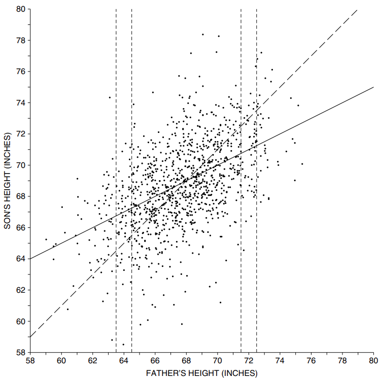
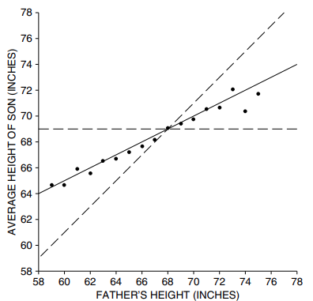
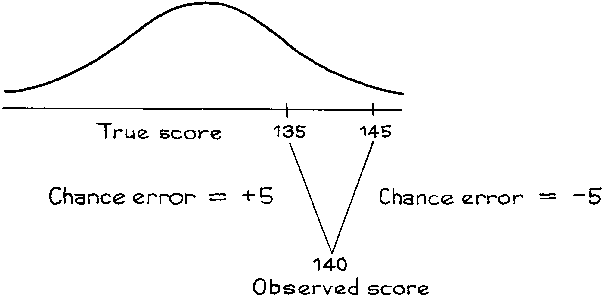

# The Regression Fallacy

Một chương trình mầm non cố gắng tăng cường chỉ số IQ của trẻ em. Trẻ em được kiểm tra khi tham gia chương trình (kiểm tra trước) và một lần nữa khi rời khỏi chương trình (kiểm tra sau). Trong cả hai trường hợp, điểm trung bình lên tới gần 100 và `SD` là khoảng 15. Chương trình dường như không có tác dụng. Tuy nhiên, xem xét kỹ hơn dữ liệu sẽ cho thấy điều gì đó rất đáng ngạc nhiên. Những đứa trẻ có điểm IQ dưới mức trung bình trong bài kiểm tra trước có mức tăng trung bình khoảng 5 điểm IQ ở bài kiểm tra sau. Ngược lại, những đứa trẻ có điểm trên trung bình trong bài kiểm tra trước lại bị mất trung bình khoảng 5 điểm. Điều này chứng tỏ điều gì? Chương trình có hoạt động để cân bằng trí thông minh không? Có lẽ khi những đứa trẻ thông minh hơn chơi với những đứa kém học hơn thì sự khác biệt giữa hai nhóm có xu hướng giảm đi. Đây là điều mong muốn hay không mong muốn?

Những suy đoán này có thể thú vị, nhưng thực tế đáng buồn là chẳng có gì nhiều xảy ra, dù tốt hay xấu. Đây là lý do tại sao. Không thể kỳ vọng rằng trẻ em sẽ đạt điểm hoàn toàn giống nhau trong hai bài kiểm tra. Sẽ có sự khác biệt giữa hai điểm số. Không ai nghĩ rằng những khác biệt này là quan trọng hoặc cần bất kỳ lời giải thích nào. Nhưng họ lại tạo ra `scatter diagram` cho điểm kiểm tra dàn trải xung quanh đường `SD` thành đám mây hình quả bóng đá quen thuộc đó. Sự chênh lệch xung quanh đường làm cho nhóm dưới cùng đi lên và nhóm trên cùng đi xuống. Không có gì khác với nó.

> Trong hầu hết các tình huống kiểm tra - kiểm tra lại, nhóm cuối bảng trong lần kiểm tra đầu tiên trung bình sẽ cho thấy một số tiến bộ trong lần kiểm tra thứ hai - và nhóm dẫn đầu trung bình sẽ tụt lại phía sau. Đây là `regression effect`.

Nghĩ rằng `regression effect` phải là do một điều gì đó quan trọng chứ không chỉ là sự chênh lệch quanh đường là `regression fallacy`.
Bây giờ chúng ta sẽ tìm hiểu lý do tại sao `regression effect` xuất hiện bất cứ khi nào có sự lan truyền xung quanh đường `SD`. Hiệu ứng này lần đầu tiên được Galton chú ý đến trong nghiên cứu của ông về những nét giống nhau trong gia đình, vì vậy đó là bối cảnh cho cuộc thảo luận. Nhưng lý do là chung chung. Hình 5 cho thấy `scatter diagram` về chiều cao của 1.078 cặp cha con, như đã thảo luận ở Chương 8. Số liệu thống kê tóm tắt là[^5]

\\[
\begin{align*}
\text{average height of fathers} &\approx \text{68 inches} & SD &\approx \text{2.7 inches} \\\\
\text{average height of sons} &\approx \text{69 inches} & SD &\approx \text{2.7 inches} & r &\approx 0.5
\end{align*}
\\]
Con trai trung bình cao hơn bố 1 inch. Trên cơ sở đó, đương nhiên người ta đoán rằng người cha cao 72 inch nên sinh con trai 73 inch; tương tự, bố cao 64 inch thì con trai phải cao 65 inch; và như thế. Những người cha và những đứa con trai như vậy được vẽ theo đường đứt nét trong Hình 5. Tất nhiên, không có nhiều gia đình đi đúng đường đó. Trên thực tế, có rất nhiều sự lan truyền xung quanh đường này. Một số người con trai cao hơn cha của họ; số khác thì thấp hơn.

**
`regression effect`. Nếu con trai cao hơn bố 1 inch thì gia đình được vẽ theo đường đứt nét. Các điểm trên dải trên 72 inch tương ứng với những gia đình có người cha cao 72 inch, tính đến inch gần nhất; hầu hết các điểm này đều nằm dưới đường đứt nét. Các điểm trên dải trên 64 inch tương ứng với những gia đình có người cha cao 64 inch, tính đến inch gần nhất; hầu hết các điểm này đều nằm trên đường đứt nét. Đường hồi quy liền nét chọn ra tâm của tất cả các dải dọc và phẳng hơn đường đứt nét.
**

Đưa những người cha cao 72 inch đến inch gần nhất. Các gia đình tương ứng được vẽ trên dải dọc dài hơn 72 inch trong Hình 5, và chiều cao của các con trai có sự chênh lệch khá lớn. Một số điểm nằm phía trên đường đứt nét: cậu con trai cao hơn 73 inch. Nhưng hầu hết các điểm đều nằm dưới đường đứt nét: cậu con trai thấp hơn 73 inch. Nhìn chung, con trai của những ông bố cao 72 inch chỉ có chiều cao trung bình 71 inch. Với những ông bố cao (điểm cao ở bài kiểm tra đầu tiên), trung bình con trai thấp hơn (điểm ở bài kiểm tra thứ hai giảm).

Bây giờ hãy nhìn vào các điểm trên dải dọc trên 64 inch, đại diện cho những gia đình có người cha cao 64 inch, tính đến inch gần nhất. Chiều cao của đường đứt nét là 65 inch, tượng trưng cho con trai cao hơn người cha 64 inch của mình 1 inch. Một số điểm nằm dưới đường đứt nét, nhưng hầu hết đều ở trên và con trai của những người cha cao 64 inch có chiều cao trung bình là 67 inch. Với những ông bố thấp (điểm thấp trong bài kiểm tra đầu tiên), trung bình con trai sẽ cao hơn (điểm trong bài kiểm tra thứ hai tăng lên). Galton quý tộc gọi đây là "regression to mediocrity".

Đường đứt nét ở Hình 5 đi qua điểm tương ứng với chiều cao trung bình của người cha là 68 inch và chiều cao trung bình của con trai là 69 inch. Dọc theo đường đứt nét, mỗi mức tăng chiều cao của người cha một `SD` sẽ tương ứng với mức tăng chiều cao của con trai một `SD`. Hai sự thật này làm cho nó trở thành `SD line`. Đám mây đối xứng xung quanh `SD line`, nhưng dải 72 inch thì không. Dải chỉ chứa các điểm có tọa độ x lớn bất thường. Và hầu hết các điểm ở dải này đều nằm dưới `SD line`. Ngược lại, dải 64 inch chỉ chứa các điểm có tọa độ x nhỏ bất thường. Hầu hết các điểm trong dải này đều nằm trên `SD line`. Sự mất cân bằng tiềm ẩn luôn hiện hữu trong những đám mây hình bóng đá. Giải thích bằng đồ thị về hiệu ứng hồi quy có vẻ không lãng mạn cho lắm. Nhưng sau đó, thống kê không được coi là một chủ đề lãng mạn.

Hình 5 cũng cho thấy đường hồi quy chiều cao của con trai theo chiều cao của cha. Đường liền nét này tăng ít dốc hơn so với `SD line` nét đứt và nó tách ra khỏi tâm của mỗi dải chấm dọc - giá trị y trung bình trong dải. Ví dụ, lấy những người cha cao 72 inch. Họ có chiều cao trên mức trung bình 4 inch:

\\(\text{4 inch/2.7 inch} \approx \text{1.5 SD}\\). Đường hồi quy cho biết con trai của họ phải cao hơn mức trung bình khoảng

\\[
r \times \text{1.5 SDs} = \text{0.75 SDs} \approx \text{2 inches}
\\]

Chiều cao trung bình nhìn chung của con trai là 69 inch, do đó, ước tính hồi quy cho chiều cao trung bình của những người con trai này là 71 inch – không thay đổi.

Hình 6 cho thấy `regression effect` ở mức rõ ràng nhất khi không có đám mây. `SD line` nét đứt tăng lên một góc 45 độ. Các chấm thể hiện chiều cao trung bình của người con tương ứng với từng giá trị chiều cao của người cha. Những chấm này là tâm của các dải dọc trong Hình 5. Các chấm tăng ít dốc hơn so với `SD line` - `regression effect`. Nhìn chung, các chấm nằm ở giữa `SD line` và đường ngang đi qua điểm trung bình. Đó là bởi vì `regression correlation` là một nửa. Mỗi mức tăng chiều cao của người cha một `SD` sẽ kéo theo sự tăng một nửa `SD` chiều cao của con trai chứ không phải mức tăng một `SD`. Đường hồi quy vững chắc đi lên với tỷ lệ nửa trên một và thực sự theo dõi biểu đồ trung bình khá tốt.

**
`regression effiect`. `SD line` là nét đứt, đường hồi quy là nét liền. Các dấu chấm thể hiện chiều cao trung bình của các con trai ứng với từng giá trị chiều cao của người cha. Chúng tăng ít dốc hơn `SD line`. Đây là hiệu ứng hồi quy. Đường hồi quy đi theo dấu chấm.
**

Thoạt nhìn, `scatter diagram` trong Hình 5 khá hỗn loạn. Galton quả là một thiên tài khi nhìn thấy một đường thẳng trong sự hỗn loạn. Kể từ thời Galton, nhiều nhà nghiên cứu khác đã phát hiện ra rằng các mức trung bình trong `scatter diagram` của họ cũng đi theo đường thẳng. Đó là lý do tại sao đường hồi quy rất hữu ích.

Bây giờ, hãy xem hậu trường: `scatter diagram` có thể được hiểu rõ hơn một chút trong một số trường hợp, chẳng hạn như trong bối cảnh bài kiểm tra IQ lặp đi lặp lại. Thực tế cơ bản là hai điểm số có xu hướng khác nhau. Sự khác biệt có thể được giải thích dưới dạng sự biến thiên ngẫu nhiên. Mỗi người có thể may mắn hoặc không may mắn trong lần thử nghiệm đầu tiên. Nhưng nếu điểm trong bài kiểm tra đầu tiên rất cao, điều đó cho thấy người đó đã may mắn trong dịp đó, ngụ ý rằng điểm ở bài kiểm tra thứ hai có thể sẽ thấp hơn. (Bạn sẽ không nói, “Anh ấy đạt điểm rất cao, chắc chắn hôm đó đã gặp xui xẻo.”) Mặt khác, nếu điểm trong bài kiểm tra đầu tiên rất thấp, người đó có thể đã không may mắn ở một mức độ nào đó trong dịp đó. và lần sau sẽ làm tốt hơn.
Đây là một mô hình thô cho tình huống kiểm tra-kiểm tra lại, làm cho việc giải thích trở nên rõ ràng hơn. Phương trình cơ bản là

\\[
\text{observed test score = true score + chance error}
\\]

Giả sử rằng sự phân bố điểm thực trong tổng thể tuân theo `normal curve`, với trung bình là 100 và `SD` là 15. Cũng giả sử rằng `chance error` có thể là dương cũng như âm và có xu hướng có kích thước khoảng 5 điểm . Một người có điểm thực là 135 thì có khả năng đạt được điểm 130 cũng như 140 trong bài kiểm tra. Một người có điểm thực là 145 thì có khả năng đạt điểm 140 cũng như 150. Tất nhiên, sai số cơ hội cũng có thể là \\(\pm4\\) hoặc \\(\pm6\\), v.v: bất kỳ cặp giá trị đối xứng nào cũng có thể được xử lý theo cách tương tự .

**
Một mô hình cho `regression effiect`.
**

Lấy những người đạt 140 điểm trong bài kiểm tra đầu tiên. Có hai cách giải thích khác cho điểm số quan sát được này:

- điểm thật dưới 140, có `chance error` dương;
- điểm thật trên 140, có `chance error` âm;

Lời giải thích đầu tiên có nhiều khả năng hơn. Ví dụ, nhiều người có số điểm thực là 135 hơn là 145, như minh họa trong Hình 7.

Mô hình tính đến `regression effect`. Nếu ai đó đạt điểm trên trung bình trong bài kiểm tra đầu tiên, điểm thực sự có thể thấp hơn một chút so với điểm quan sát được. Nếu người này làm bài kiểm tra lại, chúng tôi dự đoán rằng điểm thứ hai sẽ thấp hơn điểm đầu tiên một chút. Mặt khác, nếu một người đạt điểm dưới mức trung bình trong bài kiểm tra đầu tiên, chúng tôi ước tính rằng điểm thực sự cao hơn một chút so với điểm quan sát được và dự đoán của chúng tôi về điểm thứ hai sẽ cao hơn một chút so với điểm đầu tiên.
