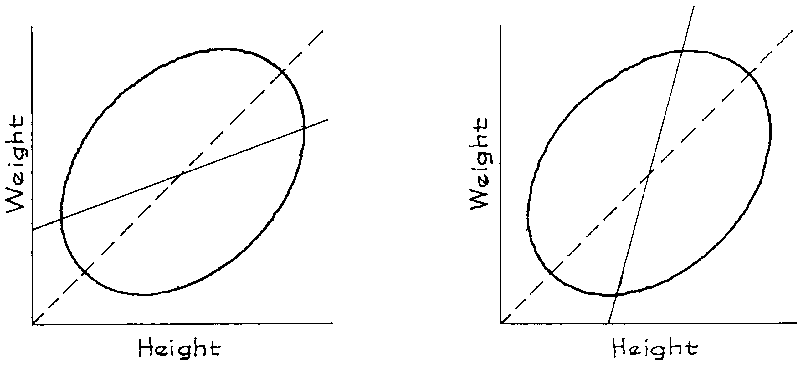
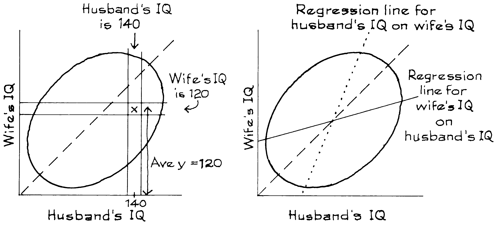

# There Are Two Regression Lines

Trong thực tế, hai đường hồi quy có thể được vẽ trên `scatter diagram`. Ví dụ: `scatter diagram` chiều cao - cân nặng được phác họa trong Hình 8. Bảng bên trái hiển thị đường hồi quy cho cân nặng theo chiều cao. Thao tác này sẽ chọn ra tâm của các dải dọc và ước tính trọng lượng trung bình cho từng chiều cao. Bảng bên phải hiển thị đường hồi quy chiều cao theo cân nặng. Thao tác này sẽ chọn ra phần giữa của các dải ngang và ước tính chiều cao trung bình cho mỗi trọng lượng. Trong cả hai bảng, đường hồi quy là đường liền nét và `SD line` là nét đứt. Sự hồi quy của cân nặng theo chiều cao có vẻ tự nhiên hơn đối với hầu hết các mục đích, nhưng đường kia cũng có thể hữu ích.

**
Hình 8. Phần bên trái cho thấy sự hồi quy của cân nặng theo chiều cao; phần bên phải, chiều cao trên cân nặng. `SD line` là đường đứt nét.
**

_Ví dụ 3._ Điểm IQ được tính theo thang điểm để có mức trung bình là khoảng 100 và `SD` khoảng 15, cho cả nam và nữ. Mối tương quan giữa chỉ số IQ của chồng và vợ là khoảng 0.50. Một nghiên cứu lớn về các gia đình cho thấy những người đàn ông có IQ là 140 có vợ có IQ trung bình là 120. Hãy nhìn vào những người vợ trong nghiên cứu có IQ là 120. Chỉ số IQ trung bình của chồng họ có nên lớn hơn 120 không? Trả lời có hoặc không và giải thích ngắn gọn.

_Giải pháp._ Không, chỉ số IQ trung bình của chồng họ sẽ vào khoảng 110. Xem Hình 9. Những gia đình có chồng có chỉ số IQ là 140 được thể hiện trên dải dọc. Tọa độ y trung bình trong dải này là 120. Những gia đình có người vợ có chỉ số IQ là 120 được hiển thị trên dải ngang. Đây là một nhóm gia đình hoàn toàn khác. Tọa độ x trung bình cho các điểm trong dải ngang là khoảng 110. Hãy nhớ rằng có hai đường hồi quy. Một dòng dùng để dự đoán chỉ số IQ của người vợ từ chỉ số IQ của chồng. Dòng còn lại dùng để dự đoán chỉ số IQ của chồng từ vợ.

**
Hình 9. Hai đường hồi quy.
**
