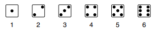
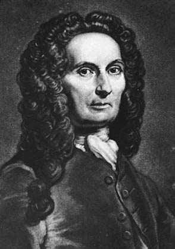
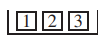
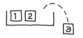
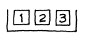
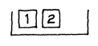

# Introduction

Mọi người luôn nói một cách hời hợt về cơ hội mà không gây hại gì. Cơ hội nhận được một công việc là gì? gặp ai đó? ngày mai có mưa không? Nhưng vì mục đích khoa học, cần phải đưa ra một cách giải thích rõ ràng, rõ ràng cho từ _chance_. Điều này hóa ra lại khó khăn và các nhà toán học đã phải vật lộn với công việc này trong nhiều thế kỷ. Họ đã phát triển một số lý thuyết cẩn thận và chặt chẽ, nhưng những lý thuyết này chỉ đề cập đến một phạm vi nhỏ các trường hợp mà người ta thường nói đến cơ hội. Cuốn sách này sẽ trình bày _frequency theory_, lý thuyết hoạt động tốt nhất cho các quy trình có thể lặp đi lặp lại, độc lập và trong cùng điều kiện.[^1] Nhiều trò chơi thuộc loại này và lý thuyết tần suất ban đầu được phát triển để giải quyết các vấn đề cờ bạc . Một trong những bậc thầy vĩ đại thời kỳ đầu là Abraham de Moivre, một người Pháp theo đạo Tin lành đã trốn sang Anh để tránh bị đàn áp tôn giáo. Một phần lời đề tặng cho cuốn sách của ông, _The Doctrine of Chances_, được trình bày trong hình 1 ở trang tiếp theo.[^2]

> To the Right Honorable the
> Lord CARPENTER.
>
> My Lord,
>
> There are many people in the World who are prepossessed with an Opinion, that the Doctrine of Chances has a Tendency to promote Play; but they soon will be undeceived, if they think fit to look into the general Design of this Book; in the mean time it will not be improper to inform them, that your Lordship is pleased to espouse the Patronage of this second Edition; which your strict Probity, and the distinguished Character you bear in the World, would not have permitted, were not their Apprehensions altogether groundless.
>
> Your Lordship does easily perceive, that this Doctrine is so far from encouraging Play, that it is rather a Guard against it, by setting in a clear light, the Advantages and Disadvantages of those Games wherein Chance is concerned....
>
> Another use to be made of this Doctrine of Chances is that it may serve in conjunction with the other parts of the Mathematicks, as a fit Introduction to the Art of Reasoning: it being known by experience that nothing can contribute more to the attaining of that Art, than the consideration of a long Train of Consequences, rightly deduced from undoubted Principles, of which this Book affords many Examples.

**
Hình 1. Lời tựa của De Moivre cho _The Doctrine of Chances_.
**

Một trò chơi may rủi đơn giản liên quan đến việc đặt cược vào việc tung đồng xu. Quá trình tung đồng xu có thể được lặp đi lặp lại nhiều lần, độc lập và trong cùng điều kiện. Cơ hội nhận được mặt ngửa là 50%: về lâu dài, tỷ lệ mặt ngửa sẽ xuất hiện khoảng 50%.

Lấy một ví dụ khác. Xúc xắc là một khối lập phương có sáu mặt, được dán nhãn

Khi xúc xắc được tung ra, các mặt đều có khả năng xuất hiện như nhau. Cơ hội để có được mặt 1 chấm là 1 trên 6, hay \\(16\frac{2}{3}\\%\\). Giải thích: nếu xúc xắc được gieo đi gieo lại, lặp lại quá trình may rủi cơ bản trong cùng điều kiện, thì về lâu dài, mặt 1 chấm sẽ xuất hiện khoảng \\(16\frac{2}{3}\\%\\) lần.

> Cơ hội của một điều gì đó cho biết tỷ lệ phần trăm số lần nó dự kiến sẽ xảy ra, khi quá trình cơ bản được thực hiện lặp đi lặp lại, độc lập và trong cùng điều kiện.

Nếu điều gì đó là không thể, nó sẽ xảy ra 0% lần. Ở thái cực khác, nếu điều gì đó chắc chắn xảy ra thì nó sẽ xảy ra 100% lần. Mọi cơ hội đều ở giữa hai thái cực này.

> Cơ hội là từ 0% đến 100%.

Đây là một thực tế cơ bản khác. Giả sử bạn đang chơi một trò chơi và có 45% cơ hội thắng. Nói cách khác, bạn mong đợi sẽ giành được khoảng 45% số lần. Vì vậy, bạn phải dự kiến sẽ mất 55% số lần còn lại.

> Cơ hội của một điều gì đó bằng 100% trừ đi cơ hội của điều ngược lại.

Abraham de Moivre (England, 1667–1754) Etching by Faber. Copyright © British Museum.

_Ví dụ 1._ Một hộp đựng bi đỏ và bi xanh. Lấy ngẫu nhiên một viên bi từ hộp (mỗi viên bi có cơ hội được lấy ra như nhau). Nếu nó màu đỏ, bạn thắng 1$. Nếu nó là màu xanh, bạn không thắng được gì. Bạn có thể chọn giữa hai hộp:

- hộp A chứa 3 viên bi đỏ và 2 viên bi xanh;
- Hộp B chứa 30 viên bi đỏ và 20 viên bi xanh.

Hộp nào mang lại cơ hội chiến thắng cao hơn, hay chúng giống nhau?

_Giải pháp._ Một số người thích hộp A hơn vì nó có ít viên bi xanh hơn. Những người khác thích B hơn vì nó có nhiều bi đỏ hơn. Cả hai quan điểm đều sai. Hai hộp có cơ hội chiến thắng như nhau, 3 trên 5. Để biết lý do tại sao, hãy tưởng tượng bạn rút ngẫu nhiên nhiều lần từ hộp A (thay viên bi sau mỗi lần rút để không làm thay đổi các điều kiện của thí nghiệm). Về lâu dài mỗi 5 viên bi sẽ xuất hiện khoảng 1 lần trong 5. Vậy số viên bi màu đỏ sẽ xuất hiện khoảng 3/5 số lần. Với hộp A, khả năng bạn lấy được viên bi đỏ là 3/5 tức là 60%.

Bây giờ hãy tưởng tượng bạn rút ngẫu nhiên nhiều lần bằng cách thay thế từ hộp B. Mỗi viên bi trong số 50 viên bi sẽ xuất hiện khoảng 1 lần trong 50 viên. Nhưng bây giờ có 30 viên bi màu đỏ. Với ô B thì khả năng thắng của bạn là \\(\frac{30}{50} = \frac{3}{5} = 60\\%\\), cũng như hộp A. Điều quan trọng là tỷ lệ

\\[
\frac{\text{number of red marbles}}{\text{total number of marbles}}
\\]

Tỷ lệ ở cả hai hộp là như nhau. Giải pháp của De Moivre cho ví dụ này được đưa ra trong Hình 2.

> The Probability of an Event is greater or less, according to the number of Chances by which it may happen, compared with the whole number of Chances by which it may either happen or fail.
>
> Wherefore, if we constitute a Fraction whereof the Numerator be the number of Chances whereby an Event may happen, and the Denominator the number of all the Chances whereby it may either happen or fail, that Fraction will be a proper designation of the Probability of it happening. Thus if an Event has 3 Chances to happen, and 2 to fail, the Fraction 3/5 will fitly represent the Probability of its happening, and may be taken as the measure of it.
>
> The same things may be said of the Probability of failing, which will likewise be measured by a Fraction, whose Numerator is the number of Chances whereby it may fail, and the Denominator the whole number of Chances, both for its happening and failing; thus the Probability of the failing of that Event which has 2 Chances to fail and 3 to happen will be measured by the Fraction 2/5.
>
> The Fractions which represent the Probabilities of happening and failing, being added together, their Sum will always be equal to Unity, since the Sum of their Numerators will be equal to their common Denominator: now it being a certainty that an Event will either happen or fail, it follows that Certainty, which may be conceived under the notion of an infinitely great degree of Probability, is fitly represented by Unity. [By “Unity,” de Moivre means the number 1.]
>
> These things will easily be apprehended, if it be considered that the word Probability includes a double Idea: first, of the number of Chances whereby an Event may happen; secondly, of the number of Chances whereby it may either happen or fail.

**
Hình 2. Lời giải của De Moivre.
**

Nhiều bài toán, như ví dụ 1, có dạng rút ngẫu nhiên từ một hộp. Một hướng dẫn điển hình là,

Rút ngẫu nhiên hai vé WITH thay thế từ hộp

Điều này yêu cầu bạn tưởng tượng quy trình sau: lắc hộp, rút ngẫu nhiên một vé (cơ hội cho cả ba vé như nhau), ghi nhớ con số trên đó, bỏ lại vào hộp, lắc lại hộp, rút ngẫu nhiên một tấm vé thứ hai (cơ hội như nhau cho cả ba tấm vé), ghi lại con số trên đó và bỏ tấm vé thứ hai trở lại hộp. Sự tương phản là với sự hướng dẫn,

Rút ngẫu nhiên hai vé WITHOUT thay thế từ hộp

Hướng dẫn thứ hai yêu cầu bạn tưởng tượng quy trình sau: lắc hộp, rút ngẫu nhiên một vé (cơ hội cho cả ba vé như nhau), đặt nó sang một bên, rút ngẫu nhiên một vé thứ hai (cơ hội bằng nhau cho hai vé còn lại trong hộp). cái hộp). Xem Hình 3.

WITH thay thế ... lần rút thăm thứ hai là từ

WITHOUT thay thế ... lần rút thăm thứ hai là từ

> Khi bạn rút ngẫu nhiên, tất cả các vé trong hộp đều có cơ hội được chọn như nhau.

---

[^1]: For other views of chance, see R. A. Fisher, Statistical Methods and Scientific Inference, 13th ed., reprinted by Oxford University Press, 1993, in J. H. Bennett, editor, _Statistical Methods, Experimental Design and Scientific Inference_.\
    L. J. Savage, _Foundations of Statistics_, 2nd ed. (Dover, 1972).\
    For discussion, see _Foundations of Science_, vol. 1 (1995) no. 1.

[^2]: The 3rd edition was published in 1756, after de Moivre’s death. It has been reprinted by Chelsea Publishing, New York, 1967.
