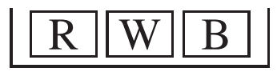
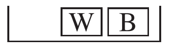
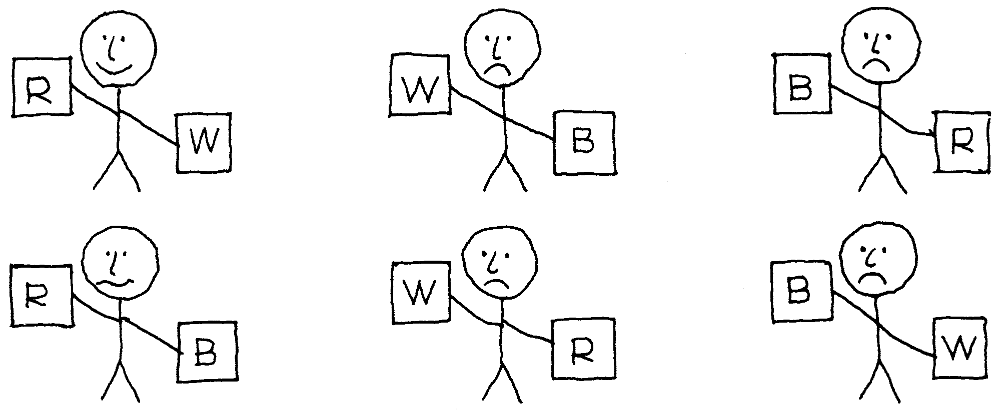

# The Multiplication Rule

Phần này sẽ chỉ ra cách tính khả năng hai sự kiện xảy ra bằng cách nhân xác suất.

_Ví dụ 3._ Một hộp có ba vé màu đỏ, trắng và xanh.

Hai vé sẽ được rút ngẫu nhiên mà không cần thay thế. Cơ hội rút được vé đỏ và sau đó là vé trắng là bao nhiêu?

_Giải pháp._ Hãy tưởng tượng một nhóm lớn người. Mỗi người trong số này cầm một hộp R,W ,B và rút ngẫu nhiên hai vé mà không cần thay thế. Khoảng một phần ba số người nhận được R trong lần rút thăm đầu tiên và còn lại

Ở lần rút thứ hai, khoảng một nửa số người này sẽ nhận được W. Do đó, phân số rút được R,W là

\\[
\frac{1}{2} \text{ of } \frac{1}{2} = \frac{1}{2} \times \frac{1}{2} = \frac{1}{6}
\\]

Cơ hội là 1 trên 6, hay \\(16\frac{2}{3}\\%\\)

Ví dụ, giả sử bạn bắt đầu với 600 người. Khoảng 200 người trong số họ sẽ nhận được R trong lần rút thăm đầu tiên. Trong số 200 người này, có khoảng 100 người sẽ nhận được W ở lần rút thăm thứ hai. Vậy 100/600 = 1/6 số người rút vé đỏ trước rồi đến vé trắng. Trong Hình 4, những người rút được R,W ở trên cùng bên trái.

Các nhà thống kê thường nhân các cơ hội theo thứ tự ngược lại:

\\[
\frac{1}{3} \times \frac{1}{3} = \frac{1}{6}
\\]

Lý do: 1/3 là lần rút đầu tiên, 1/2 là lần rút thứ hai.

**
Hình 4. Quy tắc nhân. Mỗi hình que tương ứng với 100 người.
**

Phương pháp trong Ví dụ 3 được gọi là quy tắc nhân.

> Quy tắc nhân. Cơ hội để cả hai điều cùng xảy ra bằng cơ hội để điều đầu tiên xảy ra, nhân với khả năng điều thứ hai xảy ra nếu điều thứ nhất đã xảy ra.

_Ví dụ 4._ Hai lá bài sẽ được chia trên cùng một bộ bài được xáo trộn kỹ. Khả năng lá bài đầu tiên là 7 chuồn và lá thứ hai là Q cơ là bao nhiêu?

_Giải pháp._ Giống Ví dụ 3, với một chiếc hộp lớn hơn nhiều. Cơ hội để lá bài đầu tiên là 7 chuồn là 1/52. Cho rằng lá bài đầu tiên là 7 chuồn, khả năng lá bài thứ hai là Q cơ là 1/51. Cơ hội nhận được cả hai là

\\[
\frac{1}{52} \times \frac{1}{51} = \frac{1}{2.652}
\\]

Đây là một khả năng nhỏ: khoảng 4 trên 10.000, hay 0.04 trên 1%.

_Ví dụ 5._ Một bộ bài được xáo trộn và hai lá bài được chia. Cơ hội để cả hai đều là quân át là bao nhiêu?

_Giải pháp._ Cơ hội để lá bài đầu tiên là quân Át là 4/52. Cho rằng quân bài đầu tiên là quân Át, nên có 3 quân Át trong số 51 quân bài còn lại. Vậy cơ hội có quân Át thứ hai là 3/51. Cơ hội để cả hai quân bài đều là Át bằng

\\[
\frac{4}{52} \times \frac{3}{51} = \frac{12}{2.652}
\\]

Đây là khoảng 1 trên 200, hoặc 1/2 của 1%.

_Ví dụ 6._ Một đồng xu được tung hai lần. Cơ hội của mặt sấp theo sau là mặt ngửa là bao nhiêu?
_Giải pháp._ Cơ hội xuất hiện mặt ngửa ở lần tung đầu tiên là 1/2. Dù lần tung đầu tiên có kết quả như thế nào thì khả năng mặt sấp ở lần tung thứ hai vẫn bằng 1/2. Vì vậy, cơ hội mặt ngửa rồi mặt sấp bằng

\\[
\frac{1}{2} \times \frac{1}{2} = \frac{1}{4}
\\]
