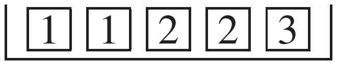
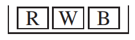

# Independence

Phần này giới thiệu ý tưởng về tính độc lập, ý tưởng này sẽ được sử dụng nhiều lần trong phần còn lại của cuốn sách.

> Hai sự kiện _độc lập_ nếu cơ hội cho cái thứ hai cho cái thứ nhất là như nhau, bất kể cái thứ nhất diễn ra như thế nào. Ngược lại, chúng _phụ thuộc_.

_Ví dụ 7._ Một người nào đó sẽ tung đồng xu hai lần. Nếu được mặt ngửa ở lần tung thứ hai, bạn sẽ thắng được một đô la.

(a) Nếu lần tung đầu tiên là mặt ngửa, cơ hội giành được $ của bạn là bao nhiêu?

(b) Nếu lần tung đầu tiên là mặt sấp, cơ hội giành được $ của bạn là bao nhiêu?

(c) Các lần tung có độc lập không?

_Giải pháp._ Nếu lần tung đầu tiên là mặt ngửa thì lần thứ hai có 50% cơ hội mặt mặt ngửa. Nếu lần tung đầu tiên là mặt sấp thì cơ hội vẫn là 50%. Cơ hội cho lần tung thứ hai vẫn giữ nguyên, dù lần tung đầu tiên xuất hiện. Đó là sự độc lập.

_Ví dụ 8._ Hai lần rút thăm sẽ được thực hiện ngẫu nhiên bằng cách thay thế từ

(a) Giả sử lần rút đầu tiên là 1 . Cơ hội nhận được 2 ở lần rút thứ hai là bao nhiêu?

(b) Giả sử lần rút đầu tiên là 2 . Cơ hội nhận được 2 ở lần rút thứ hai là bao nhiêu?

(c) Việc rút thăm có độc lập không?

_Giải pháp._ Cho dù lần rút đầu tiên là 1 hay 2 hay bất cứ điều gì khác, cơ hội nhận được 2 ở lần rút thứ hai vẫn giữ nguyên - 2/5, hay 40%. Lý do: vé đầu tiên được thay thế nên lần rút thứ 2 luôn được lấy từ cùng một hộp {1 1 2 2 3} . Việc rút thăm là độc lập.

_Ví dụ 9._ Như ví dụ 8, nhưng việc rút thăm được thực hiện không thay thế.
_Giải pháp._ Nếu lần rút đầu tiên là 1 thì lần rút thứ hai là từ hộp {1 2 2 3}. Cơ hội để lần hòa thứ 2 là 2 là 50%. Mặt khác, nếu lần rút đầu tiên là 2 thì lần rút thứ hai là từ hộp {1 1 2 3}. Bây giờ chỉ có 25% cơ hội để cái thứ hai là 2. Các lần rút là phụ thuộc.

> Khi rút ngẫu nhiên có thay thế, các lần rút là độc lập. Nếu không có sự thay thế, chúng là phụ thuộc.

Sự độc lập của các lần rút có nghĩa là gì? Để trả lời câu hỏi này, hãy nghĩ đến các cá cược có thể được giải quyết cho một lần rút: ví dụ: lần rút sẽ là 3 hoặc nhiều hơn. Khi đó, cơ hội thắng cược có điều kiện phải được giữ nguyên, bất kể các lần rút khác diễn ra như thế nào.

_Ví dụ 10._ Một hộp có ba vé màu đỏ, trắng và xanh.

Hai vé sẽ được rút ngẫu nhiên có thay thế. Cơ hội rút được vé đỏ và sau đó là vé trắng là bao nhiêu?
_Giải pháp._ Các lần rút là độc lập nên cơ hội là

\\[
\frac{1}{3} \times \frac{1}{3} = \frac{1}{9}
\\]

So sánh điều này với Ví dụ 3. Các câu trả lời đều khác nhau. Vấn đề độc lập. Và lần này dễ dàng hơn: bạn không cần phải tính các xác suất có điều kiện.

> Nếu hai sự kiện độc lập thì khả năng cả hai xảy ra bằng tích của xác suất vô điều kiện của chúng. Đây là trường hợp đặc biệt của quy tắc nhân [Mục 13.3][sec13.3].

[sec13.3]: ../ch13/ch13-03.md
