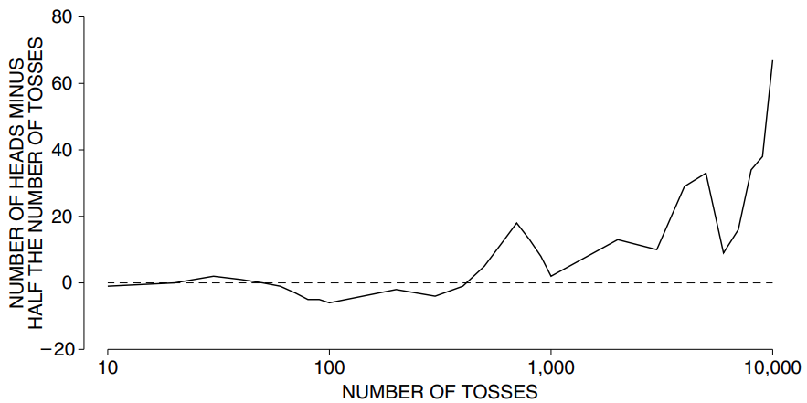
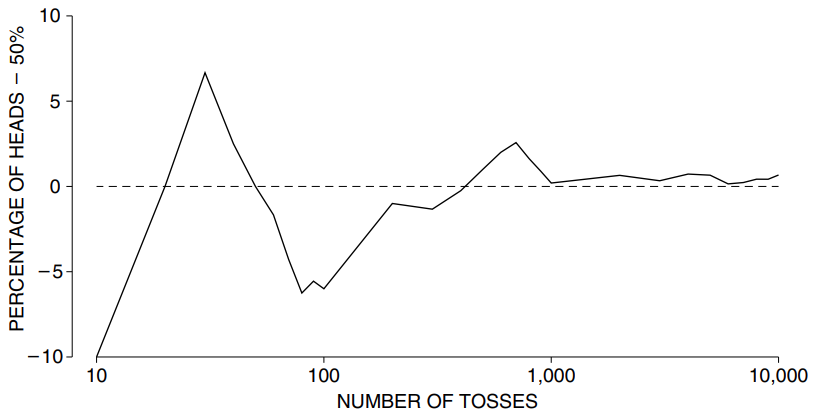
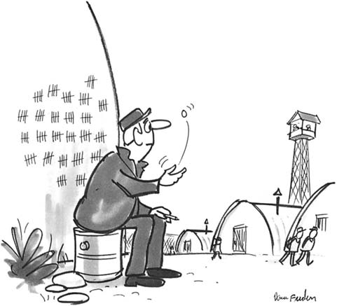

# What Does The Law of Averages Say?

Một đồng xu chạm mặt ngửa với cơ hội 50%. Sau nhiều lần tung, số mặt ngửa sẽ bằng số mặt sấp: đó chẳng phải là luật trung bình sao? John Kerrich, một nhà toán học Nam Phi, đã tìm ra điều đó một cách khó khăn. Anh ấy đang đến thăm Copenhagen khi Thế chiến II nổ ra. Hai ngày trước khi anh dự kiến bay sang Anh, quân Đức xâm chiếm Đan Mạch. Kerrich trải qua thời gian còn lại của cuộc chiến để tập trung tại một trại ở Jutland. Để giết thời gian, ông thực hiện một loạt thí nghiệm về lý thuyết xác suất.[^1] Một thí nghiệm liên quan đến việc tung đồng xu 10.000 lần. Với sự cho phép của ông, một số kết quả được tóm tắt trong Bảng 1 và Hình 1. Những kết quả này nói gì về quy luật trung bình? Để tìm hiểu, hãy giả sử rằng vào cuối Thế chiến II, Kerrich được mời đến trình diễn luật trung bình cho Vua Đan Mạch. Anh ấy đang thảo luận về lời mời với trợ lý của mình.

**Trợ lý:** Vậy ngài sẽ nói với nhà vua về luật trung bình.

**Kerrich:** Phải.

**Trợ lý:** Để nói về điều gì? Ý tôi là, mọi người đều biết về quy luật trung bình, phải không?

**Kerrich:** OK. Hãy cho tôi biết luật trung bình nói gì.

**Trợ lý:** Chà, giả sử bạn đang tung một đồng xu. Nếu bạn có nhiều mặt ngửa thì mặt sấp sẽ bắt đầu xuất hiện. Hoặc nếu bạn có quá nhiều mặt sấp thì cơ hội được mặt ngửa sẽ tăng lên. Về lâu dài, số mặt ngửa và số mặt sấp đều bằng nhau.

**Kerrich:** Không đúng.

**Trợ lý:** Ý bạn là gì, nó không đúng sự thật?

**Kerrich:** Ý tôi là, những gì bạn nói đều sai. Trước hết, với một đồng xu cân bằng, cơ hội có mặt ngửa vẫn ở mức 50%, bất kể điều gì xảy ra. Dù có 2 mặt hay 20 mặt ngửa liên tiếp thì cơ hội nhận mặt ngửa ở lần tiếp theo vẫn là 50%.

**Trợ lý:** Tôi không tin điều đó.

**Kerrich:** Được rồi. Lấy ví dụ về 4 mặt ngửa. Tôi đã ghi lại 2.000 lần tung tiên của mình. Trong 130 trường hợp đồng xu chạm mặt ngửa 4 lần liên tiếp; 69 theo sau là mặt ngửa và chỉ có 61 phần là mặt sấp. Việc lật ngửa không làm cho lần sấp có nhiều khả năng xảy ra hơn.

**Trợ lý:** Bạn luôn nói với tôi những điều mà tôi không tin. Bạn định nói gì với nhà vua?

**Kerrich:** Chà, tôi tung đồng xu 10.000 lần và tôi nhận được khoảng 5.000 mặt ngửa. Con số chính xác là 5.067. Sự khác biệt của 67 là ít hơn 1% số lần ném. Tôi có bản ghi ở đây trong Bảng 1.

**Trợ lý:** Đúng, nhưng 67 mặt ngửa là rất nhiều. Nhà vua sẽ không ấn tượng nếu đó là điều tốt nhất mà luật trung bình có thể làm được.

**Kerrich:** Bạn có đề nghị gì?

| Number of tosses | Number of heads | Difference |
| ---------------- | --------------- | ---------- |
| 10               | 4               | −1         |
| 20               | 10              | 0          |
| 30               | 17              | 2          |
| 40               | 21              | 1          |
| 50               | 25              | 0          |
| 60               | 29              | −1         |
| 70               | 32              | −3         |
| 80               | 35              | −5         |
| 90               | 40              | −5         |
| 100              | 44              | −6         |
| 200              | 98              | −2         |
| 300              | 146             | −4         |
| 400              | 199             | −1         |
| 500              | 255             | 5          |
| 600              | 312             | 12         |
| 700              | 368             | 18         |
| 800              | 413             | 13         |
| 900              | 458             | 8          |
| 1,000            | 502             | 2          |
| 2,000            | 1.013           | 13         |
| 3,000            | 1.510           | 10         |
| 4,000            | 2.029           | 29         |
| 5,000            | 2.533           | 33         |
| 6.000            | 3.009           | 9          |
| 7.000            | 3.516           | 16         |
| 8.000            | 4.034           | 34         |
| 9.000            | 4.538           | 38         |
| 10.000           | 5.067           | 67         |

**
Bảng 1. Thí nghiệm tung đồng xu của John Kerrich. Cột đầu tiên hiển thị số lần ném. Cột thứ hai cho thấy số lượng người đứng đầu. Cột thứ ba cho thấy sự khác biệt về
\\[
\text{number of heads - half the number of tosses}
\\]
**

**Trợ lý:** Tung đồng xu thêm 10.000 lần nữa. Với 20.000 lần tung, số lần ngửa sẽ gần hơn một chút so với con số dự kiến. Rốt cuộc, cuối cùng số mặt ngửa và số mặt sấp phải bằng nhau, phải không?

**Kerrich:** Bạn đã nói điều đó trước đây và nó sai. Nhìn vào Bảng 1. Trong 1.000 lần tung, chênh lệch giữa số lần ngửa và số dự kiến là 2. Với 2.000 lần tung, chênh lệch lên tới 13.

**Trợ lý:** Đó chỉ là một sự may mắn. Khi tung ra 3.000, sự khác biệt chỉ là 10.

**Kerrich:** Đó chỉ là một sự may mắn khác. Ở lần tung 4.000, chênh lệch là 29. Ở lần tung 5.000, nó là 33. Chắc chắn, nó giảm xuống 9 khi tung 6.000, nhưng hãy nhìn vào Hình 1. chance error đang tăng khá đều đặn từ 1.000 đến 10.000 lần tung và nó sẽ đi thẳng lên ở cuối.

**
Hình 1. Thí nghiệm tung đồng xu của Kerrich. "chance error" là
\\[
\text{number of heads - half the number of tosses}
\\]
Sự khác biệt này được thể hiện dựa trên số tung. Khi số lần tung tăng lên, mức độ sai số có xu hướng tăng lên. Trục hoành không theo tỷ lệ và đường cong được vẽ bằng phép nội suy tuyến tính.
**

**Trợ lý:** Vậy quy luật trung bình ở đâu?

**Kerrich:** Với số lần tung lớn, mức độ chênh lệch giữa số lần ngửa và số dự kiến có thể sẽ khá lớn về mặt tuyệt đối. Nhưng so với số lần ném, sự khác biệt có lẽ là khá nhỏ. Đó là quy luật trung bình. Như tôi đã nói, 67 chỉ là một phần nhỏ của 10.000.

**Trợ lý:** Tôi không hiểu.

**Kerrich:** Nhìn này. Trong 10.000 lần tung bạn mong đợi sẽ nhận được 5.000 mặt ngửa, phải không?

**Trợ lý:** Phải.

**Kerrich:** Nhưng không chính xác. Bạn chỉ mong đợi nhận được khoảng 5.000 đầu. Ý tôi là, bạn cũng có thể nhận được 5.001 hoặc 4.998 hoặc 5.007. The amount off 5.000 được gọi là "chance error".

**Trợ lý:** Bạn có thể cụ thể hơn không?

**Kerrich:** Hãy để tôi viết một phương trình:
\\[
\text{number of heads = half the number of tosses + chance error}.
\\]
Sai số này có thể lớn về mặt tuyệt đối, nhưng nhỏ so với số lần ném. Hãy nhìn vào Hình 2. Đó là luật trung bình, ngay tại đó.

**
Hình 2. `chance error` được biểu thị bằng phần trăm của số lần tung. Khi số lần tung tăng lên, tỷ lệ phần trăm này sẽ giảm xuống: `error chance` sẽ nhỏ hơn so với số lần tung. Trục hoành không theo tỷ lệ và đường cong được vẽ bằng phép nội suy tuyến tính.
**

**Trợ lý:** Hừm. Nhưng điều gì sẽ xảy ra nếu bạn tung đồng xu thêm 10.000 lần nữa? Sau đó, bạn sẽ có 20.000 lần tung để làm việc.

**Kerrich:** Sai số cơ hội sẽ tăng lên, nhưng không phải gấp đôi. Về mặt tuyệt đối, sai số cơ hội sẽ lớn hơn.[^2] Nhưng tính theo phần trăm số lần tung, nó sẽ nhỏ hơn.

**Trợ lý:** Hãy nói lại cho tôi biết luật trung bình nói gì.

**Kerrich:** Số lần ngửa sẽ bằng khoảng một nửa số lần tung, nhưng nó sẽ chênh lệch một chút - `chance error`. Khi số lần tung tăng lên, `chance error` sẽ lớn hơn về mặt tuyệt đối. So với số lần tung thì nó nhỏ hơn.

**Trợ lý:** Bạn có thể cho tôi biết một số ý tưởng về `chance error`có thể lớn đến mức nào không?

**Kerrich:** Chà, với 100 lần tung, `chance error` có thể là khoảng 5. Với 10.000 lần tung, `chance error` có thể là khoảng 50. Nhân số lần tung với 100 chỉ nhân độ lớn của sai số cơ hội có thể xảy ra với \\(\sqrt{100} = 10\\).

**Trợ lý:** Điều bạn đang nói là khi số lần tung tăng lên, sự khác biệt giữa số lần ngửa và một nửa số lần tung sẽ tăng lên; nhưng sự khác biệt giữa tỷ lệ phần trăm mặt ngửa và 50% ngày càng nhỏ hơn.

**Kerrich:** Chính xác.

---

[^1]: An Experimental Introduction to the Theory of Probability (University of Witwatersrand Press,1964). Kerrich went to teach in South Africa after World War II.

[^2]: We distinguish between the difference as a number (in “absolute terms”) and the difference as a percent. Absolute values also come in at a more technical level. Let Xn be the chance error after n tosses, that is, the number of heads minus half the number of tosses. Then Xn is a martingale, so \\(E\\{X*{n+m}|X_n\\} = X_n; \text{but } E\\{|X*{n+m}|\big|X_n\\} > |X_n|\\).
