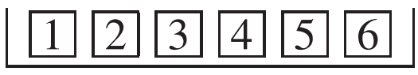
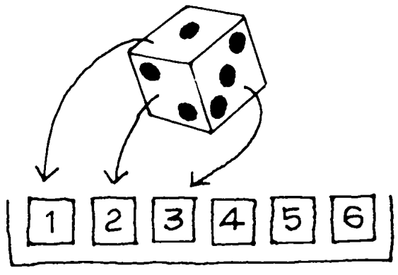

# The Sum of Draws

Mục tiêu của phần này là để minh họa quá trình sau đây. Có một hộp phiếu. Mỗi phiếu có một số được viết trên đó. Sau đó, một số phiếu được rút ngẫu nhiên từ hộp và các số trên các phiếu này được cộng lại. Ví dụ, lấy hộp

Hãy tưởng tượng rút ngẫu nhiên hai lần có thay thế từ hộp. Bạn lắc hộp để trộn các phiếu, chọn ngẫu nhiên 1 phiếu, ghi lại số trên đó rồi bỏ lại vào hộp. Sau đó, bạn lắc hộp lần nữa và rút ngẫu nhiên lần thứ hai. Cụm từ "có thay thế" nhắc bạn cất phiếu lại vào hộp trước khi rút lại. Trả lại phiếu cho phép bạn rút đi rút lại nhiều lần với cùng điều kiện. (rút có và không thay thế đã được thảo luận ở Phần 1 Chương 13.)

Sau khi rút ngẫu nhiên hai lần có thay thế, bạn cộng hai số lại với nhau. Ví dụ: lần rút đầu tiên có thể là 3 và lần thứ hai là 5. Khi đó tổng là 8. Hoặc lần rút đầu tiên có thể là 3 và lần thứ hai cũng là 3, nên tổng là 6. Có nhiều khả năng khác. Tổng có thể thay đổi theo cơ hội. Nếu các lần rút diễn ra theo một cách thì tổng là cùng một thứ; nếu chúng diễn ra khác nhau thì tổng cũng khác nhau.

Lúc đầu, ví dụ này có vẻ giả tạo. Nhưng nó cũng giống như một lượt chơi trong Monopoly bạn tung một cặp xúc xắc, cộng hai số và di chuyển nhiều ô vuông. Tung xúc xắc cũng giống như chọn một số từ hộp.

Tiếp theo, hãy tưởng tượng rút 25 lần từ cùng một ô

Tất nhiên, việc rút thăm phải được thực hiện có thay thế. Tổng của chúng sẽ lớn đến mức nào? Cách trực tiếp nhất để tìm hiểu là bằng thực nghiệm. Chúng tôi đã lập trình máy tính để thực hiện các lượt rút thăm.[^4] Nó nhận được 3 ở lần rút đầu tiên, 2 ở lần rút thứ hai, 4 ở lần rút thứ ba. Tất cả đều ở đây:

\\[
3,2,4,6,2 \quad 3,5,4,4,2 \quad 3,6,4,1,2 \quad 4,1,5,5,6 \quad 2,2,2,5,5
\\]
Tổng của 25 lần rút này là 88.

Tất nhiên, nếu số lần rút khác nhau thì tổng của chúng sẽ khác. Vì vậy chúng tôi yêu cầu máy tính lặp lại toàn bộ quá trình 10 lần. Mỗi lần, nó thực hiện 25 lần rút ngẫu nhiên có thay thế từ hộp và lấy tổng của chúng. Kết quả:

\\[
88,84,80,90,83,78,95,94,80,89
\\]

Sự biến thiên cơ hội rất dễ nhận thấy. Tổng đầu tiên là 88, tổng thứ hai giảm xuống 84, tổng thứ ba thậm chí còn giảm xuống 80. Các giá trị nằm trong khoảng từ thấp nhất là 78 đến cao nhất là 95.

Về nguyên tắc, tổng có thể nhỏ như \\(25 \times 1 = 25\\) hoặc lớn như \\(25 \times 6 = 150\\). Nhưng trên thực tế, 10 giá trị quan sát được đều nằm trong khoảng từ 75 đến 100. Liệu điều này có tiếp tục lặp lại nhiều hơn không? Cơ hội để tổng đó nằm trong khoảng từ 75 đến 100 là bao nhiêu? Loại vấn đề đó sẽ được giải quyết trong hai chương tiếp theo.

Tổng các lần rút ra từ một hộp là cách viết tắt của quy trình được thảo luận trong phần này:

- Rút ngẫu nhiên các phiếu từ một hộp.
- Cộng các số trên phiếu.[^5]

[^4]: Computer programs are deterministic, and therefore cannot generate numbers in a truly random way. However, a program can generate a sequence of numbers which look quite random. One method involves a multiplier M, which is a very big number. A "seed" x is chosen by the programmer: x is between 0 and 1. The computer works out M times x, which has an integer part and a decimal part:\
    .... aaaaaaaaaaaa. bbbbbbbbbbbbb ....\
    Digits to the left of the decimal point are printed out as the first random number, and the decimal part is used as the seed for the next random number. For more discussion, see\
    Jerry Banks, editor, _Handbook of Simulation_ (Wiley, 1998).\
    P. L’Ecuyer, "Efficient and portable combined random number generators," Communications of the ACM vol. 31 (1988) pp. 742–74.\
    J. E. Gentle, W. Haerdle, and Y. Mori, editors, Handbook of Computational Statistics
    (Springer-Verlag, 2004).\
    D. Knuth, The Art of Computer Programming vol. II (Addison–Wesley, 1998).\
    P. A. W. Lewis and E. J. Orav, Simulation Methodology for Statisticians, Operations Analysts, and Engineers (Wadsworth & Brooks/Cole, 1988, chapter 5).\
    G. Marsaglia, "Random numbers fall mainly in the planes," Proceedings of the National
    Academy of Sciences vol. 60 (1968) pp. 25–28., "A current view of random number generators," Proceedings of the Sixteenth Symposium on the Interface between Computer Science and Statistics (1985) pp. 3–10.

[^5]: "Sum of draws from a box" is not a standard term but it is lighter than “sum of independent, identically distributed, random variables.” “Box model” is not standard either, although it seems to be catching on.
