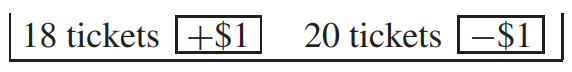
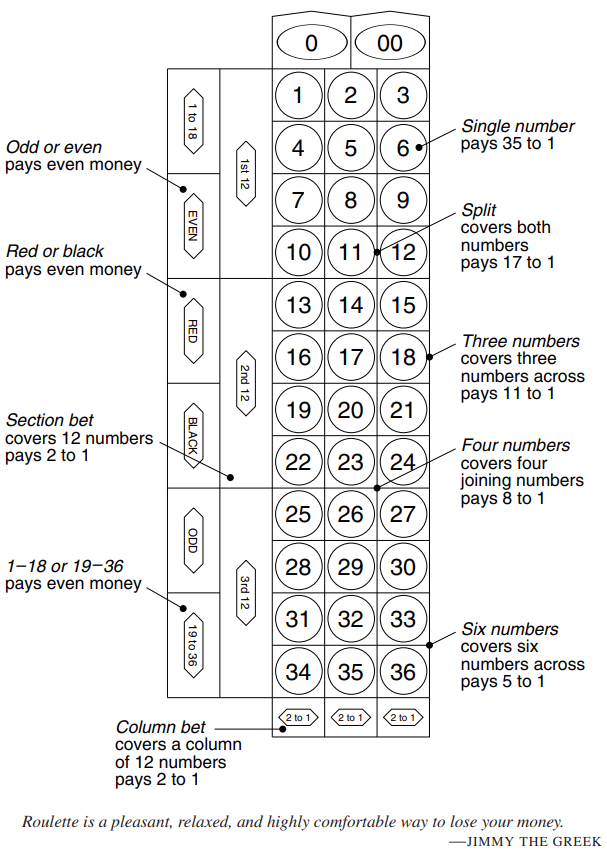
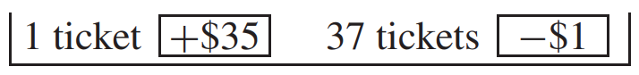

# Making a Box Model

Mục tiêu của mục này là tạo ra một số mô hình hộp để thực hành sau này. Tổng số lần rút ra từ hộp hóa ra lại là thành phần quan trọng của nhiều quy trình thống kê, vì vậy hãy chú ý đến tổng. Có ba câu hỏi cần trả lời khi làm mô hình hộp:

- Những số nào trong hộp?
- Có bao nhiêu mỗi loại?
- Rút bao nhiêu lần?

Mục đích của mô hình hộp là phân tích khả năng thay đổi cơ hội, có thể thấy rõ ràng nhất ở bất kỳ sòng bạc nào. Vì vậy phần này sẽ tập trung vào các mô hình hộp cho roulette. Bánh xe roulette Nevada có 38 ô. Một chiếc được đánh số 0, một chiếc được đánh số 00 và những chiếc còn lại được đánh số từ 1 đến 36. Người chia bài quay bánh xe và ném một quả bóng lên bánh xe. Bóng có khả năng rơi vào bất kỳ ô nào trong số 38 ô như nhau. Trước khi nó hạ cánh, bạn có thể đặt cược trên bàn (Hình 3).

Một lần cược là đỏ hoặc đen. Ngoại trừ số 0 và 00 có màu xanh lá cây, các số trên bánh xe roulette xen kẽ màu đỏ và đen. Ví dụ: nếu bạn đặt cược $1 vào màu đỏ và một con số màu đỏ xuất hiện, bạn sẽ nhận lại được $ đó cùng với $1 tiền thắng khác. Nếu một con số màu đen hoặc màu xanh lá cây xuất hiện, người tổ chức sẽ mỉm cười và lấy tiền của bạn.

Giả sử bạn đang ở Golden Nugget ở Las Vegas. Bạn vừa đặt $1 vào màu đỏ, và người chia bài sẽ quay bánh xe. Có vẻ khó để tính toán cơ hội của bạn, nhưng mô hình hộp sẽ giúp ích. Những số nào đi vào hộp? Bạn sẽ thắng được $1 hoặc mất $1. Vì vậy, vé phải hiển thị +$1 hoặc −$1.

Câu hỏi thứ hai là, mỗi loại có bao nhiêu? Bạn thắng nếu một trong 18 số màu đỏ xuất hiện và thua nếu một trong 18 số đen xuất hiện. Nhưng bạn cũng thua nếu 0 hoặc 00 xuất hiện. Và đó là nơi mà nhà cái có được lợi thế. Cơ hội thắng của bạn chỉ là 18 trên 38, và cơ hội thua là 20 trên 38. Vì vậy có 18 vé +$1 và 20 vé -$1. Chiếc hộp là

Về cơ hội, đặt cược $1 vào màu đỏ cũng giống như rút một vé ngẫu nhiên từ hộp. Ưu điểm lớn nhất của mô hình hộp là tất cả những chi tiết không liên quan - bánh xe, cái bàn và nụ cười của người chia bài - đã bị lược bỏ. Và bạn có thể thấy thực tế tàn khốc: bạn có 18 vé, họ có 20.

**
Hình 3. Bàn roulette Nevada
**

Đó là một trò chơi. Nhưng giả sử bạn chơi roulette mười lần, mỗi lần đặt cược $1 vào màu đỏ. Điều gì có khả năng xảy ra sau đó? Bạn sẽ dẫn trước hoặc tụt lại phía sau một khoảng nào đó. Số tiền này được gọi là lợi nhuận ròng của bạn. Lợi ích ròng là dương nếu bạn dẫn trước, âm nếu bạn đi sau.

Để tính toán cơ hội, lợi nhuận ròng phải được kết nối với hộp. Trong mỗi lần chơi, bạn thắng hoặc thua một số tiền. Mười con số thắng thua này giống như mười con số rút ra từ hộp, được thực hiện ngẫu nhiên và thay thế. (Việc thay thế các vé sẽ giữ cho cơ hội trên mỗi lần rút giống như cơ hội của bánh xe.) Tiền lãi ròng - tổng số tiền thắng hoặc thua - chỉ là tổng của mười con số thắng-thua này. Lợi nhuận ròng của bạn trong mười lần chơi giống như tổng của mười lần rút ngẫu nhiên có thay thế từ hộp

Đây là mô hình đầu tiên của chúng ta, vì vậy bạn nên xem xét kỹ hơn về nó. Ví dụ, giả sử mười lần chơi diễn ra theo cách này:

\\[
R,R,R,B,G,R,R,B,B,R
\\]

(R có nghĩa là màu đỏ, B có nghĩa là màu đen và G có nghĩa là màu xanh lá cây - số nhà 0 và 00). Bảng 2 dưới đây cho thấy mười con số thắng-thua tương ứng và mức lãi ròng.

| Plays            | R   | R   | R   | B   | G   | R   | R   | B   | B   | R   |
| ---------------- | --- | --- | --- | --- | --- | --- | --- | --- | --- | --- |
| Win-lose numbers | +1  | +1  | +1  | -1  | -1  | +1  | +1  | -1  | -1  | +1  |
| Net gain         | 1   | 2   | 3   | 2   | 1   | 2   | 3   | 2   | 1   | 2   |

**
Bảng 2. Lợi nhuận ròng. Đây là tổng tích lũy của các số thắng-thua.
**

Thực hiện theo mức tăng ròng. Khi bạn nhận được màu đỏ, số thắng-thua là +1 và mức lãi ròng tăng lên 1. Khi bạn nhận được màu đen hoặc xanh lục, số thắng-thua là −1 và mức lãi ròng giảm đi 1. Số tiền lãi ròng chỉ là tổng của các con số thắng thua, và đây giống như những con số rút ra từ chiếc hộp. Đó là lý do tại sao lợi nhuận ròng giống như tổng số lần rút ra từ chiếc hộp. Trò chơi này đã có một kết thúc có hậu: bạn đã thắng 2 đô la. Để biết điều gì sẽ xảy ra nếu bạn tiếp tục chơi, hãy đọc chương tiếp theo.

_Ví dụ 1._ Nếu bạn đặt cược $1 vào một số duy nhất tại trò chơi roulette Nevada và con số đó xuất hiện, bạn sẽ nhận lại được $1 cùng với số tiền thắng là $35. Nếu bất kỳ số nào khác xuất hiện, bạn sẽ mất $1. Những con đánh bạc nói rằng một số duy nhất _trả 35 trên 1_. Giả sử bạn chơi roulette 100 lần, đặt cược một đô la vào số 17 mỗi lần. Lợi nhuận ròng của bạn giống với tổng số ........... rút được thực hiện ngẫu nhiên có thay thế từ hộp ........... Điền vào chỗ trống.

_Giải pháp._ Những số nào đi vào hộp? Để trả lời câu hỏi này, hãy nghĩ về một lần chơi. Bạn đặt $1 vào số 17. Nếu quả bóng rơi vào túi 17, bạn sẽ có thêm $35. Nếu nó rơi vào bất kỳ túi nào khác, bạn sẽ mất $1. Vì vậy, hộp phải chứa vé $35 và −$1 .

> Các vé trong hộp hiển thị số tiền khác nhau có thể thắng hoặc thua trong một lần chơi.

Mỗi loại bao nhiêu vé? Hãy tiếp tục suy nghĩ về một lần chơi. Bạn chỉ có 1 cơ hội thắng trong 38 lần, vì vậy cơ hội rút được $35 phải là 1 trên 38. Bạn có 37 cơ hội thua trong 38 lần, vì vậy cơ hội rút được −$1 phải là 37 trên 38. Chiêc hộp là

> Cơ hội rút được bất kỳ số cụ thể nào từ hộp phải bằng cơ hội thắng số tiền đó trong một lần chơi. ("Thắng" một số âm tương đương về mặt toán học với cái mà hầu hết mọi người gọi là thua.)

Có bao nhiêu lần rút? Bạn đang chơi 100 lần. Số lần rút phải là 100. Vé phải được thay thế sau mỗi lần rút để không làm thay đổi tỷ lệ cược.

> Số lần rút bằng số lần chơi.

Vì vậy, mức tăng ròng trong 100 lượt chơi giống như tổng của 100 lượt rút được thực hiện ngẫu nhiên có thay thế từ hộp

Điều này hoàn thành giải pháp.

## Exercise Set C
