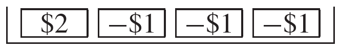

# The Expected Value

Một quá trình ngẫu nhiên đang chạy. Nó cung cấp một số. Rồi cái khác. Và một cái khác. Bạn sắp chết chìm trong đầu ra ngẫu nhiên. Nhưng các nhà toán học đã tìm thấy một chút trật tự trong sự hỗn loạn này. Các con số được quy trình phân phối khác nhau xung quanh `expected value`, lượng giảm có kích thước tương tự như `standard error`. Để cụ thể hơn, hãy tưởng tượng tạo ra một số thông qua quá trình ngẫu nhiên sau: đếm số mặt ngửa trong 100 lần tung đồng xu. Bạn có thể nhận được 57 mặt ngửa. Con số này cao hơn 7 so với giá trị mong đợi là 50, do đó `chance error` là +7. Nếu bạn tung thêm 100 lần nữa, bạn sẽ nhận được số mặt ngửa khác, có lẽ là 46. `chance error` sẽ là −4. Lần lặp lại thứ ba có thể tạo ra một số khác, chẳng hạn như 47; và `chance error` sẽ là −3. Các con số của bạn sẽ cách 50 với một lượng có kích thước tương tự như `standard error` là 5 (Mục 5).

Các công thức cho `expected value` và `standard error` phụ thuộc vào quá trình ngẫu nhiên tạo ra số đó. Chương này đề cập đến tổng số lần rút từ một hộp và công thức tính `expected value` sẽ được giới thiệu kèm theo ví dụ: tổng của 100 lần rút ngẫu nhiên có thay thế từ hộp

Tổng này nên lớn khoảng bao nhiêu? Để trả lời câu hỏi này, hãy nghĩ xem các lần rút sẽ diễn ra như thế nào. Có 4 phiếu trong hộp, vì vậy 5 phiếu sẽ xuất hiện ở khoảng 1/4 số lần rút và 1 sẽ xuất hiện ở 3/4 số phiếu. Với 100 lần rút thăm, bạn có thể mong đợi nhận được khoảng 25 số 5 và 75 số 1. Tổng các lần rút phải vào khoảng

\\[
25 \times 5 + 75 \times 1 = 200
\\]

Đó là `expected value`. Công thức cho `expected value` là một cách rút gọn. Nó có 2 thành phần:

- số lần rút;
- trung bình cộng của các số trong hộp, viết tắt là "trung bình của hộp".

> `expected value` của tổng số lần rút được thực hiện ngẫu nhiên có thay thế từ một hộp bằng \\[\text{(number of draws)} \times \text{(average of box)}\\]

Để xem logic đằng sau công thức, hãy quay lại ví dụ. Trung bình của hộp là

\\[
\frac{1 + 1 + 1 + 5}{4} = 2
\\]

Trung bình, mỗi lần rút sẽ cộng thêm khoảng 2 vào tổng. Với 100 lần rút, tổng số tiền phải vào khoảng \\(100 \times 2 = 200\\).

_Ví dụ 1._ Giả sử bạn đang tới Las Vegas để chơi Keno. Đặt cược yêu thích của bạn là $1 cho một số duy nhất. Khi bạn thắng, họ sẽ trả lại cho bạn $1 và thêm $2 nữa. Khi bạn thua, họ giữ lại $1. Có 1/4 cơ hội thắng.[^1] Bạn dự kiến sẽ thắng (hoặc thua) bao nhiêu trong 100 lượt chơi, nếu bạn đặt cược cho mỗi lượt chơi?

_Giải pháp._ Bước đầu tiên là viết ra một mô hình hộp. Trong mỗi lần chơi, số tiền kiếm được ròng của bạn sẽ tăng thêm $2 hoặc giảm đi $1. Có 1/4 cơ hội tăng lên; có 3/4 cơ hội giảm xuống. Vì vậy, mức tăng ròng của bạn sau 100 lần chơi tương tự tổng của 100 lần rút ngẫu nhiên có thay thế từ hộp

Trung bình của hộp này là

\\[
\frac{\$2 - \$1 - \$1 - \$1}{4} = -\$0.25
\\]

Trung bình, mỗi lần chơi khiến bạn tốn một phần tư. Trong 100 lượt chơi, bạn có thể sẽ thua khoảng $25. Đây là câu trả lời. Nếu bạn tiếp tục, trong 1.000 lượt chơi, bạn sẽ thua khoảng $250. Càng chơi càng thua. Có lẽ bạn nên tìm một trò chơi khác.

[^1]: Keno is the Las Vegas equivalent of bingo. There are 80 balls, numbered 1 through 80. On each play, 20 balls are chosen at random without replacement. If you bet on the single number 17, for example, you are betting that ball number 17 will be among the 20 that are chosen. Your chance of winning is \\(20/80 = 1/4\\).
