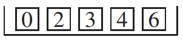
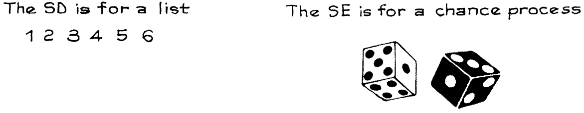

# The Standard Error

Giả sử 25 lần rút ngẫu nhiên có thay thế từ hộp

(Không có gì đặc biệt về các con số trong hộp; chúng được chọn để thực hiện các phép tính sau này cho ra kết quả đồng đều.) Mỗi tấm trong 5 tấm phiếu sẽ xuất hiện trong khoảng 1/5 số lần rút thăm, tức là 5 lần. Vì vậy tổng sẽ vào khoảng

\\[
5 \times 0 + 5 \times 2 + 5 \times 3 + 5 \times 4 + 5 \times 6 = 75
\\]

Đó là `expected value` của tổng. Tất nhiên, mỗi phiếu sẽ không xuất hiện ở chính xác 1/5 số lần rút thăm, cũng như Kerrich đã không thu được mặt ngửa ở chính xác một nửa số lần tung. Tổng sẽ lệch khỏi `expected value` do một `chance error`:

\\[
\text{sum = expected value + chance error}
\\]

`chance error` là giá trị trên (+) hoặc dưới (-) `expected value`. Ví dụ: nếu tổng là 70 thì `chance error` là −5.

`chance error` có thể lớn đến mức nào? Câu trả lời được đưa ra bởi `standard error`, thường được viết tắt là `SE`.

> Một tổng rất có thể ở quanh `expected value` của nó, nhưng bị sai lệch do `chance error` có kích thước tương tự như `standard error`.

Có một công thức được sử dụng để tính `SE` cho tổng các lần rút được thực hiện ngẫu nhiên có thay thế từ một hộp. Nó được gọi là _square root law_ vì nó liên quan đến căn bậc hai của số lần rút. Các quy trình thống kê trong phần còn lại của cuốn sách phụ thuộc vào công thức này.[^2]

> _square root law_. Khi rút ngẫu nhiên có thay thế từ một hộp phiếu được đánh số, `standard error` của tổng các lần rút là \\[\sqrt{\text{number of draws}} \times \text{SD of box}\\]

Công thức có hai phần: căn bậc hai của số lần rút thăm và `SD` của danh sách các số trong hộp(viết tắt là "SD của hộp"). `SD` đo mức độ chênh lệch giữa các số trong hộp. Nếu có nhiều chênh lệch trong hộp, `SD` lớn và khó có thể dự đoán kết quả rút thăm sẽ diễn ra như thế nào. Vì vậy `standard error` cũng phải lớn. Bây giờ về số lần rút thăm. Tổng của hai lần rút có thể thay đổi nhiều hơn so với một lần rút. Tổng số 100 lần rút vẫn có thể thay đổi nhiều hơn. Mỗi lần rút thăm sẽ thêm một số thay đổi bổ sung vào tổng số, bởi vì bạn không biết nó sẽ diễn ra như thế nào. Khi số lần rút tăng lên, tổng số sẽ khó dự đoán hơn, `chance error` sẽ lớn hơn và `standard error` cũng vậy. Tuy nhiên, `standard error` tăng lên chậm, theo hệ số bằng căn bậc hai của số lần rút thăm. Chẳng hạn, tổng của 100 lần rút chỉ thay đổi \\(\sqrt{100} = 10\\) lần so với một lần rút.

`SD` và `SE` khác nhau.[^3] `SD` áp dụng cho việc trải rộng trong danh sách các số. Nó được thực hiện bằng phương pháp được giải thích trên [Mục 4.6](../ch04/ch04-06.md). Ngược lại, `SE` áp dụng cho khả năng thay đổi cơ hội - ví dụ: trong tổng các lần rút.

Ở đầu phần, chúng ta đã thấy tổng số 25 lần rút ngẫu nhiên có thay thế từ hộp

`expected value` của tổng này là 75. Tổng sẽ vào khoảng 75, nhưng sẽ bị sai lệch do một `chance error`. `chance error` có thể lớn đến mức nào? Để tìm hiểu, hãy tính `standard error`. Trung bình cộng của các số trong hộp là 3. Các độ lệch so với trung bình là

\\[
-3 \quad -1 \quad 0 \quad 1 \quad 3
\\]

`SD` của hộp là
\\[
\sqrt{\frac{(-3)^2 + (-1)^2 + 0^2 + 1^2 + 3^2}{5}} = \sqrt{\frac{9 + 1 + 0 + 1 + 9}{5}} = \sqrt{\frac{20}{5}} = 2
\\]

Điều này đo lường sự thay đổi trong hộp. Theo luật căn bậc hai, tổng của 25 lần rút có nhiều thay đổi hơn, theo hệ số \\(\sqrt{25} = 5\\). `SE` cho tổng của 25 lần rút là \\(5 \times 2 = 10\\). Nói cách khác, độ lớn của `chance error` là 10. Và tổng số lần rút phải vào khoảng 75, cộng hoặc trừ 10 hoặc hơn. Nói chung, tổng có thể ở quanh `expected value` của nó, thêm hoặc bớt một `standard error` hoặc tương tự.

Để chỉ ra điều này có ý nghĩa gì về mặt thực nghiệm, chúng tôi đã lập trình cho máy tính rút ngẫu nhiên 25 lần có thay thế từ hộp 0 2 3 4 6 . Thu được

\\[
0,0,4,4,0 \quad 4,3,2,6,2 \quad 2,0,2,6,2 \quad 6,4,2,6,3 \quad 0,3,6,4,0
\\]

Tổng của 25 lần rút này là 71. Con số này thấp hơn 4 so với `expected value`, do đó `chance error` là −4. Máy tính rút thêm 25 lần nữa và lấy tổng, nhận được 76. `chance error` là +1. Tổng thứ ba là 86, với `chance error` là +11. Trên thực tế, chúng tôi đã yêu cầu máy tính tạo ra 100 tổng như trong Bảng 1. Những con số này đều ở khoảng 75, `expected value`. Chúng bị lệch do các `chance error` có kích thước tương tự 10, `standard error`.

> Tổng các lần rút rất có thể vào quanh......, thêm hoặc bớt ......hoặc tương tự. `expected value` của tổng sẽ điền vào chỗ trống đầu tiên. `SE` của tổng điền vào chỗ trống thứ hai.

Một số thuật ngữ: con số 71 trong Bảng 1 là giá trị quan sát được cho tổng các lần rút; 76 là một giá trị quan sát khác. Tất cả đã nói, bảng có 100 giá trị được quan sát cho tổng. Các giá trị quan sát được này khác với `expected value` là 75. Sự khác biệt là `chance error`. Ví dụ, `chance error` của 71 là −4, vì \\(71 − 75 = −4\\). `chance error` của 76 là +1, vì \\(76 − 75 = 1\\). v.v

Các giá trị quan sát được trong Bảng 1 cho thấy có sự chênh lệch rất nhỏ xung quanh `expected value`. Về nguyên tắc, chúng có thể nhỏ bằng 0 hoặc lớn đến \\(25 \times 6 = 150\\). Tuy nhiên, tất cả trừ một trong số chúng đều nằm trong khoảng từ 50 đến 100, nghĩa là nằm trong khoảng 2.5 `SE` so với `expected value`.

> Các giá trị quan sát được hiếm khi cách xa hơn 2 hoặc 3 `SE` so với `expected value`.

| Repretition | Sum | Repretition | Sum | Repretition | Sum | Repretition | Sum | Repretition | Sum |
| ----------- | --- | ----------- | --- | ----------- | --- | ----------- | --- | ----------- | --- |
| 1           | 71  | 21          | 80  | 41          | 64  | 61          | 64  | 81          | 60  |
| 2           | 76  | 22          | 77  | 42          | 65  | 62          | 70  | 82          | 67  |
| 3           | 86  | 23          | 70  | 43          | 88  | 63          | 65  | 83          | 82  |
| 4           | 78  | 24          | 71  | 44          | 77  | 64          | 78  | 84          | 85  |
| 5           | 88  | 25          | 79  | 45          | 82  | 65          | 64  | 85          | 77  |
| 6           | 67  | 26          | 56  | 46          | 73  | 66          | 77  | 86          | 79  |
| 7           | 76  | 27          | 79  | 47          | 92  | 67          | 81  | 87          | 82  |
| 8           | 59  | 28          | 65  | 48          | 75  | 68          | 72  | 88          | 88  |
| 9           | 59  | 29          | 72  | 49          | 57  | 69          | 66  | 89          | 76  |
| 10          | 75  | 30          | 73  | 50          | 68  | 70          | 74  | 90          | 75  |
| 11          | 76  | 31          | 78  | 51          | 80  | 71          | 70  | 91          | 77  |
| 12          | 66  | 32          | 75  | 52          | 70  | 72          | 76  | 92          | 66  |
| 13          | 76  | 33          | 89  | 53          | 90  | 73          | 80  | 93          | 69  |
| 14          | 84  | 34          | 77  | 54          | 76  | 74          | 70  | 94          | 86  |
| 15          | 58  | 35          | 81  | 55          | 77  | 75          | 56  | 95          | 81  |
| 16          | 60  | 36          | 68  | 56          | 65  | 76          | 49  | 96          | 90  |
| 17          | 79  | 37          | 70  | 57          | 67  | 77          | 60  | 97          | 74  |
| 18          | 78  | 38          | 86  | 58          | 60  | 78          | 98  | 98          | 72  |
| 19          | 66  | 39          | 70  | 59          | 74  | 79          | 81  | 99          | 57  |
| 20          | 71  | 40          | 71  | 60          | 83  | 80          | 72  | 100         | 62  |

**
Bảng 1. Mô phỏng trên máy tính: tổng của 25 lần rút ngẫu nhiên có thay thế từ hộp 0,2,3,4,6.
**

[^2]:Nếu \\(X_i\\) độc lập và có cùng phân bố với `mean` \\(\mu\\) và `variance` \\(\sigma^2\\) thì
    \\[
    E(X_1 + \dots + X_n) = n\mu\\\\
    var(X_1 + \dots + X_n) = var X_1 + \dots + var X_n = n\sigma^2
    \\]
    The `SE`, which is the square root of the variance, is then \\(\sqrt{n}\sigma\\). That is the square root law.

[^3]: Tom Alexander, "A revolution called plate tectonics", Smithsonian Magazine vol. 5, no. 10 (1975).A. Hallam, "Alfred Wegener and the hypothesis of continental drift", Scientific American vol. 232, no. 2 (1975). Ursula Marvin, Continental Drift (Smithsonian Press, 1973).
