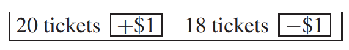

# Using The Normal Curve

Một số lượng lớn các lần rút thăm sẽ được thực hiện ngẫu nhiên có thay thế từ một hộp. Cơ hội để tổng số lần rút sẽ nằm trong một phạm vi nhất định là bao nhiêu? Các nhà toán học đã phát hiện ra `normal courve` khi cố gắng giải các bài toán thuộc loại này. Logic đằng sau đường cong sẽ được thảo luận trong chương tiếp theo. Mục đích của phần này chỉ là phác thảo phương pháp, áp dụng bất cứ khi nào số lần rút đủ lớn. Về cơ bản, vấn đề là chuyển đổi sang `standard units` (sử dụng `expected value` và `standard error`) và sau đó tính diện tích dưới đường cong, như trong Chương 5.

Bây giờ là một ví dụ. Giả sử máy tính được lập trình để lấy tổng của 25 lần rút ngẫu nhiên có thay thế từ chiếc hộp thần kỳ.

In ra kết quả, lặp đi lặp lại quá trình này. Khoảng bao nhiêu phần trăm của các giá trị quan sát được nằm trong khoảng từ 50 đến 100?

Mỗi tổng sẽ nằm ở đâu đó trên trục ngang trong khoảng từ 0 đến \\(25 \times 6 = 150\\).

Vấn đề là tính xác suất để tổng nằm trong khoảng từ 50 đến 100.

Để tìm cơ hội, hãy đổi sang `standard units` và sử dụng `normal curve`. `standard units` cho biết một số khác xa `expected value` bao nhiêu `SE`.[^4] Trong ví dụ, 100 đổi thành 2.5 theo `standard units`. Lý do: `expected value` của tổng là 75 và `SE` là 10, vậy 100 cao hơn giá trị kỳ vọng 2.5 `SE`. Tương tự, 50 thành −2,5.

Khoảng từ 50 đến 100 là khoảng trong phạm vi 2.5 `SE` của `expected value`, do đó tổng phải ở đó trong khoảng 99% lần.

Thế là xong việc tính toán. Bây giờ cho một số dữ liệu. Bảng 1 ở trên báo cáo 100 giá trị được quan sát cho tổng: khoảng 99 trong số đó phải nằm trong khoảng từ 50 đến 100, và trên thực tế, 99 trong số đó nằm trong khoảng đó. Để lấy một số phạm vi ít cực đoan hơn, khoảng 68% giá trị quan sát được phải nằm trong khoảng từ 75 − 10 đến 75 + 10. Trên thực tế, có 73 giá trị. Cuối cùng, khoảng 95% giá trị quan sát được trong Bảng 1 phải nằm trong khoảng \\(75 \pm 20\\), và 98 trong số đó nằm trong khoảng đó. Lý thuyết có vẻ khá tốt. (Phạm vi bao gồm điểm cuối; \\(\pm\\) được đọc là "cộng hoặc trừ.")

_Ví dụ 2._ Trong một tháng, có 10.000 lượt chơi độc lập trên bánh xe roulette ở một sòng bạc nhất định. Để đơn giản, giả sử người đánh bạc chỉ đặt cược $1 vào màu đỏ trong mỗi lần chơi. Ước tính khả năng nhà cái sẽ thắng nhiều hơn $250 từ những trò chơi này.[^5] (Đỏ hoặc đen trả tiền chẵn và nhà cái có 20/38 cơ hội thắng.)

_Giải pháp._ Vấn đề đòi hỏi khả năng lợi nhuận ròng của nhà cái lớn hơn 250 đô la.

Mô hình hộp là điều đầu tiên. Cái hộp là

Lợi nhuận ròng của nhà cái giống tương tự tổng 10.000 lần rút ra từ chiếc hộp này.

`expected value` của mức tăng ròng là số lần rút nhân với mức trung bình của các số trong hộp. Trung bình là

\\[
\frac{\overbrace{\$1 + ... + \$1}^{\text{20 tickets}} - \overbrace{\$1 - ... - $1}^{\text{18 tickets}}}{38} = \frac{\$20 - \$18}{38} = \frac{\$2}{38} \approx \$0.005
\\]

Trung bình, mỗi lần rút sẽ cộng thêm khoảng $0.05 vào tổng số tiền. Tổng số 10.000 lượt rút có giá trị dự kiến là \\(10.000 \times \$0.05 = \$500\\). Nhà cái tính trung bình khoảng một nikel cho mỗi lần chơi, vì vậy trong 10.000 lần chơi, họ có thể giành được khoảng 500 đô la. (Con bạc và nhà cái nằm ở hai phía đối diện của chiếc hộp: 20 vé có lợi cho nhà cái và 18 vé có lợi cho con bạc; xem [Mục 16.4][sec16.4])

Tiếp theo là tìm `SE` để thu được lợi nhuận ròng. Điều này yêu cầu `SD` của các số trong hộp. Độ lệch so với mức trung bình đều chỉ khoảng $1, vì mức trung bình gần bằng $0. Vậy `SD` của hộp là khoảng $1. $1 này đo lường sự thay đổi trong hộp. Theo luật căn bậc hai, tổng của 10.000 lần rút có nhiều thay đổi hơn, theo hệ số \\(\sqrt{10.000} = 100\\). `SE` cho tổng số 10.000 lần rút là \\(100 \times \$1 = \$100\\). Nhà cái có thể mong đợi giành được khoảng $500, thêm hoặc bớt $100 hoặc hơn.

Giờ `normal curve` đã có thể được dùng

Điều này hoàn thành giải pháp. Ý tưởng chính: lợi nhuận ròng tương tự tổng số lần rút ra từ một chiếc hộp; đã cung cấp cơ sở logic cho luật căn bậc hai.

Nhà cái có khoảng 99% cơ hội giành được hơn 250 đô la. Con số này có vẻ không nhiều nhưng bạn phải nhớ rằng nhà cái sở hữu nhiều bánh xe, thường có rất đông người chơi bạc trên mỗi vòng quay của mỗi bánh xe và rất nhiều khoản cược có giá trị trên $1. Nhà cái có thể mong đợi giành được khoảng 5% số tiền qua các bàn cược và luật căn bậc hai hầu như loại bỏ rủi ro. Ví dụ, giả sử nhà cái vận hành 25 bánh xe. Để thận trọng hơn, giả sử mỗi bánh xe hoạt động theo các điều kiện của Ví dụ 2. Với những giả định này, số tiền thắng dự kiến của sòng bạc tăng lên gấp 25 lần, lên \\(25 \times \$500 = $12.500\\). Nhưng `standard error` của họ chỉ tăng theo hệ số \\(\sqrt{25} = 5\\), lên $500. Giờ đây, sòng bạc có thể gần như chắc chắn - 99% - thắng ít nhất $11.000. Đối với sòng bạc, roulette là một hoạt động kinh doanh có số lượng lớn, giống như cửa hàng tạp hóa dành cho Safeway.

---

[^4]: In parts II and III, we used standard units for data, centering on the average and scaling by the SD. Here, we make the transition to random variables, centering on the expected value and scaling by the SE.

[^5]: We are using “estimate” in its ordinary sense, of approximation. Statisticians also use "estimate" in a more technical sense, to be taken up in part VI.

[sec16.4]: ../ch16/ch16-04.md
