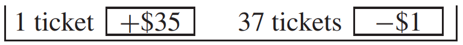

# A Short-Cut

Việc tìm `SD` có thể khó khăn nhưng có một cách rút gọn cho danh sách chỉ có hai số khác nhau, một số lớn và một số nhỏ.[^7] (Mỗi số có thể được lặp lại nhiều lần.)

> Khi danh sách chỉ có hai số khác nhau ("lớn" và "nhỏ") thì `SD` bằng
> \\[
> (\text{big number - small number}) \\\\
> \times \sqrt{\text{fraction with big number} \times \text{fraction with small number}}
> \\]

Ví dụ, lấy danh sách 5, 1, 1, 1. Có thể sử dụng shot-cut vì chỉ có hai số khác nhau là 5 và 1. `SD` là

\\[
(5-1)\times \sqrt{\frac{1}{4} \times \frac{3}{4}}
\\]

Phương pháp tắt tiết kiệm rất nhiều phép tính so với việc tìm root-mean-square của độ lệch so với trung bình([Mục 4.6][sec4.6]) , và cho ra kết quả chính xác như nhau. Phương pháp này hữu ích trong nhiều bài toán cờ bạc (và trong nhiều ngữ cảnh khác nữa).

_Ví dụ 3._ Một con bạc chơi roulette 100 lần, đặt cược $1 vào số 10 mỗi lần. Cược 35 ăn 1 và con bạc có 1/38 cơ hội thắng. Điền vào chỗ trống: con bạc sẽ thắng $....., thêm hoặc bớt $...... hoặc hơn.

_Giải pháp._ Điều đầu tiên cần làm là tạo ra một mô hình hộp để thu được lợi nhuận ròng. (Xem Ví dụ 1 ở [Mục 16.4][sec16.4].) Tiền lãi ròng của con bạc tương tự tổng của 100 lần rút ngẫu nhiên có thay thế từ

Lợi nhuận ròng dự kiến là bao nhiêu? Con số này gấp 100 lần mức trung bình của hộp. Trung bình cộng của các số trong hộp là tổng của chúng chia cho 38. Phiếu thắng đóng góp $35 vào tổng, trong khi 37 phiếu thua lấy đi tổng cộng $37. Vậy trung bình là

\\[
\frac{\$35 - \$37}{38} = \frac{-\$2}{38} \approx -\$0.05
\\]

Trong 100 lượt chơi, mức tăng ròng dự kiến là

\\[
100 \times (-\$0.05) = -\$5
\\]

Nói cách khác, con bạc dự kiến sẽ thua khoảng $5 trong 100 lần chơi.

Bước tiếp theo là tìm `SE` cho tổng số lần rút: gấp \\(\sqrt{100}\\) lần `SD` của hộp. Có thể sử dụng đường tắt và `SD` của hộp bằng

\\[
[\$35 - (-$1)] \times \sqrt{\frac{1}{38} \times \frac{37}{38}} \approx \$36 \times 0.16 \approx \$5.76
\\]

`SE` cho tổng các lần rút là \\(\sqrt{100} \times \$5.76 \approx \$58\\).

Con bạc sẽ mất khoảng $5, thêm hoặc bớt $58 hoặc hơn. Điều này hoàn thành giải pháp. `SE` lớn mang lại cho con bạc cơ hội chiến thắng hợp lý và đó chính là điểm hấp dẫn. Tất nhiên, trung bình thì con bạc thua; và `SE` cũng có nghĩa là con bạc có thể mất cả cục tiền.

[sec4.6]: ../ch04/ch04-06.md
[sec16.4]: ../ch16/ch16-04.md

[^7]: The idea of using "big" and "small" to label the values is due to the statistics group at Southern Methodist University
