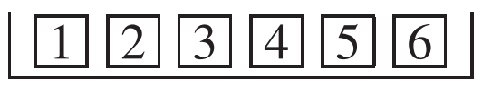
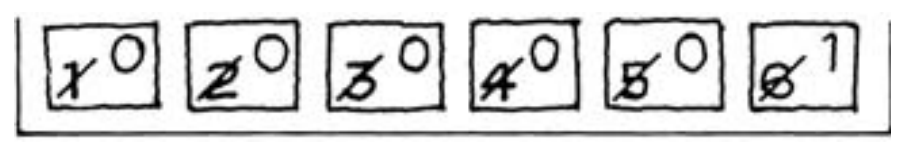
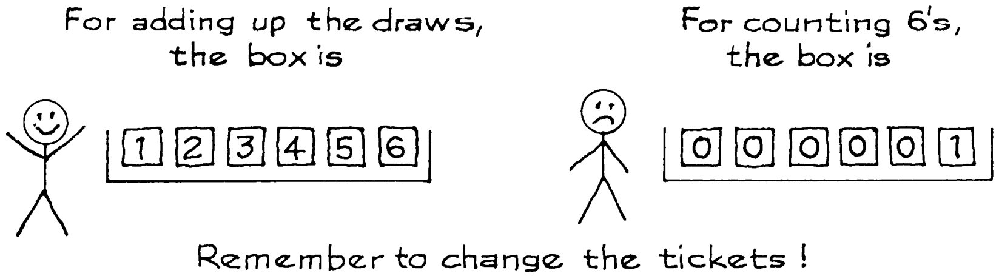
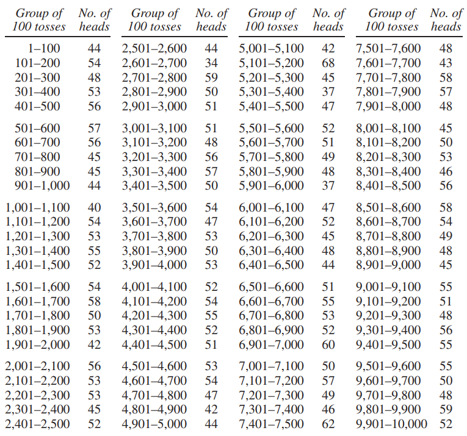

# Classifying and Counting

Một số quá trình ngẫu nhiên liên quan đến việc đếm. Luật căn bậc hai có thể được sử dụng để lấy `standard error` cho một số đếm, nhưng mô hình hộp phải được thiết lập chính xác. Ví dụ tiếp theo sẽ chỉ ra cách thực hiện việc này.

_Ví dụ 4._ Một con xúc xắc được gieo 60 lần.

(a) Tổng số chấm phải ở khoảng ........, thêm hoặc bớt ....... hoặc hơn.

(b) Số lượng 6 chấm phải ở khoảng ........, thêm hoặc bớt ......... hoặc hơn.

Để minh họa, Bảng 2 cho thấy kết quả của việc gieo xúc xắc 60 lần: lần đầu tiên là 4, lần thứ hai là 5, v.v.

|     |     |     |     |     |     |     |     |     |     |
| --- | --- | --- | --- | --- | --- | --- | --- | --- | --- |
| 4   | 5   | 5   | 2   | 4   | 5   | 3   | 2   | 6   | 3   |
| 1   | 5   | 3   | 1   | 2   | 2   | 1   | 2   | 5   | 3   |
| 4   | 4   | 2   | 1   | 4   | 4   | 5   | 2   | 6   | 3   |
| 5   | 4   | 6   | 2   | 6   | 4   | 4   | 2   | 5   | 6   |
| 3   | 6   | 6   | 1   | 1   | 5   | 1   | 6   | 1   | 2   |
| 2   | 4   | 6   | 1   | 6   | 4   | 6   | 1   | 5   | 2   |

**
Bảng 2. Gieo xúc xắc 60 lần.
**

_Giải pháp._

Phần (a) quen thuộc. Nó liên quan đến việc thêm. Mỗi lần gieo đóng góp một số chấm và chúng ta cộng các số này lại. Tổng số điểm trong 60 lần ném xúc xắc bằng tổng của 60 lần rút từ hộp

Trung bình của hộp này là 3.5 và `SD` là 1.71. Giá trị kỳ vọng của tổng là \\(60 \times 3.5 = 210\\); `SE` cho tổng là \\(\sqrt{60} \times 1.71 \approx 13\\). Tổng số điểm sẽ vào khoảng 210, thêm hoặc bớt 13 hoặc hơn. Trên thực tế, tổng các số trong Bảng 2 là 212. Tổng này lệch khỏi `expected value` khoảng 1/6 giá trị `SE`.

Phần (b). Điền vào chỗ trống đầu tiên thật dễ dàng. Mỗi mặt trong số sáu mặt sẽ xuất hiện trong khoảng 1/6 số lần ném, vì vậy `expected value` của 6 chấm là \\(60 \times 1/6 = 10\\). Ô trống thứ hai khó hơn. Chúng ta cần một loại hộp mới vì tổng số lần rút từ hộp [1,2,3,4,5,6] không còn phù hợp nữa. Thay vì được thêm vào, mỗi lần ném xúc xắc sẽ được phân loại: đó có phải là 6 chấm hay không? (Ở đây chỉ có hai lớp, mặt là 6 chấm, còn lại là các lớp khác.) Sau đó, số lượng 6 chấm được đếm lên.

Điểm cần lưu ý là ở mỗi lần ném, số lượng 6 chấm tăng lên 1 hoặc giữ nguyên:

- 1 được cộng vào số nếu lần gieo là 6 chấm;
- 0 được cộng vào số đếm lần gieo là một số khác.

Số đếm có 1 trong 6 cơ hội tăng thêm 1 và 5 trên 6 cơ hội giữ nguyên. Vì vậy, trong mỗi lần rút, tổng phải có 1 trên 6 cơ hội tăng lên một và 5 trên 6 cơ hội giữ nguyên. Hộp đúng để sử dụng là

Về cơ hội, số mặt 6 chấm trong 60 lần gieo cũng tương tự như tổng của 60 lần rút ra từ hộp mới. Điều này đặt chúng ta vào thế phải sử dụng luật căn bậc hai.

Hộp mới có năm số 0 và một số 1. `SD` là \\(\sqrt{1/6 \times 5/6} \approx 0.37\\), theo phương pháp tắt. Và `SE` cho tổng số lần rút là \\(\sqrt{60} \times 0.37 \approx 3\\). Trong 60 lần ném xúc xắc, số mặt 6 chấm sẽ vào khoảng 10, thêm hoặc bớt 3 hoặc hơn. Trên thực tế, trong Bảng 2 có 11 mặt 6 chấm. Số mặt 6 chấm được quan sát đã giảm 1/3 so với giá trị mong đợi của `SE`. Điều này hoàn thành ví dụ. Đó là câu chuyện cũ, dành cho một chiếc hộp mới.

Ví dụ này đưa ra một quan điểm chung. Mặc dù chúng có thể trông khá khác nhau nhưng nhiều bài toán về quá trình ngẫu nhiên có thể được giải theo cùng một cách. Trong những bài toán này, một số phiếu được rút ngẫu nhiên từ một hộp. Một thao tác được thực hiện trên các lần rút thăm và vấn đề yêu cầu khả năng kết quả sẽ nằm trong một khoảng nhất định. Trong chương này, có hai thao tác có thể thực hiện khi rút phiếu:

- thêm,
- phân loại và đếm.

Lời nhắn là cả hai thao tác đều có thể được xử lý theo cùng một cách - miễn là bạn thay đổi hộp.

> Nếu bạn phải phân loại và đếm số lượt rút, hãy ghi số 0 và 1 trên phiếu. Đánh dấu 1 trên các phiếu được tính cho bạn, 0 trên các phiếu còn lại.

_Ví dụ 5._ Một đồng xu sẽ được tung 100 lần. Tìm giá `expected value` và `standard error` cho số mặt ngửa. Ước tính cơ hội nhận được từ 40 đến 60 mặt ngửa.
_Giải pháp._ Việc đầu tiên là làm mô hình hộp. Vấn đề liên quan đến việc phân loại các lần tung là mặt ngửa hay sấp, sau đó đếm số mặt ngửa. Vì vậy trong hộp chỉ có số 0 và số 1. Cơ hội cho mặt ngửa là 50 - 50, vì vậy hộp phải là [0,1] . Số mặt ngửa trong 100 lần tung đồng xu giống như tổng của 100 lần rút ngẫu nhiên bằng cách thay thế từ hộp [0,1] . (Đồng xu thậm chí còn đơn giản hơn xúc xắc trong Ví dụ 4: mỗi lần tung sẽ đẩy số mặt ngửa lên 1 hoặc để nguyên, với cơ hội 50 - 50; tương tự, mỗi lần rút từ hộp sẽ đẩy tổng lên 1 hoặc để yên, với cơ hội như nhau là 50 - 50.) Điều này hoàn thành mô hình.

Vì số lần ngửa tương tự tổng số lần rút nên có thể sử dụng luật căn bậc hai. `SD` của hộp là 1/2. Vì vậy, `SE` cho tổng số 100 lần rút là \\(100 \times 1/2 = 5\\). Số lần ngửa sẽ vào khoảng 50, thêm hoặc bớt 5 hoặc hơn.
Phạm vi từ 40 đến 60 mặt ngửa thể hiện `expected value`, thêm hoặc bớt 2 `SE`. Và cơ hội là khoảng 95%. Điều này hoàn thành giải pháp.
Để giải thích 95% cơ hội này, hãy tưởng tượng đếm số mặt ngửa trong 100 lần tung đồng xu. Bạn có thể nhận được 44 mặt ngửa. Tung lần nữa: bạn có thể nhận được 54 mặt ngửa. Lần thứ ba, con số lại thay đổi một lần nữa, có lẽ là 48 mặt. Và như thế. Về lâu dài, khoảng 95% số lượng này sẽ nằm trong khoảng từ 40 đến 60. John Kerrich thực sự đã thực hiện thí nghiệm này. Bảng 3 cho thấy kết quả, trong đó 10.000 lần tung của Kerrich được chia thành các nhóm một trăm lần liên tiếp. Trên thực tế, 95 trong số 100 nhóm có từ 40 đến 60 mặt ngửa (bao gồm). Lý thuyết có vẻ tốt.

**
Bảng 3. Thí nghiệm tung đồng xu của Kerrich, cho thấy số mặt ngửa mà ông nhận được trong mỗi nhóm 100 lần tung liên tiếp.
**

Đã đến lúc kết nối luật căn bậc hai và luật trung bình. Giả sử một đồng xu được tung lên nhiều lần. Thì mặt ngửa sẽ xuất hiện trong khoảng một nửa số lần tung:

\\[
\text{number of heads = half the number of tosses + chance error}
\\]

`chance error` có thể lớn đến mức nào? Lúc đầu, trợ lý của Kerrich nghĩ rằng nó sẽ rất nhỏ. Hồ sơ cho thấy anh ta đã sai. Khi Kerrich tiếp tục tung đồng xu, `chance error` tăng lên về mặt tuyệt đối nhưng lại giảm đi tương ứng với số lần tung đồng xu, đúng như toán học dự đoán. (Xem Hình 1 và 2, [Mục 16.1][sec16.1])

Theo luật căn bậc hai, độ lớn của `chance error` có thể là \\(\sqrt{\text{number of tosses}} \times 1/2\\). Ví dụ: với 10.000 lần tung, `standard error` là \\(\sqrt{10.000} \times 1/2 = 50\\). Khi số lần tung lên tới 1.000.000, `standard error` cũng tăng theo, nhưng chỉ lên 500 - do căn bậc hai. Khi số lần tung tăng lên, `SE` của số lần ngửa sẽ ngày càng lớn hơn về mặt tuyệt đối, nhưng nhỏ hơn và nhỏ hơn so với số lần tung. Đó là lý do tại sao tỷ lệ mặt ngửa ngày càng gần hơn tới 50%. Luật căn bậc hai là lời giải thích toán học cho luật trung bình.

[sec16.1]: ../ch16/ch16-01.md
