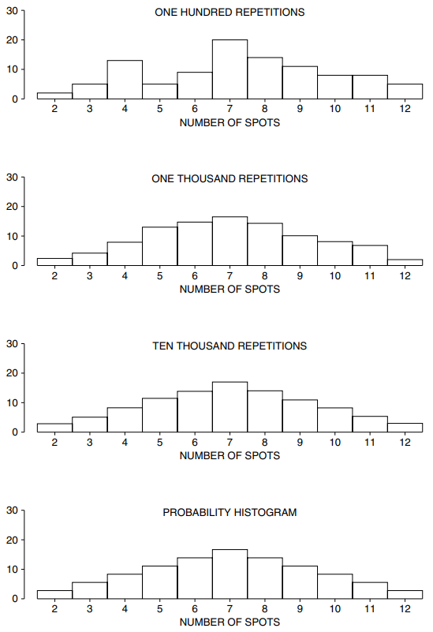
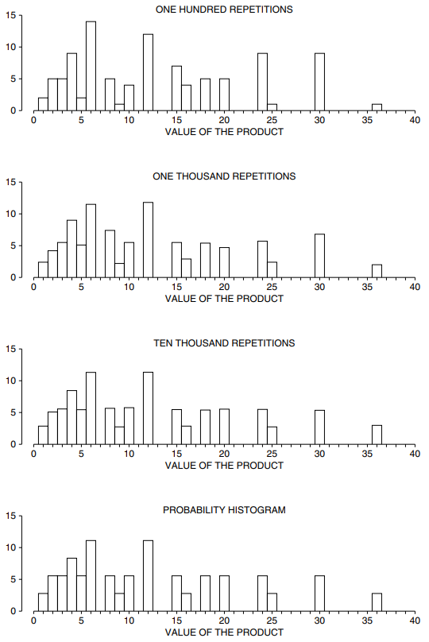

# Probability Histograms

Khi một quá trình ngẫu nhiên tạo ra một số, `expected value` và `standard error` là chỉ dẫn về vị trí của số đó. Nhưng `probability histogram` đưa ra một bức tranh hoàn chỉnh.

> `probability histogram` là một loại biểu đồ mới. Biểu đồ này thể hiện cơ hội chứ không phải dữ liệu.

Đây là một ví dụ. Người đánh bạc chơi craps đặt cược vào tổng số điểm được hiển thị bởi một cặp xúc xắc. (Các con số nằm trong khoảng từ 2 đến 12.) Vì vậy, tỷ lệ cược phụ thuộc vào cơ hội tung ra từng tổng số có thể có. Để tìm cơ hội, sòng bạc có thể thuê người ném một cặp xúc xắc. Thí nghiệm này được mô phỏng trên máy tính; Kết quả của 100 lần ném đầu tiên được thể hiện ở Bảng 2.

| Repetition | Total | Repetition | Total | Repetition | Total | Repetition | Total | Repetition | Total |
| ---------- | ----- | ---------- | ----- | ---------- | ----- | ---------- | ----- | ---------- | ----- |
| 1          | 8     | 21         | 10    | 41         | 8     | 61         | 8     | 81         | 11    |
| 2          | 9     | 22         | 4     | 42         | 10    | 62         | 5     | 82         | 9     |
| 3          | 7     | 23         | 8     | 43         | 6     | 63         | 3     | 83         | 7     |
| 4          | 10    | 24         | 7     | 44         | 3     | 64         | 11    | 84         | 4     |
| 5          | 9     | 25         | 7     | 45         | 4     | 65         | 9     | 85         | 7     |
| 6          | 5     | 26         | 3     | 46         | 8     | 66         | 4     | 86         | 4     |
| 7          | 5     | 27         | 8     | 47         | 4     | 67         | 12    | 87         | 7     |
| 8          | 4     | 28         | 8     | 48         | 4     | 68         | 7     | 88         | 6     |
| 9          | 4     | 29         | 12    | 49         | 5     | 69         | 10    | 89         | 7     |
| 10         | 4     | 30         | 2     | 50         | 4     | 70         | 4     | 90         | 11    |
| 11         | 10    | 31         | 11    | 51         | 11    | 71         | 7     | 91         | 6     |
| 12         | 8     | 32         | 12    | 52         | 8     | 72         | 4     | 92         | 11    |
| 13         | 3     | 33         | 12    | 53         | 10    | 73         | 7     | 93         | 8     |
| 14         | 11    | 34         | 7     | 54         | 9     | 74         | 9     | 94         | 8     |
| 15         | 7     | 35         | 7     | 55         | 10    | 75         | 9     | 95         | 7     |
| 16         | 8     | 36         | 6     | 56         | 12    | 76         | 11    | 96         | 9     |
| 17         | 9     | 37         | 6     | 57         | 7     | 77         | 6     | 97         | 10    |
| 18         | 8     | 38         | 2     | 58         | 6     | 78         | 9     | 98         | 5     |
| 19         | 6     | 39         | 6     | 59         | 7     | 79         | 9     | 99         | 7     |
| 20         | 8     | 40         | 3     | 60         | 7     | 80         | 7     | 100        | 7     |

Bảng trên cùng trong Hình 1 hiển thị biểu đồ cho dữ liệu trong Bảng 2. Tổng số 7 xuất hiện 20 lần, do đó hình chữ nhật trên 7 có diện tích 20% và tương tự như vậy đối với các tổng có thể khác. Bảng tiếp theo hiển thị biểu đồ thực nghiệm cho 1.000 lần lặp lại đầu tiên và bảng thứ ba cho tất cả 10.000 lần lặp lại. Những biểu đồ thực nghiệm này hội tụ đến `probability histogram` lý tưởng được hiển thị ở phần dưới cùng của hình.

**
Hình 1. Biểu đồ thực nghiệm hội tụ về `probability histogram`. Máy tính mô phỏng việc tung một cặp xúc xắc và tìm tổng số điểm. Nó lặp lại quá trình này 100 lần và tạo biểu đồ cho 100 số (bảng trên cùng). Đây là biểu đồ thực nghiệm - dựa trên quan sát. Bảng thứ hai dành cho 1.000 lần lặp lại, bảng thứ ba dành cho 10.000 lần lặp lại. (Mỗi lần lặp lại liên quan đến việc tung một cặp xúc xắc.) Bảng dưới cùng là `probability histogram` hoặc lý tưởng cho tổng số điểm khi một cặp xúc xắc được tung.
**

(Thực nghiệm có nghĩa là "được quan sát bằng thực nghiệm", hội tụ có nghĩa là "ngày càng đến gần hơn.")

Tất nhiên, `probability histogram` này có thể được tính toán bằng cách sử dụng lập luận lý thuyết. Như đã trình bày trong Chương 14, có 6 cơ hội trong 36 lần tung được số 7. Đó là \\(16\frac{2}{3|\%\\). Do đó, diện tích hình chữ nhật trên 7 trong `probability histogram` bằng \\(16\frac{2}{3}\%\\). Tương tự cho các hình chữ nhật khác.

> Biểu đồ xác suất biểu thị cơ hội theo diện tích.

`probability histogram` (bảng dưới cùng, Hình 1) được tạo thành từ các hình chữ nhật. Cơ sở của mỗi hình chữ nhật được căn giữa tại một giá trị có thể có của tổng số lần rút và diện tích của hình chữ nhật bằng cơ hội nhận được giá trị đó.[^3] Tổng diện tích của biểu đồ là 100%.

Với một ví dụ khác, hãy xem tích của các số trên một cặp xúc xắc thay vì tổng. Máy tính được lập trình để lặp đi lặp lại quá trình ngẫu nhiên sau đây: tung một cặp xúc xắc và lấy kết quả của các số. Bảng trên cùng của Hình 2 đưa ra biểu đồ thực nghiệm cho 100 lần lặp lại. Tích bằng 10 có 4 lần nên diện tích hình chữ nhật trên 10 bằng 4%. Các giá trị khác thực hiện tương tự. Bảng thứ hai đưa ra biểu đồ thực nghiệm cho 1.000 lần lặp lại; thứ ba, với giá 10.000. (Mỗi lần lặp lại bao gồm việc tung một cặp xúc xắc và lấy tích.) Bảng cuối cùng hiển thị `probability histogram`. Biểu đồ thực nghiệm cho 10.000 lần lặp lại trông gần giống hệt `probability histogram`.

Hình 2 rất khác so với Hình 1: biểu đồ mới có những khoảng trống. Để biết lý do tại sao, hãy suy nghĩ về các giá trị có thể có của sản phẩm. Giá trị nhỏ nhất là 1, nếu cả hai viên xúc xắc đều là 1; lớn nhất là 36, nếu cả hai đều là 6. Nhưng không có cách nào để có được kết quả 7. Không có hình chữ nhật nào trên 7, vì cơ hội là bằng không. Vì lý do tương tự, không có hình chữ nhật nào trên 11. Tất cả các khoảng trống có thể được giải thích theo cách này.

**
Hình 2. Biểu đồ thực nghiệm hội tụ về `probability histogram`. Máy tính mô phỏng việc tung một cặp xúc xắc và lấy tích của hai số. Nó lặp lại quá trình này 100 lần và tạo biểu đồ cho 100 sản phẩm (bảng trên cùng). Đây là biểu đồ thực nghiệm - dựa trên quan sát. Bảng thứ hai dành cho 1.000 lần lặp lại, bảng thứ ba dành cho 10.000 lần lặp lại. (Mỗi lần lặp lại liên quan đến việc tung một cặp xúc xắc.) Bảng dưới cùng là biểu đồ lý tưởng hoặc xác suất cho tích của hai số xuất hiện khi một cặp xúc xắc được tung.
**

---

[^3]: If the number of draws is very large, it may be helpful to group ranges of values together, as in figure 10 (for products). Likewise if the tickets do not show whole numbers. Even if the number of draws is moderate, and there are whole numbers on the tickets, it may be helpful to use wider class intervals: this is so when the differences of the numbers on the tickets have a common divisor bigger than 1. For example, suppose you bet $1 on the toss of a coin, 100 times. Your net gain is like the sum of 100 draws made at random with replacement from the box [−1,+1] . The possible values for the net gain are even: \\(0, \pm 2, \pm 4,...\\) The histogram can be drawn with rectangles of width 1 centered at these values. However, with the method of section 4, rectangles of width 2 give better results. The problems in this book do not raise this sort of issue.
