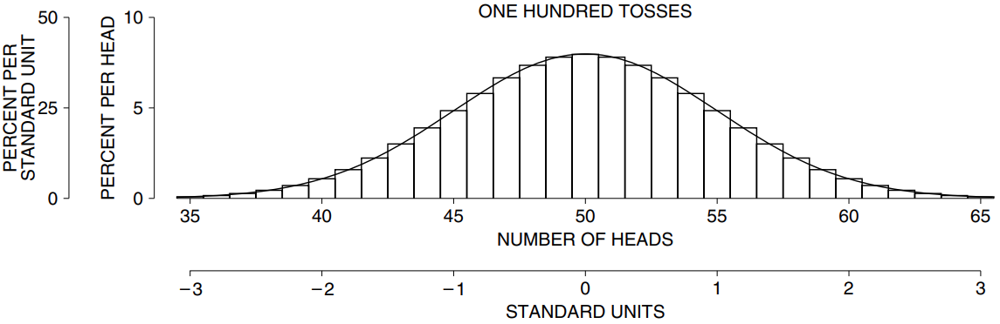
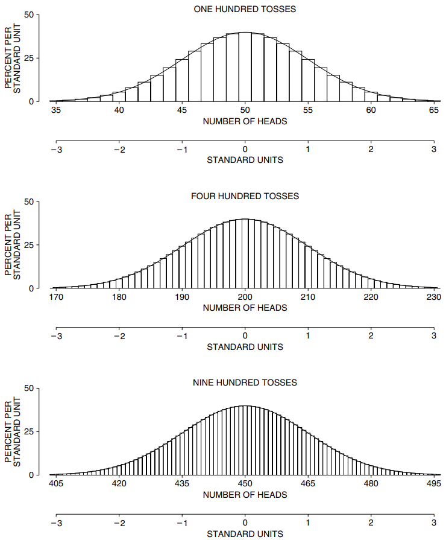

# Probability Histograms and the Normal Curve

Mục tiêu của phần này là chỉ ra `probability histogram` của số mặt ngửa gần bằng `normal curve` khi số lần tung lớn. Ví dụ: giả sử đồng xu được tung 100 lần. `probability histogram` cho số mặt ngửa hơi lởm chởm nhưng vẫn tuân theo `normal curve` khá tốt (Hình 3).

Hình có hai trục nằm ngang. `probability histogram` được vẽ tương đối với trục trên, hiển thị số mặt ngửa. `normal curve` được vẽ tương đối với trục dưới, hiển thị các `standard units`. Số mặt ngửa dự kiến là 50 và `SE` là 5. Vì vậy, 50 trên trục số mặt ngửa tương ứng với 0 trên trục `standard units`, 55 tương ứng với +1, v.v.

Ngoài ra còn có hai trục thẳng đứng trong hình. `probability histogram` được vẽ tương ứng với biểu đồ bên trong, hiển thị phần trăm số mặt ngửa. `normal curve` được vẽ tương ứng đường cong bên ngoài, hiển thị phần trăm trên mỗi `standard units`. Để xem các tỷ lệ khớp với nhau như thế nào, hãy lấy giá trị cao nhất trên mỗi trục. Tại sao 50% trên mỗi `standard units` lại khớp với 10% trên số mặt ngửa? `SE` là 5, vậy `standard units` có 5 mặt ngửa. Và \\(50/5 = 10\\). Bất kỳ cặp giá trị nào khác cũng có thể được xử lý theo cách tương tự. (Xem thêm trang 80 về biểu đồ dữ liệu.)

**
Hình 3. `probability histogram` của số mặt ngửa trong 100 lần tung đồng xu, so với `normal curve`. Đường cong được vẽ trên thang `standard units` cho biểu đồ.
**

Hình 4 cho thấy `probability histogram` của số mặt ngửa trong số lần tung đồng xu 100, 400 và 900. Với 100 lần tung, biểu đồ đi theo đường cong nhưng lởm chởm hơn. Với 900 lần tung, biểu đồ gần như giống với đường cong. Vào đầu thế kỷ 18, de Moivre đã chứng minh sự hội tụ này phải diễn ra bằng lý luận toán học thuần túy.

**
Hình 4. Phép tính xấp xỉ chuẩn. `probability histogram` được hiển thị cho số mặt ngửa trong số lần tung đồng xu 100, 400 và 900. `normal curve` được hiển thị để so sánh. Biểu đồ theo đường cong ngày càng tốt hơn khi số lần tung tăng lên.
**
