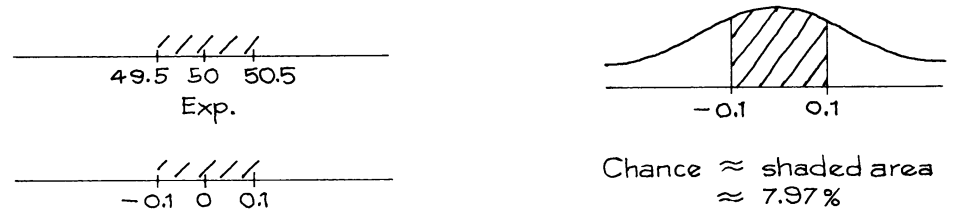
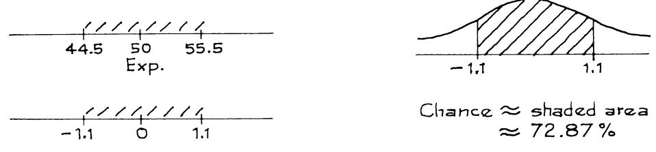
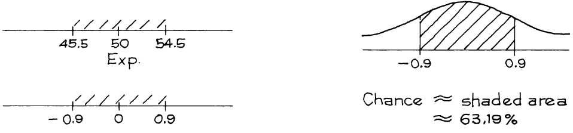

# The Normal Approximation

`normal curve` đã được sử dụng ở Chương 17 để tính xác suất. Phần này sẽ giải thích logic. Nó cũng sẽ trình bày một kỹ thuật để xử lý các điểm cuối, kỹ thuật này nên được sử dụng khi số lần tung nhỏ hoặc muốn có độ chính xác cao hơn.

_Ví dụ 1._ Một đồng xu được tung 100 lần. Ước tính cơ hội nhận được

(a) có đúng 50 mặt ngửa.

(b) trong đoạn từ 45 đến 55 mặt ngửa.

(c) trong khoảng từ 45 đến 55 mặt ngửa.

_Giải pháp._ Số mặt ngửa dự kiến là 50 và `standard error` là 5, như trình bày ở [Ví dụ 5, Mục 17.5][sec17.5].

Phần (a). Nhìn vào Hình 3 ([Mục 18.3][sec18.3]). Cơ hội nhận được chính xác 50 mặt ngửa bằng diện tích của hình chữ nhật trên 50. Đáy của hình chữ nhật này dao động từ 49.5 đến 50.5 trên thang số mặt ngửa. Trong `standard units`, đáy của hình chữ nhật đi từ −0.1 đến 0.1:

\\[
\frac{49.5 - 50}{5} = -0.1, \frac{50.5 - 50}{5} = 0.1
\\]

Nhưng biểu đồ và `normal curve` gần như trùng khớp. Vậy diện tích của góc chữ nhật gần bằng diện tích nằm trong khoảng từ −0.1 đến 0.1 dưới đường cong.

(Cơ hội chính xác là 7.96%, đến hai số thập phân; giá trị gần đúng là tuyệt vời.[^4])

Phần (b). Cơ hội nhận được từ 45 đến 55 mặt ngửa bằng diện tích của 11 hình chữ nhật trên các giá trị từ 45 đến 55 trong Hình 3. Đó là diện tích bên dưới biểu đồ nằm trong khoảng từ 44.5 đến 55.5 trên thang số mặt ngửa, tương ứng với −1.1 và 1.1 trên thang `standard units`. Vì biểu đồ bám sát `normal curve` nên diện tích này gần bằng diện tích dưới đường cong.

(Cơ hội chính xác là 72.87%, đến hai số thập phân.)

Phần (c). Cơ hội nhận được từ 45 đến 55 mặt ngửa bằng tổng diện tích của 9 hình chữ nhật trên các giá trị từ 46 đến 54. Đó là diện tích bên dưới biểu đồ nằm trong khoảng từ 45.5 đến 54.5 trên thang số mặt ngửa, tương ứng với −0.9 và 0.9 trên thang đo `standard units`.

(Cơ hội chính xác là 63.18%, đến hai số thập phân.)

Thông thường, vấn đề sẽ chỉ yêu cầu khả năng (ví dụ) số lượng đầu nằm trong khoảng từ 45 đến 55 mà không chỉ định liệu các điểm cuối được bao gồm hay loại trừ. Sau đó, bạn có thể sử dụng quy trình thỏa hiệp:

Điều này tương đương với việc thay thế vùng dưới biểu đồ trong khoảng từ 45 đến 55 bằng vùng dưới `normal curve` giữa các giá trị tương ứng (theo `standard units`). Nó chia đôi hai hình chữ nhật ở cuối và không mang lại độ chính xác cao như phương pháp được sử dụng trong Ví dụ 1. Việc theo dõi các điểm cuối có tên chính thức - "hiệu chỉnh tính liên tục". Việc chỉnh sửa sẽ có giá trị nếu hình chữ nhật lớn hoặc nếu cần độ chính xác cao. Thông thường, các bài tập trong cuốn sách này có thể được thực hiện mà không cần hiệu chỉnh.

Phép xấp xỉ chuẩn bao gồm việc thay thế xác suất thực tế của biểu đồ bằng `normal curve` trước các vùng tính toán. Điều này là hợp lý khi biểu đồ xác suất tuân theo `normal curve`. `probability histogram` thường khó tính toán, trong khi các khu vực dưới `normal curve` rất dễ tra cứu trong bảng.[^5]

[^4]: Computed on the HP 15C.

[^5]: The continuity correction can be used when the tickets in the box are integers whose differences have no common divisor (except 1). This is called "aperiodicity." If the numbers have a common divisor bigger than 1, or the tickets have values other than integers, don’t use the continuity correction without further thought. Also see notes 3 and 9.

[sec18.3]: ../ch18/ch18-03.md
[sec17.5]: ../ch17/ch17-05.md
