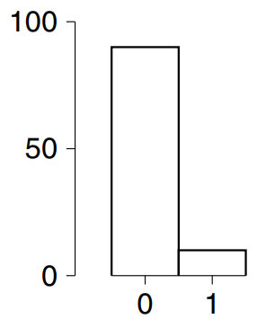
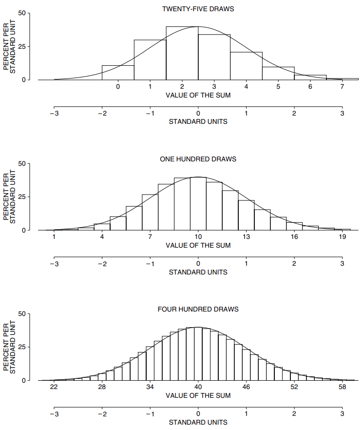
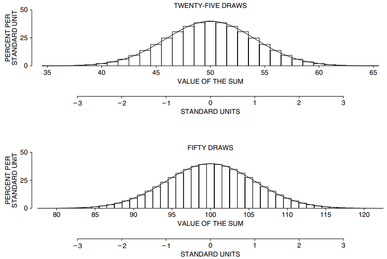
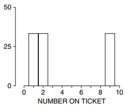
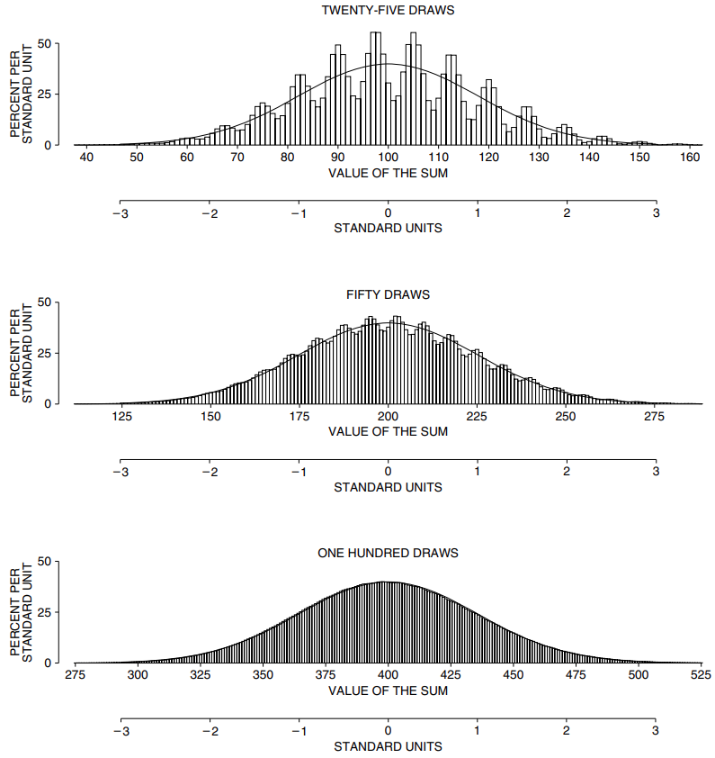
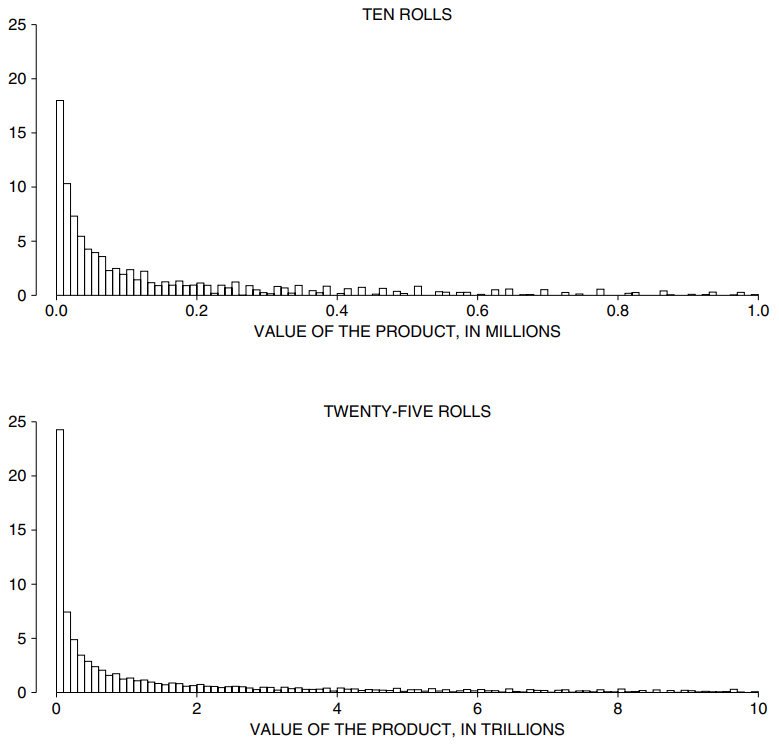
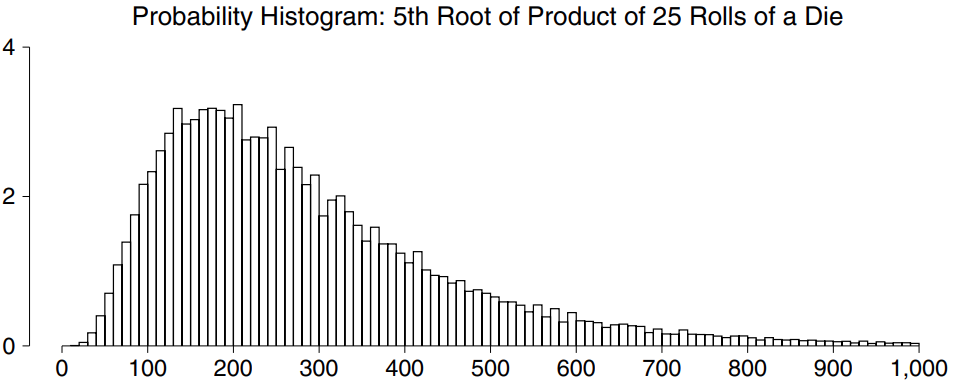

# The Scope of the Normal Approximation

Trong phần trước, cuộc thảo luận đã nói về một đồng xu, có xác suất ra mặt ngửa hoặc mặt sấp là 50%. Thế còn việc rút từ một chiếc hộp thì sao? Một lần nữa, phép tính gần đúng thông thường hoạt động hoàn toàn tốt, miễn là bạn nhớ được một điều. Biểu đồ của các số trong hộp càng khác với đường cong thông thường thì càng cần nhiều lần rút trước khi phép tính xấp xỉ được giữ nguyên. Hình 5 thể hiện biểu đồ của các phiếu trong hộp [9 phiếu 0, 1].

**
Hình 5. Biểu đồ của hộp [9 số 0, 1].
**

`probability histogram` của tổng cũng sẽ bị chênh lệch cho đến khi số lần rút trở nên khá lớn. Máy tính được lập trình để tính ra `probability histogram` cho tổng 25, 100 hoặc 400 lần rút ra từ hộp. Các biểu đồ được thể hiện trong Hình 6 bên dưới. Với 25 lần rút, biểu đồ cao hơn rất nhiều so với đường cong bên trái, thấp hơn bên phải. Phép tính xấp xỉ thường không được áp dụng.

**
Hình 6. Phép tính `normal approximation` của tổng các lần rút ra từ hộp [9 số 0, 1] . Bảng trên cùng hiển thị `probability histogram` cho tổng 25 lần rút, bảng ở giữa cho 100 lần rút, bảng dưới cùng cho 400 lần rút. Một `normal curve` được hiển thị để so sánh. Biểu đồ cao hơn `normal curve` ở bên trái và thấp hơn ở bên phải do hộp bị lệch.[^6] Khi số lần rút tăng lên, biểu đồ càng đi theo đường cong chặt chẽ hơn.
**

Với 100 lần rút, biểu đồ tuân theo đường cong tốt hơn nhiều. Ở 400 lần rút, bạn phải nhìn kỹ mới thấy được sự khác biệt.

Cho đến nay, chỉ có số 0 và 1 trong hộp. Còn những số khác thì sao? Ví dụ tiếp theo của chúng tôi là [1 2 3] . `probability histogram` cho tổng 25 lần rút từ hộp này đã gần với đường cong; với 50 lần rút, biểu đồ thực sự bám sát đường cong (Hình 7).

**
Hình 7. `probability histogram` cho tổng 25 hoặc 50 lần rút ra từ hộp [1 2 3] . Những biểu đồ này tuân theo `normal curve` rất tốt.
**

Ví dụ cuối cùng là hộp [1 2 9] . Biểu đồ cho các số trong hộp được hiển thị trong Hình 8. Biểu đồ này trông không giống `normal curve` chút nào.

**
Hình 8. Biểu đồ cho hộp [1 2 9] . Biểu đồ không giống `normal curve`.
**

Với 25 lần rút thăm, `probability histogram` của tổng vẫn khá khác so với đường cong - nó hiển thị các làn sóng (Hình 9). Với 50 lần rút, sóng vẫn còn đó, nhưng nhỏ hơn nhiều. Và với 100 lần rút thăm, `probability histogram` không thể phân biệt được với đường cong.

**
Hình 9. Phép tính `normal approximation` của một tổng. `probability histogram` được hiển thị cho tổng số lần rút ra từ hộp [1 2 9]. Bảng trên cùng dành cho 25 lần rút và đặc biệt không đi theo `normal curve`. (Lưu ý các sóng.[^7]) Bảng ở giữa dành cho 50 lần rút. Bảng phía dưới dành cho 100 lần rút. Nó tuân theo `normal curve` rất tốt.
**

`normal curve` được gắn với tổng. Ví dụ: `probability histogram` của một tích thường sẽ khá khác so với bình thường. Bảng trên cùng của Hình 10 hiển thị `probability histogram` của tích gồm 10 lần gieo xúc xắc. Điều này không giống `normal curve`. Việc làm cho số lần gieo lớn hơn không làm cho biểu đồ trở nên bình thường hơn: `probability histogram` của tích 25 lần gieo được hiển thị ở bảng dưới cùng và thậm chí còn tệ hơn.[^8] Phép nhân khác với phép cộng. Phép tính xấp xỉ thông thường áp dụng cho tổng số lần rút được thực hiện ngẫu nhiên từ một hộp - không phải cho tích.

Với 10 lần gieo, biểu đồ của tích được hiển thị lên tới một triệu; 6% diện tích nằm ngoài điểm đó và không được hiển thị. Một triệu trông có vẻ là một con số lớn nhưng tích lại tăng lên nhanh chóng. Giá trị lớn nhất của tích là 6 nhân với chính nó 10 lần: \\(6^{10} = 60.466.176\\). Ở quy mô này, một triệu không phải là quá lớn.

**
Hình 10. `probability histogram` của tích 10 và 25 lần gieo xúc xắc. Các biểu đồ trông không giống `normal curve`. Cơ sở của mỗi hình chữ nhật bao gồm một phạm vi giá trị của tích và diện tích của hình chữ nhật bằng khả năng tích nhận giá trị trong phạm vi đó. Với 10 lần gieo thì khoảng 6% diện tích không lộ ra; với 25 lần gieo, khoảng 20% không được hiển thị. Ở bảng trên cùng, tỷ lệ dọc là phần trăm trên 10.000; ở bảng dưới cùng, phần trăm trên \\(10^{11}\\).
**

Với 25 lần gieo, giá trị lớn nhất có thể có của tích thực sự là một con số lớn: \\(625 \approx 3 \times 10^{19}\\), hoặc 3 theo sau là 19 số 0. (Nợ liên bang của Mỹ "chỉ" là 8 nghìn tỷ USD vào năm 2006, tức là 8 USD theo sau là 12 số 0.)

---

[^6]: A mathematical analysis of the skewness is provided by the Edgeworth expansion. See Chapter 16 in W. Feller, An Introduction to Probability Theory and its Applications vol. II, 2nd ed. (John Wiley & Sons, 1970).

[^7]: The waves can be explained as follows. If the box were [1 1 9] , the possible values for the sum would be 25, 33, 41,... separated by gaps of 8. If the box were [2 2 9], the possible values for the sum would be 50, 57, 64,... separated by gaps of 7. The box in figure 9 is intermediate between these two, and the peak-to-peak distance alternates between 7 and 8. Another way to look at it: the peaks reflect the distribution of the number of 9’s among the 25 draws.

[^8]:The shape of the histograms in figure 10 may be a little surprising. However, if X1, X2,... are the successive rolls of the die, then it is
    \\[
    (X_1 X_2 ... X_n)^{1/\sqrt{n}}
    \\]
    which is approximately log normal after centering. A probability histogram for the 5th root of the product of 25 rolls is shown below, and it has the right shape. The probabilities were computed using a combinatorial algorithm, and the wiggles are real. (The product of 25 rolls of a die has the form \\(2^a3^b5^c\\) for non-negative integers a, b, c, lending itself to gaps and wiggles.)
    The logarithm (base 10) of the product of 25 rolls is the sum of 25 logarithms. Each has mean 0.4762 and SD 0.2627, so the sum of 25 logs has expected value \\(25 \times 0.4762 \approx 11.91\\) and standard error \\(\sqrt{25} \times 0.2627 \approx 1.31\\). The sum of 25 logs is already quite close to normally distributed. Take the bottom panel in figure 10, for the product of 25 rolls. The axis cuts off at \\(10^{13}\\), which is 13 on the log scale, or 0.83 in standard units. About 20% of the probability is to the right of this value. The width of each rectangle in the histogram is \\(10^{11}\\). The first rectangle covers the interval from \\(\infty\\) to 11 on the log scale, which in standard units is \\((−\infty, −0.69)\\). This interval contains about 25% of the probability!

