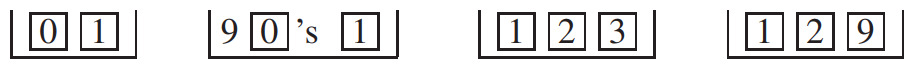
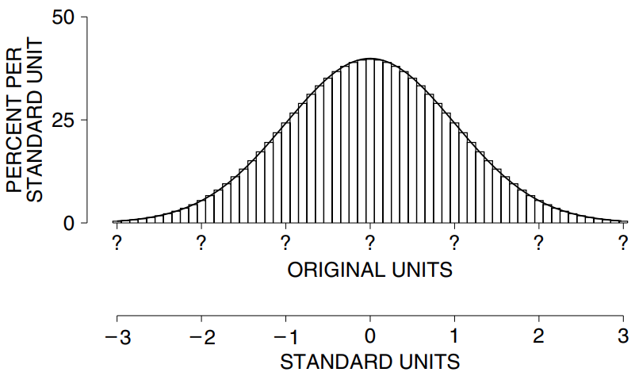
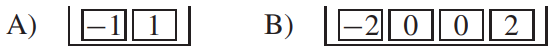

# Conclusion

Chúng ta đã xem xét tổng các lần rút thăm từ 4 hộp khác nhau:

Còn rất nhiều thứ khác. Nhưng mô hình luôn giống nhau. Với đủ số lần rút, `probability histogram` của tổng sẽ gần với `normal curve`. Các nhà toán học đặt tên cho thực tế này. Họ gọi nó là "central limit theorem" vì nó đóng vai trò trung tâm trong lý thuyết thống kê.[^9]

> `central limit theorem`. Khi rút ngẫu nhiên có thay thế từ một hộp, `probability histogram` của tổng sẽ tuân theo `normal curve`, ngay cả khi nội dung của hộp không như vậy. Biểu đồ phải được chuyển thành `standard units` và số lần rút phải lớn một cách hợp lý.

`central limit theorem` áp dụng cho tổng nhưng không áp dụng cho các phép tính khác như tích (Hình 10). Định lý này là cơ sở cho nhiều thủ tục thống kê được thảo luận trong phần còn lại của cuốn sách.

Bạn cần bao nhiêu lần rút thăm? Không có câu trả lời cố định. Phần lớn phụ thuộc vào nội dung bên trong hộp - hãy nhớ đến các làn sóng trong Hình 9. Tuy nhiên, đối với nhiều hộp,
`probability histogram` cho tổng 100 lần rút sẽ đủ sát với `normal curve`.

Khi `probability histogram` tuân theo `normal curve`, nó có thể được tổng hợp bằng `expected value` và `standard error`. Ví dụ: giả sử bạn phải vẽ biểu đồ như vậy mà không có thêm thông tin nào. Trong `standard units`, bạn có thể làm điều đó, ít nhất là với xấp xỉ đầu tiên:

Để hoàn thành bức tranh, bạn phải dịch các `standard units` trở lại đơn vị gốc bằng cách điền vào dấu chấm hỏi. Đây là những gì `expected value` và `standard error` làm. Chúng cho bạn biết hầu hết mọi điều cần biết về biểu đồ này vì nó tuân theo `normal curve`.

> `expected value` ghim tâm của `probability histogram` vào trục hoành và `standard error`sẽ khắc phục mức độ phân tán của nó.

Theo luật căn bậc hai, `expected value` và `standard error` của một tổng có thể được tính từ

- số lần rút,
- giá trị trung bình của hộp,
- `SD` của hộp.

Ba đại lượng này gần như xác định hành vi của tổng. Đó là lý do tại sao `SD` của hộp là thước đo quan trọng cho mức độ lan truyền của nó.[^10]

Chương này thảo luận về hai loại hội tụ của biểu đồ và điều quan trọng là phải phân biệt chúng. Ở Hình 1, số lần rút từ hộp [1 2 3 4 5 6] đã được ấn định. Đó là 2. Quá trình may rủi cơ bản là rút từ hộp và lấy tổng. Quá trình này được lặp lại với số lần ngày càng lớn hơn - 100, 1.000, 10.000. Biểu đồ thực nghiệm cho các giá trị quan sát được của tổng (biểu đồ cho dữ liệu) hội tụ về `probability histogram`(biểu đồ cho cơ hội). Mặt khác, ở Phần 5, số lần rút thăm từ hộp ngày càng lớn hơn. Thì `probability histogram` của tổng ngày càng mịn hơn và tiệm cận thành `normal curve`. Biểu đồ thực nghiệm là một chuyện; `probability histogram` hoàn toàn khác.

Trong phần II của cuốn sách, `normal curve` được sử dụng cho dữ liệu. Trong một số trường hợp, điều này có thể được chứng minh bằng một lập luận toán học sử dụng hai loại hội tụ được thảo luận trong chương này. Khi số lần lặp lại lớn, biểu đồ thực nghiệm sẽ gần với biểu đồ xác suất. Khi số lần rút lớn, `probability histogram` của tổng sẽ gần với `normal curve`. Do đó, khi số lần lặp lại và số lần rút đều lớn, biểu đồ thực nghiệm của các tổng sẽ gần với đường cong.[^11] Đây hoàn toàn là vấn đề logic thuần túy: một nhà toán học có thể chứng minh từng bước.

Nhưng vẫn còn thiếu cái gì đó. Phải chứng minh rằng quá trình tạo dữ liệu giống như rút số từ một hộp và lấy tổng. Loại lập luận này sẽ được thảo luận ở Phần VII. Không chỉ liên quan đến toán học - sẽ có những câu hỏi thực tế cần giải quyết.

---

[^9]: The tacit assumptions: nonzero `SD`, and a finite number of tickets in the box with integer values. Suppose for simplicity that the numbers in the box are aperiodic; let \\(\mu\\) be their mean and \\(\sigma\\) their `SD`. Let \\(h_n(x)\\) be the histogram for the sum of n draws, plotted by our convention: each rectangle has width 1, centered on a possible value. Let \\(\phi(z)\\) be the standard normal density. Then
    \\[
    \sigma \sqrt{n} h_n(n\mu + \sigma \sqrt{n} z) \rightarrow \phi(z)
    \\]
    The “histogram in standard units” euphemizes this change of scale. See W. Feller, An Introduction to Probability Theory and its Applications, vol. II, 2nd ed. (John Wiley & Sons, 1971, pp. 517,540).

[^10]: Suppose the tickets in two boxes have the same average, and average absolute deviation from average. If they also have the same `SD`, the asymptotic behavior of the sums will be the same. If not, not. An example would be

In both boxes, the tickets average out to 0, and the average absolute deviation from average is 1. But the `SD` for box A is 1, while the `SD` for box B is about 1.4. Consequently, the sum of 100 draws from box B is about 1.4 times as spread out (by any reasonable measure of spread) than the sum of 100 draws from box A. It is the average and `SD` of the numbers in the box which control the asymptotic distribution of the sum: other measures of location and spread do not.

[^11]: Let n denote the number of draws, and k the number of repetitions. The implicit condition is that \\(k/\sqrt{n}logn \rightarrow \infty\\). See D. A. Freedman, "A central limit theorem for empirical histograms," _Zeitschrift fur Wahrscheinlichkeitstheorie_ vol. 41 (1977) pp. 1–11.
