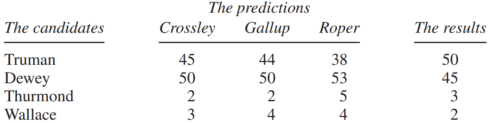

# The Year the Polls Elected Dewey

Thomas Dewey nổi tiếng với tư cách là một D.A. ở thành phố New York và tiếp tục chiếm dinh thự của thống đốc ở Albany. Năm 1948, ông là ứng cử viên Đảng Cộng hòa tranh cử tổng thống, thách thức đương kim Harry Truman. Truman bắt đầu cuộc đời chính trị với tư cách là người được ông chủ Pendergast bảo trợ ở thành phố Kansas. Sau khi được bầu vào Thượng viện, Truman trở thành phó tổng thống của FDR, kế nhiệm chức tổng thống khi Roosevelt qua đời. Truman là một trong những tổng thống quyền lực nhất thế kỷ 20, đồng thời là một trong những tổng thống có nhiều màu sắc nhất. Ông để một tấm biển trên bàn làm việc của mình, "The buck stops here". Một câu cách ngôn khác mà ông yêu thích đã trở thành một phần vốn từ vựng chính trị của nước Mỹ: "Nếu bạn không chịu được nóng, hãy tránh xa bếp". Nhưng Truman là kẻ yếu thế vào năm 1948 vì đó là thời điểm đầy khó khăn. Thế chiến II vừa mới kết thúc và giai đoạn hòa bình nửa vời của Chiến tranh Lạnh vừa mới bắt đầu. Có sự bất ổn ở trong nước và sự can thiệp phức tạp ở nước ngoài.

Ba cuộc thăm dò lớn đưa tin về chiến dịch bầu cử: Crossley, dành cho tờ báo Hearst; Gallup, được đăng trên khoảng 100 tờ báo độc lập trên khắp đất nước; và Roper, cho tạp chí _Fortune_. Đến mùa thu, cả ba đều tuyên bố Dewey là người chiến thắng, dẫn trước khoảng 5 điểm phần trăm. Dự đoán của Gallup dựa trên 50.000 cuộc phỏng vấn; và Roper's là 15.000. Như tờ Scranton Tribune đã nói,

\\[
\text{DEWEY AS GOOD AS ELECTED,\
STATISTICS CONVINCE ROPER}
\\]

**
Bảng 2. Cuộc bầu cử năm 1948
**

_Source: F. Mosteller and others, The Pre-Election Polls of 1948 (New York: Social Science Research Council, 1949)._

Để tìm ra điều gì đã xảy ra trong các cuộc thăm dò ý kiến, cần phải tìm hiểu xem họ đã chọn mẫu như thế nào.[^8] Phương pháp mà tất cả họ đã sử dụng được gọi là _quota sampling_. Với quy trình này, mỗi người phỏng vấn được giao một chỉ tiêu cố định về đối tượng phỏng vấn. Các con số thuộc một số danh mục nhất định (như nơi cư trú, giới tính, tuổi tác, chủng tộc và tình trạng kinh tế) cũng được cố định. Ở các khía cạnh khác, người phỏng vấn được tự do lựa chọn bất kỳ ai họ thích. Ví dụ: một người phỏng vấn của Gallup Poll ở St. Louis được yêu cầu phỏng vấn 13 đối tượng, trong đó:[^9]

- đúng 6 người sống ở ngoại ô, và 7 người sống ở trung tâm thành phố,
- đúng 7 người là nam và 6 nữ.

Trong số 7 nam (và có chỉ tiêu tương tự cho nữ):

- đúng 3 người dưới 40 tuổi và 4 người trên 40 tuổi,
- đúng 1 người da đen và 6 người da trắng.

Tiền thuê nhà hàng tháng mà 6 người đàn ông da trắng phải trả cũng được nêu rõ:

- 1 là trả $44.01 trở lên;
- 3 người phải trả $18.01 đến $44.00;
- 2 người phải trả $18.00 hoặc ít hơn.

Hãy nhớ rằng, đây là giá của năm 1948!

Từ quan điểm thông thường, việc lấy mẫu theo hạn ngạch có vẻ tốt. Nó dường như đảm bảo rằng mẫu sẽ giống như `population` bỏ phiếu xét về tất cả các đặc điểm quan trọng ảnh hưởng đến hành vi bỏ phiếu. (Sự phân bổ nơi cư trú, giới tính, độ tuổi, chủng tộc và tiền thuê nhà có thể được ước tính khá chặt chẽ từ dữ liệu Điều tra dân số.) Nhưng kinh nghiệm năm 1948 cho thấy quy trình này hoạt động rất tệ. Bây giờ chúng ta sẽ xem tại sao.

Các tổ chức khảo sát muốn có một mẫu thể hiện trung thực quan điểm chính trị của quốc gia. Tuy nhiên, không có hạn ngạch nào có thể được ấn định đối với phiếu bầu của đảng Cộng hòa hoặc đảng Dân chủ. Sự phân bố quan điểm chính trị chính xác là điều mà các tổ chức khảo sát không biết và đang cố gắng tìm hiểu. Hạn ngạch cho các biến số khác là nỗ lực gián tiếp nhằm làm cho mẫu phản ánh nền chính trị của quốc gia. May mắn thay hoặc không may, có nhiều yếu tố ảnh hưởng đến hành vi bỏ phiếu bên cạnh những yếu tố mà các tổ chức khảo sát kiểm soát. Có những người đàn ông da trắng giàu có ở vùng ngoại ô bỏ phiếu cho đảng Dân chủ và những phụ nữ da đen nghèo ở các thành phố trung tâm bỏ phiếu cho đảng Cộng hòa. Do đó, các tổ chức khảo sát có thể chọn thủ công một mẫu đại diện cho toàn bộ quốc gia trên tất cả các biến số nhân khẩu học, nhưng tìm mẫu bỏ phiếu theo một cách trong khi quốc gia đi theo hướng khác. Khả năng này hẳn có vẻ khá lý thuyết - trước năm 1948.

Lập luận tiếp theo chống lại việc lấy mẫu theo hạn ngạch là quan trọng nhất. Nó liên quan đến một tính chất quan trọng của phương pháp, rất dễ bị bỏ sót trong lần đầu tiên thực hiện. Trong hạn ngạch được giao, người phỏng vấn có thể tự do lựa chọn bất kỳ ai họ thích. Điều đó để lại rất nhiều chỗ cho sự lựa chọn của con người. Và sự lựa chọn của con người luôn có tính thiên vị. Năm 1948, những người phỏng vấn đã chọn quá nhiều đảng viên Đảng Cộng hòa. Nhìn chung, những người theo Đảng Cộng hòa giàu có và có trình độ học vấn tốt hơn Đảng Dân chủ. Họ có nhiều khả năng sở hữu điện thoại, có địa chỉ thường trú và sống ở những khu nhà đẹp hơn. Trong mỗi nhóm nhân khẩu học, đảng Cộng hòa dễ được phỏng vấn hơn một chút. Nếu bạn là người phỏng vấn, bạn có thể sẽ gặp quá nhiều đảng viên Đảng Cộng hòa.
Những người phỏng vấn đã chọn quá nhiều đảng viên Đảng Cộng hòa trong mọi cuộc bầu cử tổng thống từ năm 1936 đến năm 1948, như kết quả của Gallup Poll ở Bảng 3 cho thấy. Trước năm 1948, sự dẫn đầu của Đảng Dân chủ lớn đến mức đã lấn át thành kiến ​​của Đảng Cộng hòa trong các cuộc thăm dò. Sự dẫn đầu của Đảng Dân chủ đã mỏng manh hơn nhiều vào năm 1948, và sự thiên vị của Đảng Cộng hòa trong việc lấy mẫu hạn ngạch đã có tác động thực sự.

| Year | Gallup's prediction of Republican vote | Actual Republican vote | Error in favor of the Republicans |
| ---- | -------------------------------------- | ---------------------- | --------------------------------- |
| 1936 | 44                                     | 38                     | 6                                 |
| 1940 | 48                                     | 45                     | 3                                 |
| 1944 | 48                                     | 46                     | 2                                 |
| 1948 | 50                                     | 45                     | 5                                 |

**
Bảng 3. Thiên vị Đảng Cộng hòa trong Gallup Poll, 1936-1948.
**

_Note: Percentages are of the majority-party vote, except in 1948.
Source: F. Mosteller and others, The Pre-Election Polls of 1948 (New York: Social Science Research Council, 1949)._

> Trong lấy mẫu hạn ngạch, mẫu được chọn thủ công sao cho giống với tổng thể về một số đặc điểm chính. Phương pháp này có vẻ hợp lý nhưng lại không hiệu quả lắm. Nguyên nhân là do sự thiên vị không chủ ý của người phỏng vấn.

Hạn ngạch trong việc lấy mẫu hạn ngạch là đủ hợp lý, mặc dù chúng không đảm bảo thành công trước đó - còn lâu mới đạt được thành công. Nhưng phương pháp điền vào hạn ngạch, sự lựa chọn tự do của người phỏng vấn, là một thảm họa.[^10] Giải pháp thay thế là sử dụng cơ chế ngẫu nhiên khách quan và vô tư chọn mẫu. Đó sẽ là chủ đề của phần tiếp theo.

[^8]: This section draws on the book by Mosteller et al. (note 2).

[^9]: Stephan and McCarthy, p. 286 (note 2).

[^10]: It is tempting to confuse quota sampling with stratified sampling, but the two are different. Suppose, for instance, that it is desired to draw a sample of size 200 from a certain town, controlling for sex; in fact, making the number of men equal to the number of women. A quota sampler could in principle hire two interviewers, one to interview 100 men, the other to interview 100 women. In other respects, the two interviewers would pick whomever they wanted. This is not such a good design. By contrast, a stratified sample would be drawn as follows:
- Take a simple random sample of 100 men.
- Independently, take a simple random sample of 100 women.

This is a better design, because human bias is ruled out.
