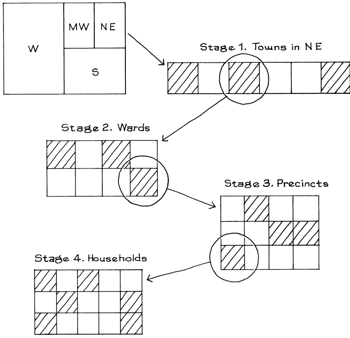

# Using Chance in Survey Work

Thậm chí vào năm 1948, một số tổ chức khảo sát đã sử dụng _phương pháp xác suất_ để lấy mẫu của họ. Bây giờ, nhiều tổ chức làm như vậy. Phương pháp xác suất cho lấy mẫu là gì? Để bắt đầu, hãy tưởng tượng thực hiện một cuộc khảo sát với 100 cử tri tại một thị trấn nhỏ với dân số 1.000 cử tri đủ điều kiện. Sau đó, có thể liệt kê tất cả các cử tri đủ điều kiện, viết tên từng người lên một tấm phiếu, cho tất cả 1.000 phiếu vào một chiếc hộp và rút ngẫu nhiên 100 phiếu. Vì không có ích gì khi phỏng vấn cùng một người hai lần nên việc rút thăm được thực hiện không thay thế. Nói cách khác, hộp được lắc để trộn phiếu. Một cái được rút ra một cách ngẫu nhiên và đặt sang một bên. Vậy là còn lại 999 trong hộp. Chiếc hộp lại được lắc, tấm phiếu thứ hai được rút ra và đặt sang một bên. Quá trình này được lặp lại cho đến khi rút được 100 phiếu. Những người trong phiếu đã được rút ra sẽ dùng làm mẫu.

Quá trình này được gọi là `simple random sampling`: phiếu được rút ngẫu nhiên không thay thế. Ở mỗi lần rút thăm, mỗi phiếu trong hộp đều có cơ hội được chọn như nhau. Người phỏng vấn hoàn toàn không có quyền quyết định chọn ai và thủ tục này rất công bằng - mọi người đều có cơ hội như nhau khi được chọn vào mẫu. Do đó, `law of averages` đảm bảo tỷ lệ phần trăm đảng viên Đảng Dân chủ trong mẫu có thể gần bằng tỷ lệ phần trăm trong `population`.

> `simple random sampling` có nghĩa là rút ngẫu nhiên mà không thay thế.

Điều gì sẽ xảy ra trong bối cảnh thực tế hơn khi Gallup Poll cố gắng dự đoán một cuộc bầu cử tổng thống? Một ý tưởng tự nhiên là lấy một `simple random sample` trên toàn quốc gồm vài nghìn cử tri đủ điều kiện. Tuy nhiên, điều này không dễ thực hiện như người ta tưởng. Rút tên ngẫu nhiên, theo nghĩa thống kê, là một công việc khó khăn. Nó hoàn toàn không giống như việc chọn người một cách bừa bãi.

Để bắt đầu thu hút ngẫu nhiên những cử tri đủ điều kiện, bạn sẽ cần một danh sách tất cả họ- hơn 200 triệu cái tên. Không có danh sách nào như vậy.[^11] Kể cả nếu có thì việc rút ngẫu nhiên vài nghìn cái tên từ 200 triệu cũng đã là một công việc rồi. (Hãy nhớ rằng, trong mỗi lần rút thăm, mọi tên trong hộp đều phải có cơ hội được chọn như nhau.) Và ngay cả khi bạn có thể rút ra một `simple random sample`, mọi người sẽ nằm rải rác khắp bản đồ. Sẽ rất tốn kém nếu cử người phỏng vấn đi khắp nơi để tìm ra tất cả.

Việc lấy một `simple random sample` là không thực tế. Do đó, hầu hết các tổ chức khảo sát đều sử dụng phương pháp xác suất được gọi là `multistage cluster sampling`. Cái tên phức tạp và các chi tiết cũng vậy. Nhưng ý tưởng này rất đơn giản. Nó sẽ được mô tả trong bối cảnh các cuộc khảo sát trước bầu cử của Gallup trong giai đoạn từ 1952 đến 1984; tất cả các cuộc khảo sát này đều được thực hiện bằng cách sử dụng cùng một quy trình. Gallup Poll thực hiện một nghiên cứu riêng biệt ở từng khu vực trong số bốn khu vực địa lý của Hoa Kỳ - Đông Bắc, Nam, Trung Tây và Tây (Hình 1). Trong mỗi vùng, họ tập hợp tất cả các trung tâm dân cư có quy mô tương tự lại với nhau. Một nhóm như vậy có thể là tất cả các thị trấn ở vùng Đông Bắc với dân số từ 50 đến 250 nghìn người. Sau đó, một mẫu ngẫu nhiên của các thị trấn này được chọn. Người phỏng vấn đóng quân tại các thị trấn được chọn và không có cuộc phỏng vấn nào được thực hiện ở các thị trấn khác trong nhóm đó. Các nhóm khác được xử lý theo cách tương tự. Điều này hoàn thành giai đoạn lấy mẫu đầu tiên.[^12]

Để phục vụ mục đích bầu cử, mỗi thị trấn được chia thành các phường và các phường được chia thành các khu bầu cử. Ở giai đoạn lấy mẫu thứ hai, một số phường được chọn - ngẫu nhiên - từ mỗi thị trấn được chọn ở giai đoạn trước. Ở giai đoạn thứ ba, một số khu vực được rút ngẫu nhiên từ mỗi phường đã chọn trước đó. Ở giai đoạn thứ tư, các hộ gia đình được chọn ngẫu nhiên từ mỗi khu vực được chọn.[^13] Cuối cùng, một số thành viên của các hộ được chọn sẽ được phỏng vấn. Ngay cả ở đây, không được phép tùy ý. Ví dụ: những người phỏng vấn Gallup Poll được hướng dẫn "nói chuyện với người đàn ông trẻ nhất từ 18 tuổi trở lên ở nhà, hoặc nếu không có đàn ông ở nhà, thì người phụ nữ lớn tuổi nhất từ 18 tuổi trở lên."[^14]

Thiết kế này mang lại nhiều lợi ích của `quota sampling`. Ví dụ, nó được thiết lập sao cho việc phân bổ mẫu theo nơi cư trú cũng giống như phân bổ cho cả nước. Nhưng mỗi giai đoạn trong quy trình lựa chọn đều sử dụng cơ chế khách quan và khách quan để lựa chọn các đơn vị mẫu. Điều này loại bỏ hoàn toàn đặc điểm tồi tệ nhất của `quota sampling`: sự thiên vị trong lựa chọn của người phỏng vấn.

**
Hình 1. `Multistage cluster sampling`
**

`simple random sampling` là phương pháp xác suất cơ bản. Các phương pháp khác có thể khá phức tạp. Nhưng tất cả các phương pháp xác suất để lấy mẫu đều có hai đặc điểm quan trọng:

- người phỏng vấn không có toàn quyền quyết định phỏng vấn ai;
- có một quy trình xác định để chọn mẫu và nó liên quan đến việc sử dụng may rủi theo kế hoạch.

Kết quả là, với phương pháp xác suất, có thể tính toán khả năng bất kỳ cá nhân cụ thể nào trong quần thể sẽ được đưa vào mẫu.[^15]

`quota sampling` không phải là một phương pháp xác suất. Nó thất bại cả hai bài kiểm tra. Người xem có nhiều quyền quyết định trong việc lựa chọn đối tượng. Và cơ hội chỉ đến một cách không có kế hoạch và ngẫu nhiên nhất. Người phỏng vấn thích tiếp cận những loại người nào? Ai sẽ đi bộ trên một con phố cụ thể vào một thời điểm cụ thể trong ngày? Không tổ chức khảo sát nào có thể đưa ra con số về những loại cơ hội này.

---

[^11]: The list of units to be sampled is the "sampling frame", and the first step in taking a probability sample is drawing up the sampling frame. This can be quite difficult, and there is often some degree of mismatch between the frame and the population. With area samples, the frame is a list of geographic units.

[^12]: Details of such designs are discussed in chapter 22. We suggest that stratification is needed to draw the sample in a way that keeps the costs reasonable, but in many polls the stratification does little to reduce sampling error. To take a hypothetical example, suppose a country consisted of two regions, East and West. In the East, 60% of the voters are Democrats; in the West, only 40% are. East and West are equal in size, so the overall percentage of Democrats is 50%. Now, two survey organizations take samples to estimate the overall percentage of Democrats. The first one uses a simple random sample of size n. The standard error is \\(50\\%/\sqrt{n}\\). The second one stratifies, taking a simple random sample of size n/2 in the East, and an independent simple random sample of size n/2 in the West. The standard error is \\(\sqrt{0.4 \times 0.6} \times 100\%/\sqrt{n}\\). Since \\(\sqrt{0.4 \times 0.6} \approx 0.49\\), the reduction in `SE` is minimal. Furthermore, in this artificial example, the difference between the regions is much larger than the difference observed in real elections. So the advantage of stratification in predicting real elections is even less. (By contrast, when sampling economic units like companies or establishments, stratification can really help to reduce variance; also see note 5 to chapter 20.)

[^13]: The Gallup Poll uses variants of random-start list sampling. In the first 3 stages, probability is proportional to size; in effect, each unit appears on the list with multiplicity equal to its size. Within each of the four geographic regions, there is a stratum of rural areas, which is handled somewhat differently from the urban areas.

[^14]: The Gallup organization explains "This method of selection within the household has been developed empirically to produce an age distribution by men and women separately which compares closely with the age distribution of the population."

[^15]: Strictly speaking, for the Gallup Poll it is possible to compute sampling probabilities only for households, not for individuals—due to the rule used in selecting individuals within households. Non-response is another complication. We thank Ben King (Florida) for useful discussions on this point. Often, probability methods are designed so that each individual in the population will get into the sample with an equal chance, so the sample is “self-weighting.” However, the Gallup poll interviews only one person in each household selected for the survey. This discriminates against people who live in large households; not enough of them are represented in the sample. (See sketch at top of next page.) An adjustment is made to correct for this bias, by giving more weight to the people from large households who do get into the sample. Household size is obtained from question 18, figure 3, p. 347.
