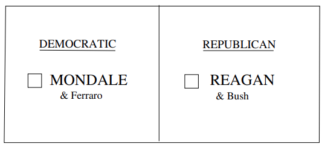
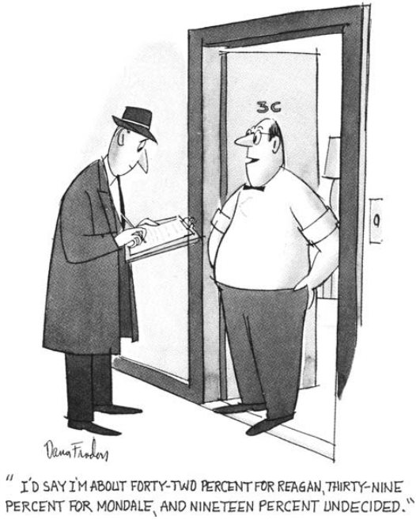
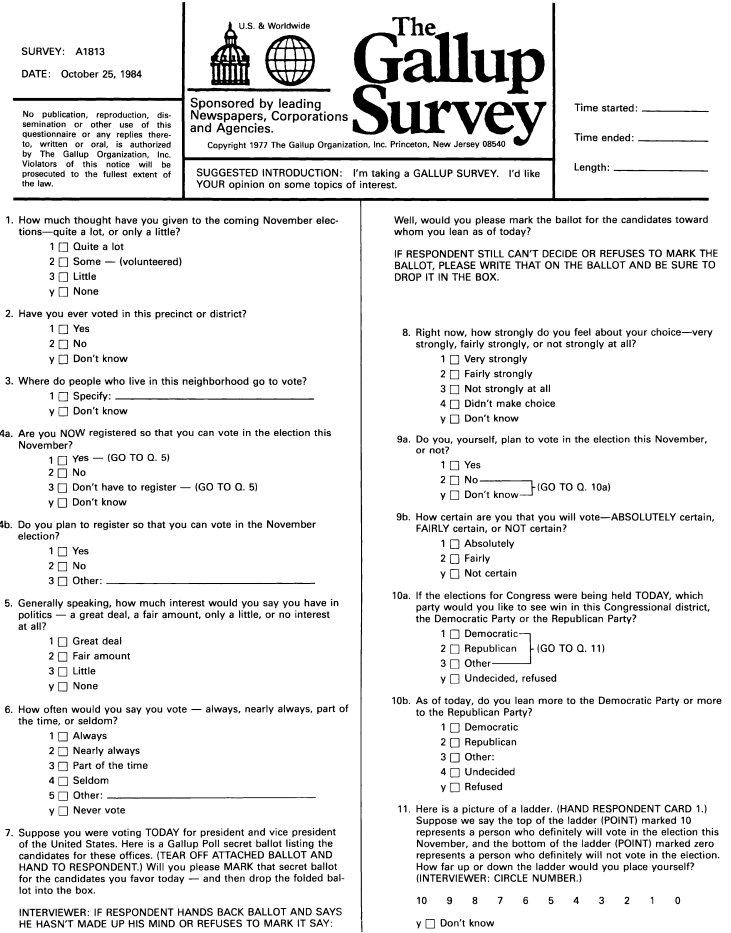
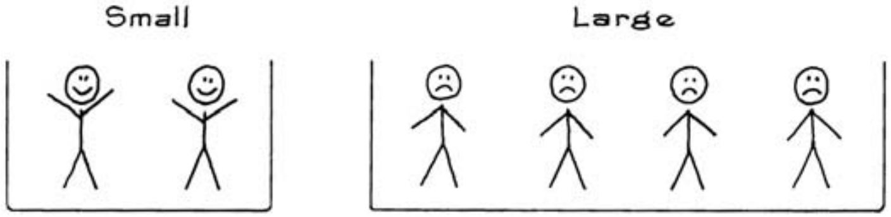

# A Closer Look at the Gallup Poll

Một số mức độ `bias` gần như không thể tránh khỏi ngay cả khi sử dụng phương pháp xác suất để chọn mẫu, do có nhiều khó khăn thực tế mà các tổ chức khảo sát phải vượt qua. Cuộc thảo luận ở đây được tổ chức xoay quanh bảng câu hỏi được Gallup Poll sử dụng trong cuộc bầu cử tổng thống năm 1984. Xem Hình 2 và 3.

**
Hình 2. Cuộc bỏ phiếu của Gallup Poll, 1984. Những người phỏng vấn sử dụng các lô phiếu bầu bí mật để giảm thiểu số lượng người trả lời chưa quyết định.
**

_Những người không bỏ phiếu_. Trong một cuộc bầu cử tổng thống điển hình, từ một phần ba đến một nửa số cử tri đủ điều kiện không bỏ phiếu. Công việc của Gallup Poll là dự đoán những gì cử tri sẽ làm; những người không phải là cử tri không liên quan và cần được sàng lọc ra khỏi mẫu càng nhiều càng tốt. Điều đó không dễ dàng như vậy. Có một sự kỳ thị đối với việc không bỏ phiếu, và nhiều người được hỏi nói rằng họ sẽ bỏ phiếu ngay cả khi họ biết rõ hơn. Vấn đề sàng lọc những người không phải là cử tri được giải quyết bằng các câu hỏi từ 1-6 và một số câu hỏi sau đó: đây là chủ đề nóng đối với những người thăm dò ý kiến. Ví dụ, câu hỏi 3 hỏi người trả lời sẽ đi bỏ phiếu ở đâu (Hình 3). Những người trả lời biết câu trả lời có nhiều khả năng bỏ phiếu hơn. [Câu hỏi 13 - Hình 3 - Mục 19.7](../ch19/ch19-07.md) hỏi liệu người trả lời có bỏ phiếu trong cuộc bầu cử vừa qua hay không và được dùng để tạo ra câu trả lời phủ định dễ dàng đưa ra - bù đắp cho sự kỳ thị gắn liền với việc không bỏ phiếu. Những người trả lời đã bỏ phiếu lần trước có nhiều khả năng bỏ phiếu lần này hơn.

Chuỗi câu hỏi này được sử dụng để quyết định liệu người trả lời có khả năng bỏ phiếu hay không; dự báo bầu cử chỉ dựa trên phần mẫu được đánh giá là có khả năng bỏ phiếu. Vấn đề được ghi lại là ai thực sự bỏ phiếu trong mỗi cuộc bầu cử. Các nghiên cứu sau bầu cử của tổ chức Gallup cho thấy rằng những đánh giá của họ về ai sẽ bỏ phiếu là khá chính xác. Các nghiên cứu cũng chỉ ra rằng việc sàng lọc những người có khả năng không phải là cử tri sẽ làm tăng độ chính xác của dự báo bầu cử, bởi vì sở thích của những người có vẻ là cử tri khác với sở thích của những người có vẻ không phải là cử tri.[^16]

_Chưa quyết định_. Một số phần trăm đối tượng được phỏng vấn chưa quyết định họ sẽ bỏ phiếu như thế nào. Câu hỏi 7, yêu cầu các ưu tiên, được thiết kế để giữ tỷ lệ phần trăm càng nhỏ càng tốt. Để bắt đầu, nó hỏi người trả lời sẽ bỏ phiếu như thế nào vào ngày phỏng vấn, thay vì Ngày bầu cử. Những đối tượng không thể quyết định sẽ được yêu cầu chỉ ra "những ứng viên mà bạn hướng tới ngày hôm nay". Công cụ cuối cùng là lá phiếu giấy (Hình 2). Thay vì nêu rõ sở thích của mình, người trả lời chỉ đánh dấu vào lá phiếu và bỏ vào hộp do người phỏng vấn mang theo.[^17]

Những kỹ thuật này đã được chứng minh là có thể giảm thiểu tỷ lệ chưa quyết định. Nhưng vẫn còn một số người còn lại và nếu họ được cho là có khả năng bỏ phiếu, Gallup Poll sẽ phải đoán xem họ sẽ bỏ phiếu như thế nào. Một số thông tin về thái độ chính trị có sẵn từ [các câu hỏi 12-14 - Hình 3 - Mục 19.7](../ch19/ch19-07.md). Thông tin này có thể được sử dụng để dự đoán xem những người chưa quyết định sẽ bỏ phiếu như thế nào, nhưng rất khó để nói những dự đoán đó hoạt động tốt như thế nào.

`response bias`. Câu trả lời mà người trả lời đưa ra bị ảnh hưởng ở một mức độ nào đó bởi cách diễn đạt câu hỏi và thậm chí cả giọng điệu hoặc thái độ của người phỏng vấn. Loại biến dạng này được gọi là `response bias`. Có một ví dụ nổi bật trong cuộc khảo sát bầu cử năm 1948: việc thay đổi thứ tự tên của các ứng cử viên được cho là làm thay đổi 5% phản hồi, lợi thế thuộc về ứng cử viên được nêu tên đầu tiên. Để kiểm soát `response bias`, tất cả người phỏng vấn đều sử dụng cùng một bảng câu hỏi và quy trình phỏng vấn được chuẩn hóa đến mức có thể. Kỹ thuật bỏ phiếu được cho là làm giảm ảnh hưởng của thái độ chính trị của người phỏng vấn đến câu trả lời của đối tượng.

`non-response bias`. Ngay cả với các cuộc phỏng vấn cá nhân, nhiều chủ đề cũng bị bỏ sót. Vì chúng có xu hướng khác với các chủ đề có sẵn cho cuộc phỏng vấn nên sẽ tạo ra `non-response bias`. Ở một mức độ nào đó, `bias` này có thể được điều chỉnh bằng cách tập trung nhiều hơn vào những đối tượng có sẵn nhưng khó tiếp cận. Thông tin này có được từ [câu hỏi 20 - Hình 3 - Mục 19.7](../ch19/ch19-07.md), trong đó hỏi liệu đối tượng có ở nhà vào những ngày trước đó hay không. Điều này được thực hiện khá tinh tế, bạn có thể nhận ra điều này bằng cách đọc câu hỏi.

**
Hình 3. Bảng câu hỏi của Gallup Poll cho cuộc bầu cử năm 1984. Được sự cho phép của Dịch vụ Tin tức Thăm dò Gallup.
**

_Kiểm tra dữ liệu_. Mẫu của Gallup thường bao gồm quá nhiều người có trình độ học vấn cao hơn. Trong phân tích chi tiết, câu trả lời của các đối tượng đó ít được chú trọng hơn (câu hỏi 16). Dữ liệu nhân khẩu học khác có thể được sử dụng theo cách tương tự. Kỹ thuật tính trọng số này được gọi là "ước tính tỷ lệ". Đừng nhầm lẫn giữa ước tính tỷ lệ với `quota sampling`. Ước tính tỷ lệ là một kỹ thuật số học, khách quan được áp dụng cho mẫu sau khi nó được chọn, để bù đắp cho các sai lệch nhỏ khác nhau trong quy trình lấy mẫu. `quota sampling` là một phương pháp chọn mẫu. Nó có yếu tố chủ quan lớn - khi người phỏng vấn chọn đối tượng - và đưa ra những thành kiến lớn.

_Kiểm soát người phỏng vấn_. Trong công việc khảo sát quy mô lớn, luôn có vấn đề là đảm bảo người phỏng vấn làm theo hướng dẫn. Một số thông tin dư thừa được đưa vào bảng câu hỏi, do đó, các câu trả lời có thể được kiểm tra tính nhất quán: sự không nhất quán cho thấy người phỏng vấn có thể đang thực hiện công việc không đúng cách. Một tỷ lệ nhỏ các đối tượng được nhân viên hành chính phỏng vấn lại để kiểm tra thêm về chất lượng công việc.

_Lời nói là rẻ tiền_. Sẽ có một chút rủi ro khi dự đoán mọi người sẽ làm gì vào Ngày bầu cử từ những gì họ nói với người phỏng vấn rằng họ sẽ làm. Mọi người có thể không muốn tiết lộ sở thích thực sự của họ. Ngay cả khi họ làm vậy, họ có thể thay đổi quyết định sau này. Lời nói và việc làm thường khác nhau.

Cuộc bầu cử năm 1992, có một tỷ lệ khá lớn những người trả lời chưa quyết định và Gallup đã phân bổ tất cả số đó cho Clinton. Đó hóa ra là một ý tưởng tồi. Nhiều người trong số những người chưa quyết định cuối cùng dường như đã bỏ phiếu cho Perot, giải thích cho sai lầm lớn của Gallup trong cuộc bầu cử năm 1992 ([Bảng 4 - Mục 19.5](../ch19/ch19-05.md)). Các phiếu bầu dự đoán và thực tế cho Clinton, Bush và Perot được hiển thị bên dưới.

|        | Clinton | Bush  | Perot |
| ------ | ------- | ----- | ----- |
| Gallup | 49%     | 37%   | 14%   |
| Actual | 43.0%   | 37.4% | 18.9% |

[^16]: Paul Perry, "A comparison of the voting preferences of likely voters and likely nonvoters," Public Opinion Quarterly vol. 37 (1973) pp. 99–109. Who has voted is a matter of public record; how they voted, of course, is not.\
    Household bias. Imagine selecting one of the two households below at random: then select a person at random from the selected household. This produces a sample of size one. A person in the small household has a better chance of getting into the sample than a person in the large household.

[^17]: The Gallup Poll “secret ballot” is not secret; ballots are connected to questionnaires.
