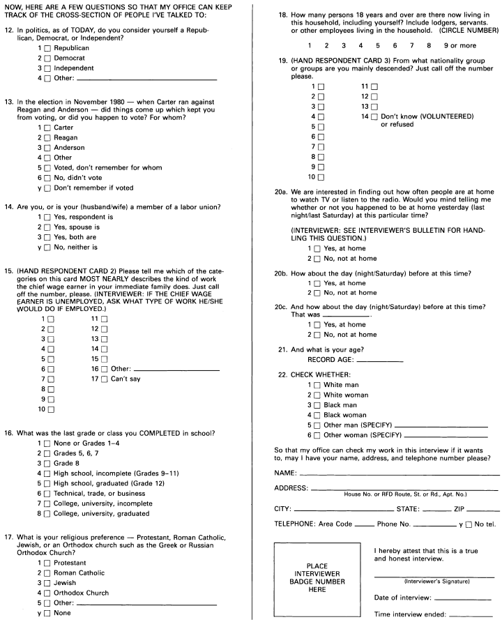

# Telephone

Nhiều cuộc khảo sát hiện nay được thực hiện qua điện thoại. Việc tiết kiệm chi phí rất đáng kể và nếu công việc đạt được kết quả tốt thì kết quả sẽ rất tốt. Cuộc thăm dò của Gallup chuyển sang qua điện thoại vào năm 1988, với 200 người phỏng vấn phủ sóng khắp đất nước trong vài ngày, từ các văn phòng ở Atlanta, Austin, Lincoln, Minneapolis và Omaha.

Họ chọn mẫu như thế nào? Năm 1988, Gallup Poll đã sử dụng mẫu cụm nhiều tầng dựa trên mã vùng, "sàn giao dịch" và "ngân hàng:"

| Area code | Exchange | Bank | Digits |
| --------- | -------- | ---- | ------ |
| 415       | 767      | 26   | 76     |

Năm 1992, họ chuyển sang thiết kế đơn giản hơn. Có 4 múi giờ ở Hoa Kỳ. Cuộc thăm dò của Gallup chia mỗi vùng thành 3 loại khu vực, theo mật độ dân số (nặng, trung bình, nhẹ). Điều đó mang lại \\(4 \times 3 = 12\\) tầng. Ví dụ, một tầng bao gồm các khu vực đông dân cư ở múi giờ miền Đông; một khu vực khác bao gồm các khu vực dân cư thưa thớt theo giờ Thái Bình Dương. Trong mỗi tầng, Gallup Poll chỉ lấy một mẫu số điện thoại ngẫu nhiên đơn giản, sử dụng máy tính để loại trừ các doanh nghiệp bằng cách kiểm tra các trang vàng. Việc chọn số điện thoại ngẫu nhiên được gọi là RDD, để _quay số ngẫu nhiên_. [^18]

**
Hình 3. Tiếp tục bảng câu hỏi của Gallup Poll cho cuộc bầu cử năm 1984. Được sự cho phép của Dịch vụ Tin tức Thăm dò Gallup.
**

Những người không có điện thoại hẳn phải khác với phần còn lại của chúng ta và điều đó gây ra `bias` trong các cuộc khảo sát qua điện thoại. Ảnh hưởng là rất nhỏ vì ngày nay hầu hết mọi người đều có điện thoại. Mặt khác, khoảng một phần ba số điện thoại dân dụng không được kê khai. Người giàu và người nghèo thường có số không kê khai nên danh bạ điện thoại nghiêng về tầng lớp trung lưu. Việc lấy mẫu từ các thư mục sẽ tạo ra `bias` thực sự, nhưng việc quay số ngẫu nhiên sẽ giải quyết khó khăn này. Năm 2005, các tổ chức khảo sát mới bắt đầu giải quyết các câu hỏi đưa ra bởi điện thoại di động. Còn những cuộc gọi bị rớt thì sao? Ai trả tiền cho thời gian phát sóng? Phải làm gì với những người có đường dây cố định và điện thoại di động?

Những người không trả lời sẽ tạo ra vấn đề, như thường lệ. Vì vậy, Gallup Poll thực hiện hầu hết các cuộc phỏng vấn vào buổi tối và cuối tuần, khi mọi người có nhiều khả năng ở nhà hơn. Nếu không có câu trả lời, người phỏng vấn sẽ gọi lại tối đa 3 lần.[^19] (Một số thiết kế có tới 15 cuộc gọi lại; điều đó tốt hơn nhưng đắt hơn.) Vì nhiều mục đích, kết quả có thể so sánh với kết quả gặp mặt trực tiếp - phỏng vấn trực tiếp và chi phí chỉ bằng một phần ba. Đó là lý do tại sao các tổ chức khảo sát đang sử dụng điện thoại.

[^18]: After 1992, the Gallup Poll changed the design. They stratified the sample by four census regions. Within each region, they chose a random sample of residential telephone banks, and dialed random numbers within sampled banks.

[^19]: In 2005, for a good commercial telephone survey, about 1/3 of the telephone numbers dialed do not answer. If someone answers the phone, about 2/3 hang up rather quickly. However, if the interviewer gets through to a person, and engages them for a minute or two, the completion rate is around 95%.
