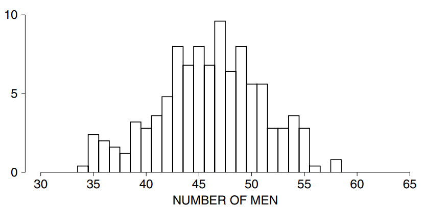
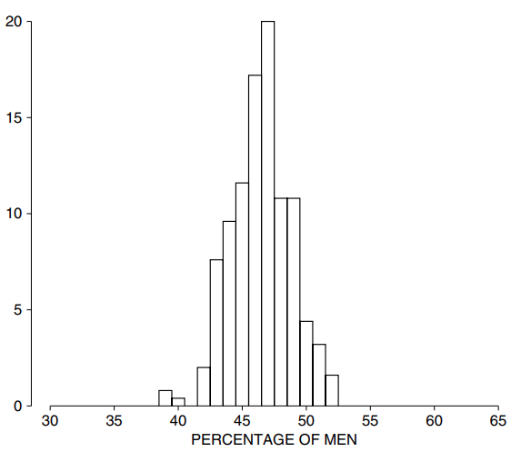
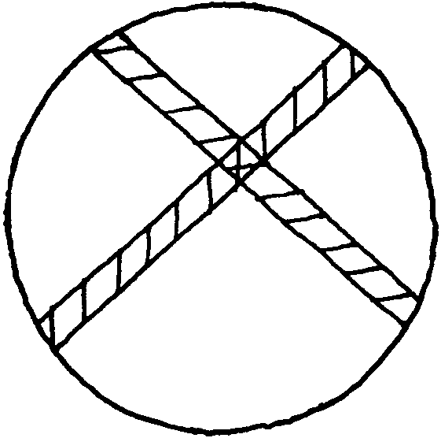

# Introduction

Khảo sát mẫu liên quan đến `error chance`. Chương này sẽ giải thích cách tìm độ lớn của `error chance` theo tỷ lệ phần trăm đối với các `simple random sample` từ một tổng thể có thành phần đã biết. Điều đó chủ yếu phụ thuộc vào kích thước của mẫu chứ không phải kích thước của tổng thể. Đầu tiên, một ví dụ. Một nghiên cứu về sức khoẻ dựa trên một mặt cắt ngang đại diện của 6.672 người Mỹ từ 18 đến 79 tuổi. Hiện tại, một nhà xã hội học muốn phỏng vấn những người này. Cô ấy không có đủ nguồn lực để làm tất cả, thực tế là cô ấy chỉ có đủ tiền để thử 100 người trong số đó. Để tránh `bias`, cô ấy sẽ lấy mẫu ngẫu nhiên. Trong cuộc đối thoại tưởng tượng sau đó, cô ấy đang thảo luận vấn đề với nhà thống kê của mình[^1].

**Nhà xã hội học:** Tôi đoán là tôi phải viết tất cả 6.672 cái tên lên những tấm vé riêng biệt, cho vào hộp và rút ngẫu nhiên 100 tấm vé. Nghe có vẻ như rất nhiều công việc.

**Nhà thống kê:** Chúng ta có các file trên máy tính, được đánh số từ 1 đến 6.672. Vì vậy, bạn có thể rút ngẫu nhiên 100 số trong phạm vi đó. Mẫu của bạn sẽ là những người có mã số đó.

**Nhà xã hội học:** Có, nhưng sau đó tôi vẫn phải ghi các số từ 1 đến 6.672 lên tấm vé. Bạn đã không giúp tôi tiết kiệm nhiều thời gian.

**Nhà thống kê:** Đó không phải là điều tôi nghĩ. Với một hộp lớn, thật khó để trộn vé đúng cách. Nếu không, hầu hết số tiền rút ra có thể đến từ những tấm vé bạn đặt cuối cùng. Đó có thể là một `bias` nghiêm trọng.

**Nhà xã hội học:** Bạn có đề nghị gì?

**Nhà thống kê:** Máy tính có một bộ tạo số ngẫu nhiên. Nó chọn một số ngẫu nhiên từ 1 đến 6.672. Người có số đó sẽ vào mẫu. Sau đó, nó chọn ngẫu nhiên số thứ 2, khác với số đầu tiên. Đó là người thứ 2 đi vào mẫu. Máy tính tiếp tục hoạt động cho đến khi có đủ 100 người. Thay vì cố gắng tự trộn các vé, hãy để các số ngẫu nhiên thực hiện việc trộn. Ngoài ra, máy tính còn lưu tất cả những chữ viết đó.

**Nhà xã hội học:** OK. Nhưng nếu chúng ta sử dụng máy tính thì mẫu của tôi có mang tính đại diện không?

**Nhà thống kê:** Bạn đang nghĩ gì vậy?

**Nhà xã hội học:** Chà, có 3.091 nam và 3.581 nữ trong cuộc khảo sát ban đầu: 46% là nam. Tôi muốn mẫu của tôi có 46% là nam. Ngoài ra, tôi muốn họ có sự phân bổ độ tuổi phù hợp. Sau đó, có thu nhập và giáo dục để suy nghĩ. Tất nhiên, điều tôi thực sự muốn là một nhóm có thái độ điển hình đối với việc chăm sóc sức khỏe.

**Nhà thống kê:** Đừng đi sâu vào thái độ ngay bây giờ. Tôi đã lấy mẫu cho bạn. Nhìn vào Bảng 1. Người đầu tiên được máy tính chọn là nữ, người thứ hai cũng vậy. Nhưng người thứ ba là nam giới. Và như thế. Tổng cộng bạn có 51 người. Nó khá gần.

```
F F M F M M F M M M M F M M M M F M F F
F M M F M F F M F F M M F F F M F M F M
F M F F M M F M M F M F M F M M M F F F
F M M M F M F M M F M M M M F F F M F M
F M F M M M F F F F M M F M M F F F F F
```

**Nhà xã hội học:** Nhưng lẽ ra chỉ có 46 người thôi. Chắc máy tính có vấn đề gì đó.

**Nhà thống kê:** Không thật sự vậy. Hãy nhớ rằng, những người trong mẫu được chọn ngẫu nhiên. Chỉ nhờ may mắn rút thăm, bạn có thể có được quá nhiều đàn ông - hoặc quá ít. Tôi đã bảo máy tính lấy rất nhiều mẫu cho bạn, tổng cộng là 250 mẫu (Bảng 2). Số lượng nam giới dao động từ mức thấp nhất là 34 đến mức cao nhất là 58. Chỉ có 17 mẫu trong lô có đúng 46 nam. Có một biểu đồ (Hình 1).

<center></center>

**<center>Hình 1: `histogram` số lượng nam trong các mẫu có kích thước 100.</center>**

**Nhà xã hội học:** Điều gì ngăn cản các con số là 46?

**Nhà thống kê:** Sự thay đổi cơ hội. Bạn có nhớ thí nghiệm Kerrich mà tôi đã kể cho bạn hôm trước không?

**Nhà xã hội học:** Có, nhưng đó là tung đồng xu chứ không phải lấy mẫu.

**Nhà thống kê:** Chà, không có nhiều khác biệt giữa việc tung đồng xu và lấy mẫu. Mỗi lần bạn tung đồng xu, bạn sẽ nhận được mặt ngửa hoặc mặt sấp và số mặt ngửa sẽ tăng thêm 1 hoặc giữ nguyên. Cơ hội là 50–50 mỗi lần tung. Việc lấy mẫu cũng vậy. Mỗi lần máy tính chọn một người cho mẫu, nó sẽ chọn một nam hoặc một nữ, do đó số lượng nam giới sẽ tăng thêm 1 hoặc giữ nguyên. Cơ hội mỗi lần chỉ là khoảng 46 đến 54 - việc lấy 100 vé ra khỏi hộp không thể thay đổi tỷ lệ trong hộp nhiều lắm.

**Nhà xã hội học:** Vấn đề ở đây là gì?

**Nhà thống kê:** Sự thay đổi cơ hội trong việc lấy mẫu cũng giống như sự thay đổi cơ hội trong việc tung đồng xu.

**Nhà xã hội học:** Hừm. Điều gì xảy ra nếu chúng ta tăng kích thước mẫu? Nó sẽ không xuất hiện giống dân số hơn sao?

**Nhà thống kê:** Đúng. Ví dụ: giả sử chúng ta tăng cỡ mẫu lên gấp 4, thành 400. Tôi dùng máy tính để rút thêm 250 mẫu nữa, lần này có 400 người trong mỗi mẫu. Với một số mẫu này, tỷ lệ nam là dưới 46%, những mẫu khác thì cao hơn. Mức thấp là 39%, mức cao là 54%.

```
51 40 49 34 36 43 42 45 48 47 51 47 50 54 39 42 47 43 46 46 51 43 53 43 51
42 49 46 44 55 36 49 44 43 45 42 42 45 43 55 53 49 46 45 42 48 44 43 41 44
47 54 54 39 39 52 43 36 39 43 43 46 47 44 55 50 53 55 45 43 47 40 47 40 51
43 56 40 40 49 47 45 49 41 43 45 54 49 50 44 46 48 52 45 47 50 53 46 44 47
47 46 54 42 44 47 47 36 52 50 51 48 46 45 54 48 46 41 49 37 49 45 50 43 54
39 55 38 49 44 43 47 51 46 51 49 42 50 48 52 54 47 51 49 44 37 43 41 48 39
50 41 48 47 50 48 46 37 41 55 43 48 44 40 50 58 47 47 48 45 52 35 45 41 35
38 44 50 44 35 48 49 35 41 37 46 49 42 53 47 48 36 51 45 43 52 46 49 51 44
51 51 39 45 44 40 50 50 46 50 49 47 45 49 39 44 48 42 47 38 53 47 48 51 49
45 42 46 49 45 45 42 45 53 54 47 43 41 49 48 35 55 58 35 47 52 43 45 44 46
```

Có một `histogram` (Hình 2). Bạn có thể so sánh nó với biểu đồ của các mẫu có kích thước 100. Nhân kích thước mẫu với 4 sẽ cắt giảm kích thước có thể xảy ra của `error chance` theo tỷ lệ phần trăm theo hệ số 2.

<center></center>

**<center>Hình 2: histogram cho % nam giới trong các mẫu có kích thước 400. Có 250 mẫu được lấy ngẫu nhiên từ những người trả lời nghiên cứu về sức khỏe. </center>**

**Nhà xã hội học:** Bạn có thể nói cụ thể hơn về lỗi cơ hội này không?

**Nhà thống kê:** Hãy để tôi viết một phương trình:

\\[ \\%\\ trong\\ mẫu = \\%\\ trong\\ dân\\ số\\ +\\ error\\ chance. \\]

Tất nhiên, `error chance` sẽ khác nhau giữa các mẫu - hãy nhớ độ biến thiên trong Bảng 2.

**Nhà xã hội học:** Vì vậy, nếu tôi để bạn rút cho tôi một mẫu, với việc kinh doanh số ngẫu nhiên này, bạn có thể cho biết `error chance` của tôi sẽ lớn đến mức nào không?

**Nhà thống kê:** Không chính xác, nhưng tôi có thể cho bạn biết kích thước của nó. Nếu bạn để tôi làm mô hình hộp, tôi có thể tính `standard error` và sau đó...

**Nhà xã hội học:** Chờ đã. Có một điểm tôi đã bỏ lỡ trước đó. Làm thế nào bạn có thể có 250 mẫu khác nhau với mỗi mẫu 100 người? Ý tôi là, \\(250 \times 100 = 25.000\\) và chúng tôi chỉ bắt đầu với 6.672 người.

**Nhà thống kê:** Các mẫu đều khác nhau, nhưng chúng có một số điểm chung. Nhìn vào bản phác thảo. Bên trong vòng tròn giống như 6.672 người và mỗi dải bóng mờ giống như 1 mẫu:

<center></center>

Các dải khác nhau, nhưng chúng chồng lên nhau. Trên thực tế, chúng tôi chỉ mới bắt đầu với việc lấy mẫu của mình. Số lượng mẫu khác nhau có kích thước 100 là hơn \\(10^{200}\\). Đó là 1 theo sau là 200 số 0. Một số nhà vật lý thậm chí không nghĩ rằng có nhiều hạt cơ bản như vậy trong toàn bộ vũ trụ.
