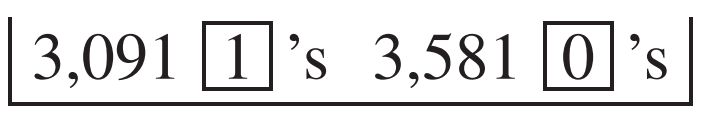
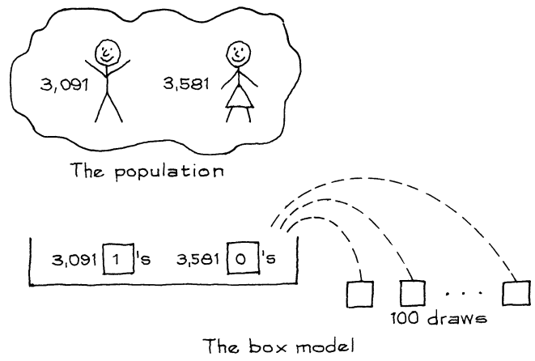

# The Expected Value and Standard Error

Nhà xã hội học ở phần trước đang nghĩ đến việc lấy mẫu cỡ 100 từ `population` 6.672 đối tượng trong một nghiên cứu về sức khỏe. Cô biết rằng tỷ lệ nam trong mẫu sẽ xấp xỉ tỷ lệ nam trong `population`.

> Với `simple random sample`, `expected value` của phần trăm mẫu bằng phần trăm `population`.

Tuy nhiên, tỷ lệ phần trăm mẫu sẽ không hoàn toàn bằng `expected value` của nó - nó sẽ bị sai lệch do một `chance error`. Lỗi này có thể lớn đến mức nào? Câu trả lời được đưa ra bởi `standard error`. Đối với bài toán của nhà xã hội học, `standard error` là 5 điểm phần trăm. Nói cách khác, nhà xã hội học nên kỳ vọng tỷ lệ nam giới trong mẫu của cô ấy sẽ chênh lệch tỷ lệ phần trăm trong `population` khoảng 5 điểm phần trăm và hơn nữa. Giờ phương pháp tính các `standard erorr `như vậy sẽ được trình bày. Ý tưởng: (i) tìm `SE` cho số lượng nam giới trong mẫu; sau đó (ii) chuyển đổi sang phần trăm, tương ứng với kích thước của mẫu. Kích thước của mẫu chỉ có nghĩa là số lượng người trong mẫu - trong trường hợp này là 100.

Để tính `SE`, bạn cần có mô hình hộp. Nhà xã hội học đã lấy mẫu cỡ 100 từ một quần thể gồm 3.091 nam và 3.581 nữ. Cô phân loại những người trong mẫu theo giới tính và đếm số lượng nam giới. Vì vậy chỉ nên có số 1 và số 0 trong ô ([Mục 17.5](../ch17/ch17-05.md)). Số lượng nam trong mẫu giống như tổng của 100 lần rút từ hộp

Cô ấy sử dụng một `simple random sample` nên phiếu phải được rút ra không thay thế. Điều này hoàn thành mô hình hộp.

Phân số của số 1 trong hộp là 0.46. Do đó, `SD` của hộp là \\(0.46 \times 0,54 \approx 0.50\\). `SE` cho tổng 100 lần rút là \\(\sqrt{100} \times 0,5 = 5\\). Tổng 100 lần rút từ hộp sẽ vào khoảng 46, cộng hoặc trừ 5 hoặc hơn. Nói cách khác, số lượng đàn ông trong mẫu 100 người của nhà xã hội học có thể là khoảng 46, thêm hoặc bớt 5 hoặc hơn. `SE` của số lượng nam là 5. Hiện tại, 46 trên 100 là 46% và 5 trên 100 là 5%. Do đó, tỷ lệ nam giới trong mẫu có thể là khoảng 46%, thêm hoặc bớt khoảng 5%. 5% này là `SE` cho phần trăm nam trong mẫu.

> Để tính `SE` theo tỷ lệ phần trăm, trước tiên hãy lấy `SE` cho số phản hồi tương ứng; sau đó chuyển đổi sang phần trăm, tương ứng với kích thước của mẫu. Là một công thức toán học lạnh lùng,
> \\[
> \text{SE for percentage} = \frac{\text{SE for number}}{\text{size of sample}} \times 100\\%
> \\]

Điều gì xảy ra khi mẫu lớn hơn? Ví dụ, nếu nhà xã hội học lấy một mẫu cỡ 400, `SE` cho số nam trong mẫu sẽ là

\\[
\sqrt{400} \times 0.5 = 10
\\]

Bây giờ 10 đại diện cho 2.5% của 400, kích thước của mẫu. `SE` cho phần trăm nam giới trong mẫu 400 người sẽ là 2.5%. Nhân kích thước của mẫu với 4 chia `SE` cho phần trăm cho \\(\sqrt{4} = 2\\).

> Nhân kích thước của một mẫu với một số yếu tố sẽ chia `SE` theo tỷ lệ phần trăm không phải cho toàn bộ yếu tố mà cho căn bậc hai của nó.

Các công thức chính xác khi rút có thay thế. Và chúng là những giá trị gần đúng tốt cho các lần rút được thực hiện không thay thế, miễn là số lần rút nhỏ so với số lượng phiếu trong hộp. Ví dụ: lấy `SE` của nhà xã hội học. Bất kể 100 phiếu nào được rút ra, trong số các phiếu còn lại trong hộp, tỷ lệ vé 1 sẽ rất gần 46%. Vì vậy, xét về cơ hội, không có nhiều khác biệt giữa việc rút có hoặc không thay thế. Thông tin thêm về điều này trong Mục 4.

Phần này trình bày cách có thể lấy `SE` cho một tỷ lệ phần trăm từ `SE` cho số tương ứng. Nhưng hai `SE` này hoạt động khá khác nhau. Khi kích thước mẫu tăng lên, `SE` cho số lượng tăng lên và `SE` cho tỷ lệ phần trăm giảm xuống. Đó là do `SE` của số lượng tăng chậm so với cỡ mẫu ([Mục 16.1](../ch16/ch16-01.md), [Mục 17.5](../ch17/ch17-05.md)):

- `SE` của số lượng mẫu tăng lên bằng căn bậc hai của cỡ mẫu
- `SE` của tỷ lệ phần trăm mẫu giảm xuống bằng bình phương của cỡ mẫu.
